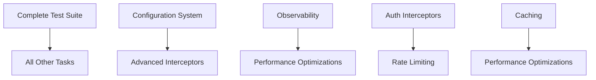

# Task 02 Middleware Improvements Tracker

## Overview
This document tracks improvement tasks for the V2 middleware pipeline implementation based on the comprehensive review. All tasks are focused on V2 implementation only - no legacy integration needed as everything will eventually move to V2.

---

## 🎯 High Priority Tasks

### 1. Complete Test Suite
**Priority**: HIGH | **Estimated Effort**: 3-4 days | **Status**: 🔴 Not Started

#### Subtasks:
- [ ] Create `test_interfaces.py` - Test all interface contracts
  - [ ] IRequestContext interface tests
  - [ ] IResponseContext interface tests
  - [ ] IMiddlewareInterceptor interface tests
  - [ ] IMiddlewarePipeline interface tests
  
- [ ] Create `test_context.py` - Test context objects
  - [ ] RequestContext creation and immutability
  - [ ] ResponseContext factory methods
  - [ ] Context serialization/deserialization
  - [ ] Metadata handling and validation
  
- [ ] Create interceptor unit tests
  - [ ] `test_routing.py` - Routing logic and registry adapters
  - [ ] `test_validation.py` - Security and input validation
  - [ ] `test_execution.py` - Handler execution patterns
  - [ ] `test_error.py` - Error handling and recovery
  - [ ] `test_observability.py` - Logging and metrics
  - [ ] `test_context_interceptor.py` - Context enrichment
  
- [ ] Create integration tests
  - [ ] Full pipeline execution flows
  - [ ] Error propagation scenarios
  - [ ] Concurrent request handling
  - [ ] Performance benchmarks

### 2. Implement Caching Interceptor
**Priority**: HIGH | **Estimated Effort**: 2 days | **Status**: 🔴 Not Started

#### Implementation Tasks:
- [ ] Design cache key generation strategy
- [ ] Implement `CachingInterceptor` class
- [ ] Add cache backend abstractions (Redis, Memory, etc.)
- [ ] Implement TTL and invalidation logic
- [ ] Add cache statistics and monitoring
- [ ] Write comprehensive tests
- [ ] Create usage documentation

### 3. Create Configuration System
**Priority**: HIGH | **Estimated Effort**: 2 days | **Status**: 🔴 Not Started

#### Implementation Tasks:
- [ ] Design `MiddlewareConfig` dataclass
- [ ] Implement environment variable loading
- [ ] Create configuration validation
- [ ] Add dynamic reconfiguration support
- [ ] Implement config hot-reloading
- [ ] Write configuration tests
- [ ] Document configuration options

---

## 📊 Medium Priority Tasks

### 4. Enhance Observability Interceptor
**Priority**: MEDIUM | **Estimated Effort**: 3 days | **Status**: 🔴 Not Started

#### Subtasks:
- [ ] Integrate with OpenTelemetry
  - [ ] Add trace span creation
  - [ ] Implement span attributes
  - [ ] Add baggage propagation
  
- [ ] Add metrics collection
  - [ ] Request counters by handler
  - [ ] Latency histograms
  - [ ] Error rate metrics
  - [ ] Custom business metrics
  
- [ ] Implement structured logging
  - [ ] JSON log formatting
  - [ ] Log correlation IDs
  - [ ] Configurable log levels
  
- [ ] Create monitoring dashboard templates
  - [ ] Grafana dashboard JSON
  - [ ] Prometheus alerts
  - [ ] DataDog monitors

### 5. Implement Rate Limiting Interceptor
**Priority**: MEDIUM | **Estimated Effort**: 2 days | **Status**: 🔴 Not Started

#### Implementation Tasks:
- [ ] Design rate limiting algorithms
  - [ ] Token bucket implementation
  - [ ] Sliding window counter
  - [ ] Distributed rate limiting
  
- [ ] Implement `RateLimitInterceptor`
- [ ] Add rate limit storage backends
- [ ] Create rate limit headers
- [ ] Implement graceful degradation
- [ ] Write rate limit tests
- [ ] Document rate limiting strategies

### 6. Add Authentication/Authorization Interceptors
**Priority**: MEDIUM | **Estimated Effort**: 3 days | **Status**: 🔴 Not Started

#### Subtasks:
- [ ] Design auth interceptor architecture
- [ ] Implement `AuthenticationInterceptor`
  - [ ] JWT token validation
  - [ ] API key validation
  - [ ] OAuth2 support
  
- [ ] Implement `AuthorizationInterceptor`
  - [ ] Role-based access control
  - [ ] Resource-based permissions
  - [ ] Policy engine integration
  
- [ ] Add auth context enrichment
- [ ] Create auth failure handling
- [ ] Write security tests
- [ ] Document auth patterns

### 7. Create Migration Tooling
**Priority**: MEDIUM | **Estimated Effort**: 2 days | **Status**: 🔴 Not Started

#### Implementation Tasks:
- [ ] Build V1 → V2 pipeline converter
- [ ] Create middleware mapping guide
- [ ] Implement compatibility analyzer
- [ ] Add migration validation
- [ ] Create migration scripts
- [ ] Write migration tests
- [ ] Document migration process

---

## 🔧 Low Priority Tasks

### 8. Implement Advanced Interceptors
**Priority**: LOW | **Estimated Effort**: 4 days | **Status**: 🔴 Not Started

#### Interceptor Ideas:
- [ ] `RetryInterceptor` - Automatic retry with backoff
- [ ] `CircuitBreakerInterceptor` - Fault tolerance
- [ ] `TimeoutInterceptor` - Request deadline enforcement
- [ ] `CompressionInterceptor` - Request/response compression
- [ ] `EncryptionInterceptor` - Data encryption in transit
- [ ] `ValidationSchemaInterceptor` - JSON Schema validation
- [ ] `TransformationInterceptor` - Request/response mapping
- [ ] `BatchingInterceptor` - Request batching
- [ ] `PriorityInterceptor` - Request prioritization
- [ ] `ThrottlingInterceptor` - Adaptive load management

### 9. Performance Optimizations
**Priority**: LOW | **Estimated Effort**: 3 days | **Status**: 🔴 Not Started

#### Optimization Tasks:
- [ ] Implement interceptor result caching
- [ ] Add connection pooling
- [ ] Create object pooling for contexts
- [ ] Optimize interceptor chain building
- [ ] Add lazy loading for heavy interceptors
- [ ] Implement fast-path optimizations
- [ ] Profile and optimize hot paths
- [ ] Add JIT compilation hints

### 10. Developer Experience Enhancements
**Priority**: LOW | **Estimated Effort**: 2 days | **Status**: 🔴 Not Started

#### Enhancement Tasks:
- [ ] Create interceptor templates
- [ ] Build interceptor generator CLI
- [ ] Add debugging utilities
- [ ] Create visual pipeline inspector
- [ ] Implement request replay tools
- [ ] Add performance profiling
- [ ] Create interceptor marketplace

---

## 📈 Progress Tracking

### Summary Statistics
- **Total Tasks**: 10 major tasks
- **Total Subtasks**: 75+ individual items
- **Completed**: 0 / 10 (0%)
- **In Progress**: 0 / 10 (0%)
- **Not Started**: 10 / 10 (100%)

### Estimated Timeline
- **High Priority**: 7-9 days (Tasks 1-3)
- **Medium Priority**: 10-12 days (Tasks 4-7)
- **Low Priority**: 9-11 days (Tasks 8-10)
- **Total Estimate**: 26-32 days of focused development

### Dependencies

---

## 🚀 Quick Wins

For immediate impact, prioritize these quick wins:

1. **Basic Caching** - Even simple in-memory caching will improve performance
2. **Request ID Tracking** - Add to observability for better debugging
3. **Basic Rate Limiting** - Protect against accidental overload
4. **Test Pipeline Core** - At minimum, test the pipeline class thoroughly

---

## 📊 Success Metrics

Track progress using these metrics:

1. **Test Coverage**: Target > 95% coverage
2. **Performance**: < 5ms pipeline overhead
3. **Memory Usage**: < 100MB for 1000 pipelines
4. **Error Rate**: < 0.1% middleware errors
5. **Developer Satisfaction**: Time to add new interceptor < 30 minutes

---

## 🔄 Review Schedule

- **Weekly**: Review task progress and priorities
- **Bi-weekly**: Assess architecture decisions
- **Monthly**: Evaluate performance metrics
- **Quarterly**: Plan next phase improvements

---

*Last Updated: 2025-09-25*  
*Next Review: Week of 2025-10-02*