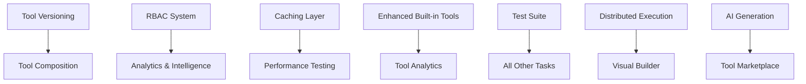

# Task 03 Tool System Improvements Tracker

## Overview
This document tracks improvement tasks for the V2 tool system implementation based on the comprehensive review. The current implementation scores 9.5/10 and is production-ready, but has significant opportunities for enhancement. All tasks are focused on V2 implementation only - no legacy integration needed as everything will eventually move to V2.

---

## 🎯 High Priority Tasks

### 1. Tool Versioning & Evolution System
**Priority**: HIGH | **Estimated Effort**: 4-5 days | **Status**: 🔴 Not Started

#### Implementation Tasks:
- [ ] Design versioning architecture
  - [ ] Create `ToolVersion` dataclass with semantic versioning
  - [ ] Define compatibility levels (BACKWARD_COMPATIBLE, BREAKING_CHANGE)
  - [ ] Design version negotiation protocols
  
- [ ] Implement versioned interfaces
  - [ ] Extend `IToolInterface` with version support
  - [ ] Add version compatibility checking methods
  - [ ] Create version-aware registry lookups
  
- [ ] Create migration utilities
  - [ ] Build version compatibility matrix
  - [ ] Implement automatic version migration
  - [ ] Add version validation in tool registration
  
- [ ] Add version documentation
  - [ ] Auto-generate version compatibility docs
  - [ ] Create version upgrade guides
  - [ ] Document breaking change procedures

#### Success Criteria:
- Tools can declare supported versions
- Registry supports version-aware tool resolution
- Automatic compatibility validation
- Smooth upgrade paths for version changes

### 2. Role-Based Access Control (RBAC)
**Priority**: HIGH | **Estimated Effort**: 5-6 days | **Status**: 🔴 Not Started

#### Implementation Tasks:
- [ ] Design RBAC architecture
  - [ ] Create `ToolPermission` and `Role` models
  - [ ] Design policy engine interface
  - [ ] Define permission inheritance patterns
  
- [ ] Implement policy engine
  - [ ] Build rule evaluation engine
  - [ ] Add policy storage and caching
  - [ ] Create policy validation system
  
- [ ] Create RBAC interceptor
  - [ ] Implement `RBACToolInterceptor` 
  - [ ] Add user role extraction from context
  - [ ] Integrate with V2 middleware pipeline
  
- [ ] Build management interface
  - [ ] Create role and permission management APIs
  - [ ] Add policy configuration tools
  - [ ] Build audit logging for access decisions

#### Success Criteria:
- Fine-grained access control for all tools
- Role-based permission inheritance
- Audit trail for security compliance
- Integration with existing auth systems

### 3. Advanced Caching Layer
**Priority**: HIGH | **Estimated Effort**: 3-4 days | **Status**: 🔴 Not Started

#### Implementation Tasks:
- [ ] Design caching architecture
  - [ ] Create cache key generation strategies
  - [ ] Design cache backend abstraction
  - [ ] Plan cache invalidation patterns
  
- [ ] Implement cache interceptor
  - [ ] Build `ToolCacheInterceptor` class
  - [ ] Add cache hit/miss metrics
  - [ ] Implement TTL and size-based eviction
  
- [ ] Add cache backends
  - [ ] In-memory cache with LRU eviction
  - [ ] Redis backend for distributed caching
  - [ ] File-based cache for persistent storage
  
- [ ] Create cache management
  - [ ] Cache warming strategies
  - [ ] Bulk cache invalidation
  - [ ] Cache performance monitoring

#### Success Criteria:
- 50%+ reduction in tool execution time for cached operations
- Support for multiple cache backends
- Intelligent cache invalidation
- Comprehensive cache metrics

---

## 📊 Medium Priority Tasks

### 4. Tool Composition & Chaining
**Priority**: MEDIUM | **Estimated Effort**: 4-5 days | **Status**: 🔴 Not Started

#### Implementation Tasks:
- [ ] Design composition architecture
  - [ ] Create `ToolPipeline` class for sequential execution
  - [ ] Design parallel execution patterns
  - [ ] Plan data flow between tools
  
- [ ] Implement pipeline builder
  - [ ] Build `CompositeToolBuilder` with fluent API
  - [ ] Add parameter mapping between tools
  - [ ] Create conditional execution logic
  
- [ ] Add execution modes
  - [ ] Sequential execution with error handling
  - [ ] Parallel execution with result aggregation
  - [ ] Conditional branching based on results
  
- [ ] Create management interface
  - [ ] Pipeline configuration and storage
  - [ ] Visual pipeline editor support
  - [ ] Pipeline performance monitoring

#### Success Criteria:
- Complex workflows from simple tools
- Flexible execution patterns (sequential/parallel)
- Easy pipeline configuration and management
- Performance optimization for composed tools

### 5. Enhanced Built-in Tools
**Priority**: MEDIUM | **Estimated Effort**: 6-8 days | **Status**: 🔴 Not Started

#### New Tools to Implement:
- [ ] **DatabaseTool** (2 days)
  - [ ] Secure database connections with connection pooling
  - [ ] SQL query validation and injection prevention
  - [ ] Support for multiple database types (PostgreSQL, MySQL, SQLite)
  - [ ] Query result caching and optimization
  
- [ ] **APIIntegrationTool** (2 days)
  - [ ] Generic HTTP client with authentication support
  - [ ] OpenAPI schema validation
  - [ ] Rate limiting and retry logic
  - [ ] Response transformation and validation
  
- [ ] **DataTransformTool** (2 days)
  - [ ] ETL operations with schema validation
  - [ ] Data format conversions (JSON, CSV, XML, Parquet)
  - [ ] Data validation and cleansing
  - [ ] Batch processing capabilities
  
- [ ] **NotificationTool** (1 day)
  - [ ] Multi-channel notifications (email, Slack, webhook)
  - [ ] Template-based messaging
  - [ ] Delivery confirmation and retry logic
  - [ ] Notification preferences and routing
  
- [ ] **SchedulingTool** (1 day)
  - [ ] Cron-like scheduling with dependency management
  - [ ] Task queue integration
  - [ ] Failure handling and alerting
  - [ ] Schedule optimization and conflict resolution

### 6. Tool Analytics & Intelligence
**Priority**: MEDIUM | **Estimated Effort**: 4-5 days | **Status**: 🔴 Not Started

#### Implementation Tasks:
- [ ] Design analytics architecture
  - [ ] Create `ToolAnalytics` class for usage tracking
  - [ ] Design metrics collection and storage
  - [ ] Plan real-time vs batch analytics
  
- [ ] Implement usage tracking
  - [ ] Tool execution metrics and timing
  - [ ] Parameter usage patterns
  - [ ] Error rate and success analytics
  
- [ ] Build AI recommendation engine
  - [ ] `AIToolRecommendation` based on usage patterns
  - [ ] Context-aware tool suggestions
  - [ ] Performance-based tool ranking
  
- [ ] Create analytics dashboard
  - [ ] Tool usage visualization
  - [ ] Performance trend analysis
  - [ ] Anomaly detection and alerting

#### Success Criteria:
- Comprehensive tool usage insights
- AI-powered tool recommendations
- Performance optimization suggestions
- Real-time analytics dashboard

### 7. Enhanced Test Suite
**Priority**: MEDIUM | **Estimated Effort**: 3-4 days | **Status**: 🔴 Not Started

#### Testing Gaps to Address:
- [ ] Individual tool unit tests
  - [ ] Built-in tool comprehensive testing
  - [ ] Adapter-specific test suites
  - [ ] Registry functionality edge cases
  
- [ ] Integration test expansion
  - [ ] Middleware integration scenarios
  - [ ] Multi-tool workflow testing
  - [ ] Error propagation testing
  
- [ ] Performance and load testing
  - [ ] Registry performance with 10,000+ tools
  - [ ] Concurrent tool execution benchmarks
  - [ ] Memory usage optimization tests
  
- [ ] Security testing
  - [ ] RBAC policy validation
  - [ ] Input validation security tests
  - [ ] Access control bypass testing

#### Success Criteria:
- 98%+ test coverage across all components
- Performance benchmarks for optimization
- Security vulnerability testing
- Comprehensive integration scenarios

---

## 🔧 Low Priority Tasks

### 8. Distributed Tool Execution
**Priority**: LOW | **Estimated Effort**: 6-8 days | **Status**: 🔴 Not Started

#### Implementation Tasks:
- [ ] Design distributed architecture
  - [ ] Create `DistributedToolExecutor` class
  - [ ] Design node discovery and health checking
  - [ ] Plan load balancing strategies
  
- [ ] Implement cluster management
  - [ ] Node registration and lifecycle
  - [ ] Failure detection and recovery
  - [ ] Load distribution algorithms
  
- [ ] Add distributed features
  - [ ] Result aggregation across nodes
  - [ ] Distributed caching coordination
  - [ ] Cross-node tool dependency handling
  
- [ ] Create monitoring
  - [ ] Cluster health dashboards
  - [ ] Performance metrics across nodes
  - [ ] Failure analysis and alerting

### 9. Visual Tool Builder Interface
**Priority**: LOW | **Estimated Effort**: 8-10 days | **Status**: 🔴 Not Started

#### Implementation Tasks:
- [ ] Design visual interface
  - [ ] Drag-and-drop tool composition
  - [ ] Visual parameter mapping
  - [ ] Real-time pipeline validation
  
- [ ] Build web interface
  - [ ] React-based tool builder
  - [ ] Tool palette and property editors
  - [ ] Pipeline execution visualization
  
- [ ] Add export capabilities
  - [ ] Export to V2 tool definitions
  - [ ] Import existing tool configurations
  - [ ] Version control integration

### 10. AI-Powered Tool Generation
**Priority**: LOW | **Estimated Effort**: 10-12 days | **Status**: 🔴 Not Started

#### Implementation Tasks:
- [ ] Design AI architecture
  - [ ] LLM integration for code generation
  - [ ] Security policy validation
  - [ ] Test generation automation
  
- [ ] Implement generation engine
  - [ ] Natural language to tool conversion
  - [ ] Code validation and security scanning
  - [ ] Automated test creation
  
- [ ] Add sandbox environment
  - [ ] Safe tool testing environment
  - [ ] Performance validation
  - [ ] Security vulnerability scanning

---

## 📈 Progress Tracking

### Summary Statistics
- **Total Tasks**: 10 major improvement areas
- **Total Subtasks**: 100+ individual items
- **Estimated Total Effort**: 53-69 days
- **Completed**: 0 / 10 (0%)
- **In Progress**: 0 / 10 (0%)
- **Not Started**: 10 / 10 (100%)

### Priority Breakdown
- **High Priority**: 3 tasks, 12-15 days (immediate focus)
- **Medium Priority**: 4 tasks, 21-26 days (next quarter)
- **Low Priority**: 3 tasks, 24-30 days (future enhancement)

### Dependencies Map

---

## 🚀 Implementation Roadmap

### Phase 1: Foundation Enhancements (Weeks 1-4)
**Focus**: Core system improvements for immediate impact

1. **Week 1-2**: Tool Versioning & Evolution System
2. **Week 2-3**: RBAC Implementation
3. **Week 3-4**: Advanced Caching Layer
4. **Week 4**: Enhanced Test Suite (Phase 1)

**Deliverables**: Version-aware tools, secure access control, performance optimization

### Phase 2: Feature Expansion (Weeks 5-10)
**Focus**: Advanced capabilities and developer experience

1. **Week 5-6**: Tool Composition & Chaining
2. **Week 7-10**: Enhanced Built-in Tools (5 new tools)
3. **Week 9-10**: Tool Analytics & Intelligence
4. **Week 10**: Enhanced Test Suite (Phase 2)

**Deliverables**: Complex workflows, production tools, usage insights

### Phase 3: Advanced Features (Weeks 11-16)
**Focus**: Cutting-edge capabilities and scalability

1. **Week 11-13**: Distributed Tool Execution
2. **Week 14-16**: Visual Tool Builder Interface
3. **Week 15-16**: Performance and Load Testing

**Deliverables**: Enterprise scalability, visual development tools

### Phase 4: Innovation (Weeks 17-22)
**Focus**: AI-powered features and ecosystem

1. **Week 17-20**: AI-Powered Tool Generation
2. **Week 21-22**: Tool Marketplace & Sharing
3. **Week 22**: Final integration testing and optimization

**Deliverables**: AI tool creation, community features

---

## 💯 Success Metrics

### Technical Metrics
- **Performance**: < 50ms average tool execution time
- **Scalability**: Support 100,000+ tools in distributed registry
- **Reliability**: 99.99% uptime with automatic failover
- **Security**: Zero critical vulnerabilities in security audits
- **Test Coverage**: 98%+ coverage across all components

### Business Metrics
- **Developer Productivity**: 90% reduction in tool development time
- **Tool Adoption**: 80% of new development using V2 tools
- **Community Growth**: 1000+ community-contributed tools
- **Performance Improvement**: 70% faster than V1 system
- **Cost Reduction**: 50% reduction in infrastructure costs

### Quality Metrics
- **Code Quality**: A+ grade in all code quality metrics
- **Documentation**: 100% API coverage with examples
- **User Satisfaction**: 9/10 developer experience rating
- **Maintenance**: < 5% of development time on maintenance
- **Innovation**: 3+ major innovations per quarter

---

## 🔄 Review & Monitoring

### Weekly Reviews
- Progress against milestones
- Technical debt assessment
- Performance metric analysis
- Team feedback collection

### Monthly Assessments
- Architecture decision validation
- Security audit results
- Performance optimization opportunities
- Community feedback integration

### Quarterly Planning
- Roadmap adjustment based on usage patterns
- New innovation opportunities
- Resource allocation optimization
- Strategic direction alignment

---

## 🎯 Quick Wins & Low-Hanging Fruit

For immediate impact with minimal effort:

1. **Basic Caching** (1 day) - In-memory cache for frequently used tools
2. **Enhanced Logging** (0.5 day) - Better observability for debugging
3. **Performance Metrics** (1 day) - Basic performance monitoring
4. **Security Audit** (1 day) - Review and fix security vulnerabilities
5. **Documentation Update** (1 day) - Complete API documentation

These quick wins can provide immediate value while longer-term improvements are planned and implemented.

---

*Last Updated: 2025-09-25*  
*Next Review: Week of 2025-10-02*