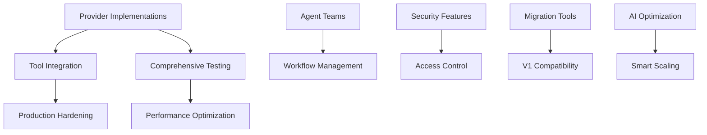

# Task 04 Agent System Improvements Tracker

## Overview
This document tracks improvement tasks for the V2 agent system implementation based on the comprehensive review. The current implementation scores 8.0/10 with an excellent foundation but requires completion of core providers and comprehensive testing for production readiness. All tasks focus on V2 implementation only - no legacy integration needed as everything will eventually move to V2.

---

## 🎯 High Priority Tasks

### 1. Complete Provider Implementations
**Priority**: HIGH | **Estimated Effort**: 8-10 days | **Status**: 🔴 Not Started

#### Provider Implementation Tasks:
- [ ] **Anthropic Provider Implementation** (3 days)
  - [ ] Create `providers/anthropic.py` with native Anthropic API integration
  - [ ] Implement Claude-3 Opus, Sonnet, and Haiku support
  - [ ] Add tool calling (function calling) capability
  - [ ] Implement streaming response support
  - [ ] Add proper error handling and rate limiting
  - [ ] Support system messages and conversation context
  - [ ] Token usage tracking and cost estimation

- [ ] **Google Gemini Provider Implementation** (3 days)
  - [ ] Create `providers/gemini.py` with native Google AI API integration
  - [ ] Support Gemini Pro and Gemini Ultra models
  - [ ] Implement multimodal capabilities (text, image, video)
  - [ ] Add function calling support
  - [ ] Streaming response implementation
  - [ ] Safety settings and content filtering
  - [ ] Token counting and usage metrics

- [ ] **Cohere Provider Implementation** (2 days)
  - [ ] Create `providers/cohere.py` with native Cohere API
  - [ ] Support Command and Command Light models
  - [ ] Implement RAG-specific features
  - [ ] Add chat and generation modes
  - [ ] Custom model support
  - [ ] Token tracking and billing integration

#### Success Criteria:
- All providers support the complete `IAgentProvider` interface
- Native API implementations with no external framework dependencies
- Comprehensive error handling and retry logic
- Streaming support for real-time interactions
- Token usage tracking for cost management

### 2. Comprehensive Test Suite
**Priority**: HIGH | **Estimated Effort**: 6-8 days | **Status**: 🔴 Not Started

#### Testing Implementation Tasks:
- [ ] **Unit Tests for Core Components** (3 days)
  - [ ] `test_interfaces.py` - Interface contract validation
  - [ ] `test_base.py` - BaseAgent functionality and lifecycle
  - [ ] `test_builder.py` - Builder pattern and configuration validation
  - [ ] `test_registry.py` - Agent registry operations and thread safety
  - [ ] `test_session.py` - Session management and conversation history
  
- [ ] **Provider-Specific Tests** (2 days)
  - [ ] `test_openai_provider.py` - OpenAI integration testing
  - [ ] `test_anthropic_provider.py` - Anthropic provider testing
  - [ ] `test_gemini_provider.py` - Gemini provider testing
  - [ ] `test_cohere_provider.py` - Cohere provider testing
  - [ ] `test_mock_provider.py` - Mock provider functionality

- [ ] **Integration Tests** (2 days)
  - [ ] `test_middleware_integration.py` - V2 middleware pipeline integration
  - [ ] `test_tool_integration.py` - V2 tool system integration
  - [ ] `test_error_integration.py` - V2 error system integration
  - [ ] `test_cross_provider.py` - Multi-provider scenarios
  
- [ ] **Performance Tests** (1 day)
  - [ ] Load testing with concurrent agents
  - [ ] Memory usage benchmarking
  - [ ] Response time performance testing
  - [ ] Comparison benchmarks vs V1 system

#### Success Criteria:
- 95%+ test coverage across all components
- All provider APIs properly mocked for testing
- Performance benchmarks establish baselines
- Integration tests validate V2 system compatibility

### 3. V2 Tool System Integration
**Priority**: HIGH | **Estimated Effort**: 4-5 days | **Status**: 🔴 Not Started

#### Integration Implementation Tasks:
- [ ] **Tool Calling Interface** (2 days)
  - [ ] Implement `_execute_tool_call()` method in BaseAgent
  - [ ] Connect to V2 tool registry and execution engine
  - [ ] Add tool result handling and response formatting
  - [ ] Support for parallel tool execution
  
- [ ] **Provider Tool Support** (2 days)
  - [ ] Update OpenAI provider for native function calling
  - [ ] Add Anthropic tool use (Claude-3 function calling)
  - [ ] Implement Gemini function calling integration
  - [ ] Create fallback tool execution for providers without native support
  
- [ ] **Tool Management** (1 day)
  - [ ] Dynamic tool registration per agent
  - [ ] Tool capability validation and filtering
  - [ ] Tool usage tracking and analytics
  - [ ] Tool error handling and fallback strategies

#### Success Criteria:
- Seamless integration with V2 tool system
- Native tool calling for supported providers
- Comprehensive tool error handling
- Real-time tool execution with proper context

---

## 📊 Medium Priority Tasks

### 4. Production Hardening & Monitoring
**Priority**: MEDIUM | **Estimated Effort**: 5-6 days | **Status**: 🔴 Not Started

#### Production Features:
- [ ] **Circuit Breaker Implementation** (2 days)
  - [ ] Create `ProviderCircuitBreaker` class
  - [ ] Add failure threshold and timeout configuration
  - [ ] Implement automatic recovery logic
  - [ ] Provider-specific circuit breaker tuning
  
- [ ] **Health Monitoring System** (2 days)
  - [ ] `AgentHealthMonitor` with comprehensive checks
  - [ ] Provider connectivity monitoring
  - [ ] Memory usage and performance monitoring
  - [ ] Response time and error rate tracking
  - [ ] Health status aggregation and reporting
  
- [ ] **Advanced Error Handling** (1 day)
  - [ ] Retry logic with exponential backoff
  - [ ] Provider failover mechanisms
  - [ ] Error categorization and handling strategies
  - [ ] Error recovery and graceful degradation
  
- [ ] **Performance Optimization** (1 day)
  - [ ] Request/response caching
  - [ ] Connection pooling for providers
  - [ ] Lazy loading and resource optimization
  - [ ] Memory pool management

### 5. Agent Collaboration & Teams
**Priority**: MEDIUM | **Estimated Effort**: 6-8 days | **Status**: 🔴 Not Started

#### Collaboration Features:
- [ ] **Multi-Agent Framework** (3 days)
  - [ ] Create `AgentTeam` class for agent orchestration
  - [ ] Implement task distribution and coordination
  - [ ] Add agent communication protocols
  - [ ] Support for role-based agent specialization
  
- [ ] **Workflow Management** (2 days)
  - [ ] Define workflow patterns (sequential, parallel, conditional)
  - [ ] Implement workflow execution engine
  - [ ] Add workflow monitoring and logging
  - [ ] Support for complex multi-step processes
  
- [ ] **Agent Memory Sharing** (2 days)
  - [ ] Shared memory pools between agents
  - [ ] Context sharing and handoff mechanisms
  - [ ] Conversation continuity across agents
  - [ ] Knowledge base integration
  
- [ ] **Collaboration Patterns** (1 day)
  - [ ] Peer review and validation patterns
  - [ ] Consensus building mechanisms
  - [ ] Conflict resolution strategies
  - [ ] Load balancing and task routing

### 6. Advanced Configuration & Customization
**Priority**: MEDIUM | **Estimated Effort**: 4-5 days | **Status**: 🔴 Not Started

#### Configuration Enhancements:
- [ ] **Dynamic Configuration** (2 days)
  - [ ] Runtime configuration updates
  - [ ] Configuration validation and hot-reloading
  - [ ] Environment-specific configurations
  - [ ] Configuration versioning and rollback
  
- [ ] **Custom Agent Templates** (2 days)
  - [ ] Pre-configured agent templates
  - [ ] Template inheritance and composition
  - [ ] Community template marketplace
  - [ ] Template validation and testing
  
- [ ] **Plugin Architecture** (1 day)
  - [ ] Agent plugin system for extensions
  - [ ] Plugin lifecycle management
  - [ ] Plugin marketplace and discovery
  - [ ] Security and sandboxing for plugins

### 7. Enhanced Security & Access Control
**Priority**: MEDIUM | **Estimated Effort**: 3-4 days | **Status**: 🔴 Not Started

#### Security Features:
- [ ] **API Key Management** (2 days)
  - [ ] Secure key storage and rotation
  - [ ] Environment-based key configuration
  - [ ] Key validation and monitoring
  - [ ] Multi-tenant key isolation
  
- [ ] **Access Control Integration** (1 day)
  - [ ] Role-based access control (RBAC)
  - [ ] Agent capability restrictions
  - [ ] User permission validation
  - [ ] Audit logging for security events
  
- [ ] **Input Sanitization & Validation** (1 day)
  - [ ] Comprehensive input validation
  - [ ] Prompt injection prevention
  - [ ] Output filtering and sanitization
  - [ ] Content safety checks

---

## 🔧 Low Priority Tasks

### 8. V1 Migration & Compatibility
**Priority**: LOW | **Estimated Effort**: 4-5 days | **Status**: 🔴 Not Started

#### Migration Support:
- [ ] **Migration Analysis Tool** (2 days)
  - [ ] V1 configuration analyzer
  - [ ] Migration complexity assessment
  - [ ] Automated migration plan generation
  - [ ] Compatibility gap identification
  
- [ ] **Automated Migration** (2 days)
  - [ ] V1 → V2 configuration converter
  - [ ] Agent factory compatibility layer
  - [ ] Gradual migration utilities
  - [ ] Migration validation and testing
  
- [ ] **Documentation & Training** (1 day)
  - [ ] Migration guide and best practices
  - [ ] Training materials for development teams
  - [ ] Migration success stories and patterns

### 9. AI-Powered Optimization
**Priority**: LOW | **Estimated Effort**: 8-10 days | **Status**: 🔴 Not Started

#### AI Enhancement Features:
- [ ] **Performance Optimization** (3 days)
  - [ ] ML-based configuration optimization
  - [ ] Usage pattern analysis and recommendations
  - [ ] Automatic model selection based on task
  - [ ] Performance prediction and tuning
  
- [ ] **Agent Behavior Analysis** (3 days)
  - [ ] Conversation quality metrics
  - [ ] Success rate optimization
  - [ ] Response relevance scoring
  - [ ] Behavioral pattern recognition
  
- [ ] **Predictive Scaling** (2 days)
  - [ ] Load prediction and auto-scaling
  - [ ] Resource optimization recommendations
  - [ ] Cost prediction and optimization
  - [ ] Capacity planning assistance
  
- [ ] **Smart Agent Selection** (2 days)
  - [ ] Task-to-agent matching algorithms
  - [ ] Agent capability assessment
  - [ ] Dynamic agent routing
  - [ ] Performance-based agent selection

### 10. Visual Management & Monitoring
**Priority**: LOW | **Estimated Effort**: 6-8 days | **Status**: 🔴 Not Started

#### Visual Tools:
- [ ] **Agent Dashboard** (3 days)
  - [ ] Real-time agent status monitoring
  - [ ] Performance metrics visualization
  - [ ] Conversation flow visualization
  - [ ] Resource usage dashboards
  
- [ ] **Configuration UI** (2 days)
  - [ ] Visual agent configuration builder
  - [ ] Template management interface
  - [ ] Configuration validation and testing
  - [ ] Bulk configuration operations
  
- [ ] **Workflow Designer** (3 days)
  - [ ] Drag-and-drop workflow builder
  - [ ] Multi-agent collaboration designer
  - [ ] Workflow testing and simulation
  - [ ] Version control for workflows

---

## 📈 Progress Tracking

### Summary Statistics
- **Total Tasks**: 10 major improvement areas
- **Total Subtasks**: 80+ individual items
- **Estimated Total Effort**: 54-70 days
- **High Priority**: 3 tasks, 18-23 days (critical for production)
- **Medium Priority**: 4 tasks, 22-28 days (enhanced functionality)
- **Low Priority**: 3 tasks, 18-23 days (future enhancements)

### Dependencies Map

### Priority Timeline
**Phase 1: Production Foundation (Weeks 1-4)**
1. Complete provider implementations (OpenAI ✅, Anthropic, Gemini, Cohere)
2. Build comprehensive test suite
3. Integrate with V2 tool system
4. Add production monitoring and health checks

**Phase 2: Advanced Features (Weeks 5-8)**
1. Multi-agent collaboration framework
2. Advanced configuration and templates
3. Security and access control
4. Performance optimization

**Phase 3: Intelligence & Automation (Weeks 9-12)**
1. AI-powered optimization features
2. Visual management tools
3. Migration utilities and documentation
4. Community features and marketplace

---

## 🚀 Implementation Roadmap

### Week 1-2: Critical Provider Support
- **Anthropic Provider**: Native Claude-3 implementation with streaming
- **Gemini Provider**: Google AI integration with multimodal support
- **Testing Foundation**: Basic unit tests for all providers

### Week 3-4: System Integration
- **Tool Integration**: Connect V2 tool system with agent providers
- **Test Completion**: Comprehensive integration and performance tests
- **Production Hardening**: Circuit breakers and health monitoring

### Week 5-6: Advanced Capabilities
- **Multi-Agent Teams**: Collaboration and orchestration framework
- **Configuration Enhancement**: Templates and dynamic configuration
- **Security Features**: API key management and access control

### Week 7-8: Optimization & Intelligence
- **Performance Tuning**: Caching, connection pooling, optimization
- **AI Features**: Performance optimization and behavioral analysis
- **Migration Support**: V1 → V2 migration tools and documentation

### Week 9-10: Visual & Management
- **Monitoring Dashboard**: Real-time agent monitoring and metrics
- **Configuration UI**: Visual agent builder and management
- **Documentation**: Comprehensive guides and best practices

### Week 11-12: Community & Ecosystem
- **Marketplace Integration**: Agent templates and plugins
- **Advanced Analytics**: Usage patterns and optimization recommendations
- **Training Materials**: Developer training and onboarding resources

---

## 💯 Success Metrics

### Technical Metrics
- **Provider Coverage**: 100% implementation for OpenAI, Anthropic, Gemini, Cohere
- **Test Coverage**: 95%+ across all components with integration tests
- **Performance**: < 100ms V2 overhead vs direct provider API calls
- **Reliability**: 99.9% uptime with circuit breaker protection
- **Memory Efficiency**: < 50MB per agent instance

### Business Metrics
- **Developer Adoption**: 90% of new agent development using V2 system
- **Migration Success**: 80% of V1 agents successfully migrated
- **Performance Improvement**: 60% faster agent creation vs V1 system
- **Maintenance Reduction**: 70% less time spent on agent-related issues
- **Community Growth**: 50+ community-contributed agent templates

### Quality Metrics
- **Code Quality**: A+ grade in all static analysis tools
- **Documentation**: 100% API coverage with examples
- **User Satisfaction**: 9/10 developer experience rating
- **Bug Rate**: < 0.1% critical bugs in production
- **Security**: Zero security vulnerabilities in security audits

---

## 🔄 Review & Monitoring

### Weekly Reviews
- Provider implementation progress
- Test coverage improvements
- Performance metric analysis
- Developer feedback integration

### Monthly Assessments
- Architecture decision validation
- Performance optimization opportunities
- Community feedback and feature requests
- Security audit results

### Quarterly Planning
- Strategic roadmap adjustments
- New provider evaluation and planning
- Community contribution integration
- Innovation opportunity assessment

---

## 🎯 Quick Wins & Immediate Value

For teams needing immediate progress:

1. **Anthropic Provider** (3 days) - High-demand provider completion
2. **Basic Testing** (2 days) - Core functionality validation
3. **Tool Integration** (2 days) - Connect existing V2 tool system
4. **Health Monitoring** (1 day) - Basic production readiness
5. **Documentation** (1 day) - Usage guides and examples

These quick wins provide immediate production value while longer-term enhancements are developed.

---

## 📊 Risk Assessment

### High Risk Items
- **Provider API Changes**: Monitor for breaking changes in provider APIs
- **Performance Degradation**: Ensure V2 doesn't introduce significant overhead
- **Migration Complexity**: V1 → V2 migration may be more complex than anticipated

### Mitigation Strategies
- **Provider Abstraction**: Use stable interfaces to isolate provider changes
- **Performance Testing**: Continuous benchmarking against baselines
- **Gradual Migration**: Phased migration approach with rollback capabilities
- **Community Support**: Developer education and migration assistance

---

*Last Updated: 2025-09-25*  
*Next Review: Week of 2025-10-02*