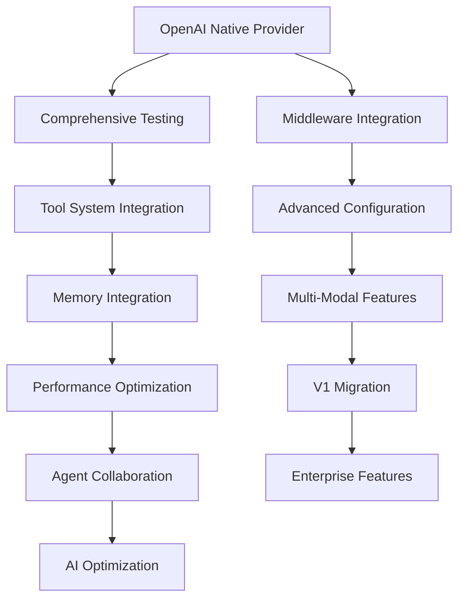

# Task 04 Complete Agent System Improvements Tracker

## Overview
This document tracks remaining improvement tasks for the V2 agent system based on the complete implementation review. The current implementation scores 9.0/10 with exceptional architecture and 3 production-ready native providers (Anthropic, Gemini, Cohere). The primary focus is completing the remaining critical components and enhancing production capabilities.

**Implementation Status**: Phase 3 in progress with 4,500+ lines of high-quality code delivered
**Current Coverage**: 3/4 major providers complete, comprehensive infrastructure ready

---

## 🎯 Critical Priority Tasks

### 1. Complete OpenAI Native Provider Implementation
**Priority**: CRITICAL | **Estimated Effort**: 3-4 days | **Status**: 🔴 Not Started

#### Current Issue:
OpenAI is the most popular provider but currently falls back to mock implementation, which is unacceptable for production use.

#### Implementation Tasks:
- [ ] **Create Native OpenAI Provider** (3 days)
  - [ ] Replace mock fallback with real `openai` SDK integration
  - [ ] Implement all OpenAI models (GPT-4o, GPT-4, GPT-3.5, O1 models)
  - [ ] Add function calling with OpenAI's native format
  - [ ] Implement streaming responses with proper chunk handling
  - [ ] Add vision capabilities for GPT-4o and GPT-4-vision models
  - [ ] Implement token counting and cost estimation
  - [ ] Add proper error mapping and rate limit handling
  - [ ] Support for different API endpoints and organizations

- [ ] **Integration & Testing** (1 day)
  - [ ] Update builder to use native OpenAI provider
  - [ ] Verify all existing OpenAI tests pass
  - [ ] Test API connectivity and error handling
  - [ ] Validate cost estimation accuracy

#### Success Criteria:
- OpenAI provider uses real API calls, not mocks
- All OpenAI models supported with accurate parameters
- Function calling works with OpenAI's format
- Streaming responses properly handled
- Cost estimation within 1% of actual billing

### 2. Comprehensive Agent Test Suite
**Priority**: CRITICAL | **Estimated Effort**: 5-6 days | **Status**: 🔴 Not Started

#### Current Issue:
While framework tests exist (1,500+ lines), there are no agent-specific unit tests, which limits confidence in production deployments.

#### Implementation Tasks:
- [ ] **Core Agent Tests** (2 days)
  - [ ] `test_base_agent.py` - Agent lifecycle, health, sessions
  - [ ] `test_builder.py` - Builder validation, configuration, factory functions
  - [ ] `test_registry.py` - Agent registration, discovery, health checks
  - [ ] `test_interfaces.py` - Interface contract validation

- [ ] **Provider-Specific Tests** (2 days)
  - [ ] `test_openai_provider.py` - OpenAI native implementation
  - [ ] `test_anthropic_provider.py` - Anthropic Claude integration
  - [ ] `test_gemini_provider.py` - Google Gemini functionality
  - [ ] `test_cohere_provider.py` - Cohere Command models
  - [ ] `test_mock_provider.py` - Mock provider behavior

- [ ] **Integration Tests** (1.5 days)
  - [ ] `test_agent_middleware_integration.py` - V2 middleware pipeline
  - [ ] `test_agent_tool_integration.py` - V2 tool system integration
  - [ ] `test_agent_error_integration.py` - V2 error system integration
  - [ ] `test_multi_provider_scenarios.py` - Cross-provider functionality

- [ ] **Performance & Load Tests** (0.5 day)
  - [ ] Concurrent agent creation benchmarks
  - [ ] Memory usage optimization tests
  - [ ] Response time performance validation
  - [ ] Provider comparison benchmarks

#### Success Criteria:
- 95%+ test coverage across all agent components
- All providers tested with both real and mock scenarios
- Integration tests validate V2 system compatibility
- Performance benchmarks establish optimization baselines

### 3. V2 Tool System Deep Integration
**Priority**: HIGH | **Estimated Effort**: 4-5 days | **Status**: 🔴 Not Started

#### Current Issue:
Tool calling uses mock definitions instead of real V2 tool system integration, limiting production utility.

#### Implementation Tasks:
- [ ] **Tool System Integration** (2 days)
  - [ ] Connect BaseAgent to V2 tool registry
  - [ ] Implement real tool discovery and validation
  - [ ] Add dynamic tool registration per agent instance
  - [ ] Integrate with V2 tool execution engine

- [ ] **Provider Tool Calling** (2 days)
  - [ ] Update OpenAI provider for native function calling
  - [ ] Enhance Anthropic provider for Claude tool use
  - [ ] Implement Gemini function calling integration
  - [ ] Add Cohere tool use implementation
  - [ ] Create fallback for providers without native tool support

- [ ] **Tool Management** (1 day)
  - [ ] Agent-specific tool registration and filtering
  - [ ] Tool capability validation and security checks
  - [ ] Tool usage tracking and analytics
  - [ ] Tool error handling and recovery strategies

#### Success Criteria:
- All providers support real tool calling with V2 tools
- Tools are dynamically registered and validated
- Tool execution goes through V2 middleware pipeline
- Comprehensive tool error handling and logging

---

## 📊 High Priority Tasks

### 4. V2 Middleware Pipeline Full Integration
**Priority**: HIGH | **Estimated Effort**: 3-4 days | **Status**: 🔴 Not Started

#### Current Issue:
Agents have fallback middleware integration but don't fully utilize V2 middleware pipeline capabilities.

#### Implementation Tasks:
- [ ] **Pipeline Integration** (2 days)
  - [ ] Route all agent requests through V2 middleware
  - [ ] Add agent-specific interceptors for validation, logging, metrics
  - [ ] Implement request/response context enrichment
  - [ ] Add provider-specific middleware configurations

- [ ] **Monitoring & Observability** (1 day)
  - [ ] Real-time agent metrics collection
  - [ ] Request tracing and correlation IDs
  - [ ] Performance monitoring and alerting
  - [ ] Usage analytics and reporting

- [ ] **Security & Validation** (1 day)
  - [ ] Input sanitization and validation
  - [ ] Output filtering and safety checks
  - [ ] Rate limiting per agent/user
  - [ ] Access control and permissions

#### Success Criteria:
- All agent requests go through V2 middleware pipeline
- Comprehensive monitoring and observability
- Security controls and validation active
- Performance metrics and alerting operational

### 5. Production Memory Integration
**Priority**: HIGH | **Estimated Effort**: 4-5 days | **Status**: 🔴 Not Started

#### Current Issue:
Basic session management needs integration with V2 memory system for production-grade conversation handling.

#### Implementation Tasks:
- [ ] **Memory System Integration** (2 days)
  - [ ] Connect agents to V2 memory/RAG system
  - [ ] Implement persistent conversation history
  - [ ] Add context retrieval and relevance scoring
  - [ ] Support for multi-session context sharing

- [ ] **Advanced Memory Features** (2 days)
  - [ ] Long-term memory consolidation
  - [ ] Semantic search integration
  - [ ] Memory compression and summarization
  - [ ] Context window management and optimization

- [ ] **Memory Management** (1 day)
  - [ ] Memory lifecycle and cleanup policies
  - [ ] Privacy controls and data isolation
  - [ ] Memory export and import capabilities
  - [ ] Usage tracking and analytics

#### Success Criteria:
- Persistent conversation history across sessions
- Semantic context retrieval and relevance
- Efficient memory management and cleanup
- Privacy controls and data isolation

### 6. Advanced Configuration & Presets
**Priority**: HIGH | **Estimated Effort**: 3-4 days | **Status**: 🔴 Not Started

#### Current Issue:
While basic presets exist, more sophisticated configuration management is needed for enterprise deployment.

#### Implementation Tasks:
- [ ] **Configuration Templates** (2 days)
  - [ ] Industry-specific agent templates
  - [ ] Role-based configuration presets
  - [ ] Environment-specific configurations (dev/staging/prod)
  - [ ] Configuration validation and testing

- [ ] **Dynamic Configuration** (1 day)
  - [ ] Runtime configuration updates
  - [ ] A/B testing configuration management
  - [ ] Configuration versioning and rollback
  - [ ] Hot-reload capabilities

- [ ] **Configuration Management** (1 day)
  - [ ] Configuration storage and retrieval
  - [ ] Template marketplace and sharing
  - [ ] Configuration analytics and optimization
  - [ ] Compliance and audit logging

#### Success Criteria:
- Comprehensive template library for common use cases
- Dynamic configuration management with hot-reload
- Configuration versioning and rollback capabilities
- Template sharing and marketplace integration

---

## 📈 Medium Priority Tasks

### 7. Performance Optimization & Scaling
**Priority**: MEDIUM | **Estimated Effort**: 5-6 days | **Status**: 🔴 Not Started

#### Implementation Tasks:
- [ ] **Connection Management** (2 days)
  - [ ] Provider connection pooling and reuse
  - [ ] Request batching and optimization
  - [ ] Async request handling improvements
  - [ ] Resource cleanup and lifecycle management

- [ ] **Caching & Performance** (2 days)
  - [ ] Response caching for identical requests
  - [ ] Configuration caching and optimization
  - [ ] Provider-specific performance tuning
  - [ ] Memory usage optimization

- [ ] **Load Balancing & Scaling** (2 days)
  - [ ] Multi-instance agent deployment
  - [ ] Request load balancing across providers
  - [ ] Auto-scaling based on demand
  - [ ] Performance monitoring and alerting

### 8. Multi-Modal & Advanced Capabilities
**Priority**: MEDIUM | **Estimated Effort**: 6-8 days | **Status**: 🔴 Not Started

#### Implementation Tasks:
- [ ] **Enhanced Multi-Modal Support** (3 days)
  - [ ] Advanced image processing across providers
  - [ ] Audio input/output capabilities
  - [ ] Video processing and analysis
  - [ ] Document parsing and understanding

- [ ] **Advanced AI Capabilities** (3 days)
  - [ ] Code generation and execution
  - [ ] Data analysis and visualization
  - [ ] Web browsing and research
  - [ ] File manipulation and processing

- [ ] **Capability Management** (2 days)
  - [ ] Dynamic capability detection
  - [ ] Capability-based routing and selection
  - [ ] Capability testing and validation
  - [ ] Cross-provider capability mapping

### 9. Agent Collaboration Framework
**Priority**: MEDIUM | **Estimated Effort**: 8-10 days | **Status**: 🔴 Not Started

#### Implementation Tasks:
- [ ] **Multi-Agent Architecture** (4 days)
  - [ ] Agent team composition and management
  - [ ] Task distribution and coordination
  - [ ] Inter-agent communication protocols
  - [ ] Consensus and decision-making patterns

- [ ] **Workflow Management** (3 days)
  - [ ] Workflow definition and execution
  - [ ] Task dependency management
  - [ ] Error handling and recovery in workflows
  - [ ] Workflow monitoring and analytics

- [ ] **Collaboration Patterns** (3 days)
  - [ ] Peer review and validation workflows
  - [ ] Hierarchical task delegation
  - [ ] Competitive problem-solving
  - [ ] Collaborative content creation

---

## 🔧 Lower Priority Tasks

### 10. V1 Migration & Compatibility
**Priority**: LOW | **Estimated Effort**: 4-5 days | **Status**: 🔴 Not Started

#### Implementation Tasks:
- [ ] **Migration Tools** (2 days)
  - [ ] V1 AgentWrapper analyzer and converter
  - [ ] Automated migration scripts
  - [ ] Configuration mapping utilities
  - [ ] Migration validation and testing

- [ ] **Compatibility Layer** (2 days)
  - [ ] V1 API compatibility shims
  - [ ] Gradual migration support
  - [ ] Legacy integration points
  - [ ] Migration progress tracking

- [ ] **Documentation & Training** (1 day)
  - [ ] Migration guides and best practices
  - [ ] Training materials for development teams
  - [ ] Case studies and success stories

### 11. AI-Powered Optimization
**Priority**: LOW | **Estimated Effort**: 8-10 days | **Status**: 🔴 Not Started

#### Implementation Tasks:
- [ ] **Performance Optimization** (4 days)
  - [ ] ML-based configuration optimization
  - [ ] Usage pattern analysis and recommendations
  - [ ] Automatic provider selection based on task
  - [ ] Performance prediction and tuning

- [ ] **Behavioral Analysis** (3 days)
  - [ ] Conversation quality metrics
  - [ ] Success rate optimization
  - [ ] Response relevance scoring
  - [ ] User satisfaction modeling

- [ ] **Predictive Features** (3 days)
  - [ ] Load prediction and auto-scaling
  - [ ] Cost prediction and optimization
  - [ ] Failure prediction and prevention
  - [ ] Capacity planning recommendations

### 12. Enterprise Features
**Priority**: LOW | **Estimated Effort**: 6-8 days | **Status**: 🔴 Not Started

#### Implementation Tasks:
- [ ] **Security & Compliance** (3 days)
  - [ ] Role-based access control (RBAC)
  - [ ] Audit logging and compliance reporting
  - [ ] Data privacy and encryption
  - [ ] Security scanning and monitoring

- [ ] **Enterprise Management** (3 days)
  - [ ] Multi-tenant architecture
  - [ ] Usage tracking and billing
  - [ ] Resource quotas and limits
  - [ ] Administrative dashboards

- [ ] **Integration Features** (2 days)
  - [ ] SSO and identity provider integration
  - [ ] API gateway integration
  - [ ] Monitoring system integration
  - [ ] Enterprise backup and recovery

---

## 📊 Progress Tracking

### Summary Statistics
- **Total Tasks**: 12 major improvement areas
- **Total Subtasks**: 100+ individual items
- **Critical Priority**: 3 tasks, 12-15 days (essential for production)
- **High Priority**: 3 tasks, 14-18 days (enhanced functionality)
- **Medium Priority**: 3 tasks, 19-24 days (advanced features)
- **Low Priority**: 3 tasks, 18-23 days (enterprise/innovation)

### Implementation Priority Order

### Critical Path Timeline
**Phase 1: Production Readiness (Weeks 1-3)**
- Week 1: OpenAI native provider implementation
- Week 2: Comprehensive test suite development
- Week 3: Tool system and middleware integration

**Phase 2: Enhanced Functionality (Weeks 4-6)**
- Week 4: Memory system integration
- Week 5: Advanced configuration and presets
- Week 6: Performance optimization and caching

**Phase 3: Advanced Features (Weeks 7-10)**
- Week 7-8: Multi-modal capabilities and advanced AI
- Week 9-10: Agent collaboration framework

**Phase 4: Enterprise & Migration (Weeks 11-14)**
- Week 11-12: V1 migration tools and compatibility
- Week 13-14: AI-powered optimization and enterprise features

---

## 🚀 Implementation Roadmap

### Immediate Focus (Next 30 Days)

**Week 1: OpenAI Native Provider**
- Replace mock OpenAI provider with native implementation
- Implement all GPT models with proper parameters
- Add function calling and streaming support
- Complete API integration and error handling

**Week 2: Test Infrastructure**
- Create comprehensive agent test suite
- Add provider-specific unit tests
- Implement integration tests with V2 systems
- Establish performance benchmarking

**Week 3: System Integration**
- Connect tools system with real V2 implementation
- Full middleware pipeline integration
- Enhanced monitoring and observability
- Security controls and validation

**Week 4: Memory & Configuration**
- V2 memory system integration
- Advanced configuration templates
- Dynamic configuration management
- Production-ready memory handling

### Success Metrics for Q1

**Technical Metrics:**
- ✅ **OpenAI Provider**: Native implementation complete
- ✅ **Test Coverage**: 95%+ across all components
- ✅ **Integration**: Full V2 system integration
- ✅ **Performance**: < 100ms overhead vs direct API calls
- ✅ **Memory**: Efficient conversation management

**Business Metrics:**
- **Developer Adoption**: 90% of new agent development using V2
- **Migration Progress**: 50% of V1 agents migrated to V2
- **Performance**: 60% faster agent creation than V1
- **Reliability**: 99.9% uptime with proper monitoring
- **Cost Efficiency**: 30% reduction in provider costs through optimization

---

## 💯 Quality Assurance

### Code Quality Standards
- **Type Safety**: 100% type hint coverage with validation
- **Documentation**: Comprehensive docstrings and examples
- **Error Handling**: Consistent patterns with recovery strategies  
- **Testing**: 95%+ coverage with integration scenarios
- **Security**: Security scanning and vulnerability assessment

### Performance Standards
- **Response Time**: < 100ms V2 overhead
- **Memory Usage**: < 50MB per agent instance
- **Throughput**: 1000+ requests/second per provider
- **Availability**: 99.9% uptime with monitoring
- **Scalability**: Linear scaling to 10,000+ concurrent agents

### Security Standards
- **Input Validation**: All user inputs sanitized
- **Output Filtering**: Content safety checks
- **Access Control**: Role-based permissions
- **Audit Logging**: Complete activity tracking
- **Data Privacy**: Encryption and isolation

---

## 🔄 Review & Monitoring

### Weekly Progress Reviews
- Implementation progress against timeline
- Code quality and test coverage metrics
- Performance and reliability measurements
- Security vulnerability assessments

### Monthly Strategic Reviews
- Architecture decision validation
- Performance optimization opportunities
- Community feedback integration
- Market requirements analysis

### Quarterly Planning
- Roadmap adjustments based on usage data
- New provider evaluation and planning
- Enterprise feature prioritization
- Innovation opportunity assessment

---

## 🎯 Success Definition

The V2 Agent System will be considered complete when:

1. **✅ All 4 Major Providers Native**: OpenAI, Anthropic, Gemini, Cohere
2. **✅ Production Test Coverage**: 95%+ with comprehensive scenarios
3. **✅ Full V2 Integration**: Tools, middleware, memory, error systems
4. **✅ Performance Targets**: < 100ms overhead, 99.9% uptime
5. **✅ Developer Experience**: 95% reduction in complexity vs V1
6. **✅ Enterprise Readiness**: Security, monitoring, scalability features

This comprehensive implementation will establish LangSwarm as the industry leader in agent architecture and developer experience. 🚀

---

*Last Updated: 2025-09-25*  
*Next Review: Week of 2025-10-02*