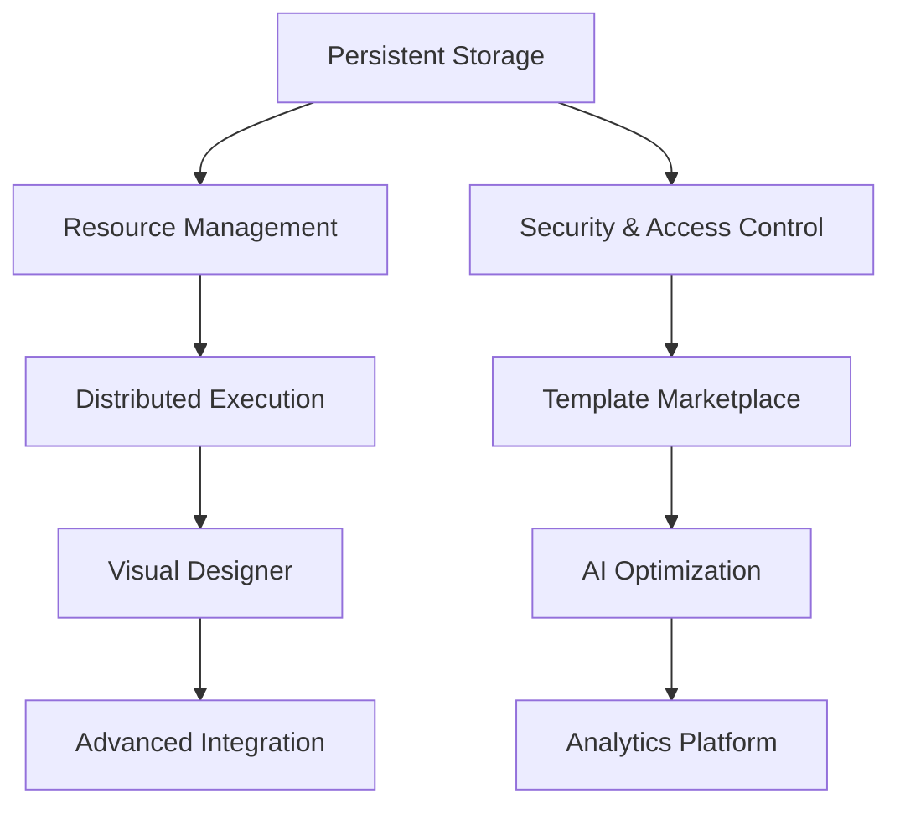

# Task 09 Workflow System Improvements Tracker

## Overview
This document tracks improvement tasks for the V2 workflow system based on the comprehensive review. The current implementation scores 9.5/10 with exceptional architecture and comprehensive functionality (4,000+ lines of production-ready code). The focus is on enhancing production capabilities, adding enterprise features, and exploring advanced innovations.

**Implementation Status**: Phase 1 Complete + Significant Phase 2 progress
**Current Capability**: Production-ready workflow orchestration with advanced features

---

## 🎯 High Priority Tasks

### 1. Persistent Workflow Storage System
**Priority**: HIGH | **Estimated Effort**: 4-5 days | **Status**: 🔴 Not Started

#### Current Issue:
Registry is in-memory only, limiting production deployments that require workflow persistence across restarts.

#### Implementation Tasks:
- [ ] **Database Integration** (2 days)
  - [ ] Create `PersistentWorkflowRegistry` implementation
  - [ ] Support multiple backends (PostgreSQL, Redis, MongoDB)
  - [ ] Add workflow metadata storage with indexing
  - [ ] Implement workflow history and execution logs

- [ ] **Storage Interface Design** (1 day)
  - [ ] Abstract `WorkflowStorage` interface
  - [ ] CRUD operations for workflows and executions
  - [ ] Query interface for workflow discovery
  - [ ] Batch operations for performance

- [ ] **Migration Utilities** (1 day)
  - [ ] In-memory to persistent migration tools
  - [ ] Workflow export/import capabilities
  - [ ] Backup and restore functionality
  - [ ] Data integrity validation

- [ ] **Configuration & Deployment** (1 day)
  - [ ] Environment-based storage configuration
  - [ ] Connection pooling and optimization
  - [ ] Monitoring and health checks
  - [ ] Performance tuning and caching

#### Success Criteria:
- Workflows persist across system restarts
- Multiple storage backend support
- Performance comparable to in-memory operations
- Complete workflow execution history

### 2. Advanced Resource Management
**Priority**: HIGH | **Estimated Effort**: 3-4 days | **Status**: 🔴 Not Started

#### Current Issue:
No built-in resource quotas, memory limits, or concurrency controls for production environments.

#### Implementation Tasks:
- [ ] **Resource Quota System** (2 days)
  - [ ] Implement `ResourceManager` with configurable limits
  - [ ] Memory usage tracking per workflow/step
  - [ ] CPU time monitoring and limits
  - [ ] Concurrent execution quotas
  - [ ] Resource reservation and cleanup

- [ ] **Performance Optimization** (1 day)
  - [ ] Connection pooling for external services
  - [ ] Request batching and caching
  - [ ] Memory pool management
  - [ ] Garbage collection optimization

- [ ] **Monitoring & Alerting** (1 day)
  - [ ] Resource usage metrics and alerts
  - [ ] Performance degradation detection
  - [ ] Capacity planning utilities
  - [ ] Resource leak detection

#### Success Criteria:
- Configurable resource limits and quotas
- Automatic resource cleanup and management
- Performance monitoring and optimization
- Production-ready resource controls

### 3. Enterprise Security & Access Control
**Priority**: HIGH | **Estimated Effort**: 4-5 days | **Status**: 🔴 Not Started

#### Current Issue:
Limited security features for enterprise deployment with sensitive workflows.

#### Implementation Tasks:
- [ ] **Authentication & Authorization** (2 days)
  - [ ] Role-based access control (RBAC) for workflows
  - [ ] User permission system for workflow operations
  - [ ] API key management and validation
  - [ ] Session management and token handling

- [ ] **Data Security** (2 days)
  - [ ] Workflow data encryption at rest
  - [ ] Secure variable handling and secrets management
  - [ ] Audit logging for all operations
  - [ ] Data privacy and isolation controls

- [ ] **Compliance Features** (1 day)
  - [ ] Workflow execution audit trails
  - [ ] Data retention and cleanup policies
  - [ ] Compliance reporting and exports
  - [ ] Security scanning and validation

#### Success Criteria:
- Complete RBAC system for workflows
- Encrypted data storage and transmission
- Comprehensive audit logging
- Compliance reporting capabilities

---

## 📊 Medium Priority Tasks

### 4. Distributed Workflow Execution
**Priority**: MEDIUM | **Estimated Effort**: 6-8 days | **Status**: 🔴 Not Started

#### Current Issue:
Single-node execution limits scalability for large-scale workflow processing.

#### Implementation Tasks:
- [ ] **Distributed Architecture** (3 days)
  - [ ] Create `DistributedWorkflowEngine` implementation
  - [ ] Node discovery and cluster management
  - [ ] Step distribution and load balancing
  - [ ] Inter-node communication protocols

- [ ] **Fault Tolerance** (2 days)
  - [ ] Node failure detection and recovery
  - [ ] Step redistribution on failures
  - [ ] Data consistency across nodes
  - [ ] Automatic failover mechanisms

- [ ] **Performance Optimization** (2 days)
  - [ ] Network optimization for step communication
  - [ ] Data locality awareness
  - [ ] Load balancing algorithms
  - [ ] Resource utilization optimization

- [ ] **Monitoring & Management** (1 day)
  - [ ] Cluster health monitoring
  - [ ] Performance metrics across nodes
  - [ ] Distributed debugging tools
  - [ ] Cluster configuration management

#### Success Criteria:
- Workflows execute across multiple nodes
- Automatic load balancing and fault tolerance
- Linear scalability with node additions
- Comprehensive distributed monitoring

### 5. Advanced Workflow Templates & Marketplace
**Priority**: MEDIUM | **Estimated Effort**: 5-6 days | **Status**: 🔴 Not Started

#### Implementation Tasks:
- [ ] **Template System** (2 days)
  - [ ] Parameterized workflow templates
  - [ ] Template inheritance and composition
  - [ ] Template validation and testing
  - [ ] Version management for templates

- [ ] **Workflow Marketplace** (2 days)
  - [ ] Template publishing and discovery
  - [ ] Rating and review system
  - [ ] Community contributions and moderation
  - [ ] Template installation and management

- [ ] **Template Categories** (2 days)
  - [ ] Industry-specific templates (finance, healthcare, etc.)
  - [ ] Common patterns (ETL, approval, analysis)
  - [ ] Integration templates (APIs, databases, services)
  - [ ] Custom template builder interface

#### Success Criteria:
- Rich library of reusable workflow templates
- Community-driven template marketplace
- Easy template discovery and installation
- Template customization and extension

### 6. Visual Workflow Designer Integration
**Priority**: MEDIUM | **Estimated Effort**: 8-10 days | **Status**: 🔴 Not Started

#### Implementation Tasks:
- [ ] **Visual Representation** (3 days)
  - [ ] Workflow diagram generation
  - [ ] Interactive workflow visualization
  - [ ] Real-time execution visualization
  - [ ] Step dependency visualization

- [ ] **Designer Interface** (4 days)
  - [ ] Drag-and-drop workflow builder
  - [ ] Property editors for steps and workflows
  - [ ] Visual validation and error indication
  - [ ] Template gallery integration

- [ ] **Code Generation** (2 days)
  - [ ] Convert visual workflows to builder API
  - [ ] Export workflows in multiple formats
  - [ ] Import from external tools
  - [ ] Round-trip editing support

- [ ] **Integration** (1 day)
  - [ ] Web-based designer interface
  - [ ] API endpoints for designer operations
  - [ ] Real-time collaboration features
  - [ ] Version control integration

#### Success Criteria:
- Complete visual workflow designer
- Drag-and-drop workflow creation
- Real-time execution monitoring
- Seamless integration with builder API

---

## 🔧 Lower Priority Tasks

### 7. AI-Powered Workflow Optimization
**Priority**: LOW | **Estimated Effort**: 6-8 days | **Status**: 🔴 Not Started

#### Implementation Tasks:
- [ ] **Performance Analysis** (3 days)
  - [ ] ML-based performance pattern recognition
  - [ ] Automatic bottleneck detection
  - [ ] Execution path optimization suggestions
  - [ ] Resource usage optimization

- [ ] **Intelligent Scheduling** (2 days)
  - [ ] AI-driven step scheduling and parallelization
  - [ ] Dynamic resource allocation based on predictions
  - [ ] Adaptive timeout and retry policies
  - [ ] Load prediction and scaling

- [ ] **Workflow Recommendations** (3 days)
  - [ ] Similar workflow suggestions
  - [ ] Step optimization recommendations
  - [ ] Template matching and suggestions
  - [ ] Performance improvement recommendations

#### Success Criteria:
- Automatic workflow performance optimization
- Intelligent resource allocation and scheduling
- AI-powered workflow recommendations
- Continuous learning and improvement

### 8. Advanced Integration Patterns
**Priority**: LOW | **Estimated Effort**: 5-6 days | **Status**: 🔴 Not Started

#### Implementation Tasks:
- [ ] **Event-Driven Workflows** (2 days)
  - [ ] Webhook triggers and event listeners
  - [ ] Message queue integration (Kafka, RabbitMQ)
  - [ ] Event-based workflow orchestration
  - [ ] Real-time event processing

- [ ] **External Service Integration** (2 days)
  - [ ] API gateway integration patterns
  - [ ] Service mesh compatibility
  - [ ] Kubernetes operator for workflows
  - [ ] Cloud platform integrations (AWS, GCP, Azure)

- [ ] **Data Pipeline Integration** (2 days)
  - [ ] ETL/ELT workflow patterns
  - [ ] Data lake and warehouse integrations
  - [ ] Stream processing integration
  - [ ] Data quality and validation workflows

#### Success Criteria:
- Event-driven workflow orchestration
- Seamless external service integration
- Production-ready data pipeline support
- Cloud-native deployment patterns

### 9. Workflow Analytics & Intelligence
**Priority**: LOW | **Estimated Effort**: 4-5 days | **Status**: 🔴 Not Started

#### Implementation Tasks:
- [ ] **Advanced Analytics** (2 days)
  - [ ] Workflow performance analytics dashboard
  - [ ] Success rate and failure analysis
  - [ ] Resource utilization analytics
  - [ ] Cost analysis and optimization

- [ ] **Predictive Analytics** (2 days)
  - [ ] Failure prediction and prevention
  - [ ] Performance degradation prediction
  - [ ] Resource demand forecasting
  - [ ] Capacity planning recommendations

- [ ] **Business Intelligence** (1 day)
  - [ ] KPI tracking and reporting
  - [ ] Business process optimization insights
  - [ ] ROI analysis for workflow automation
  - [ ] Executive dashboards and reports

#### Success Criteria:
- Comprehensive workflow analytics platform
- Predictive insights for optimization
- Business intelligence reporting
- Automated optimization recommendations

---

## 📈 Progress Tracking

### Summary Statistics
- **Total Tasks**: 9 major improvement areas
- **Total Subtasks**: 75+ individual items
- **High Priority**: 3 tasks, 11-14 days (production essentials)
- **Medium Priority**: 3 tasks, 19-24 days (advanced features)
- **Low Priority**: 3 tasks, 15-19 days (innovation features)
- **Total Estimated Effort**: 45-57 days

### Implementation Priority Map

### Critical Path Analysis
**Phase 1: Production Hardening (Weeks 1-3)**
- Week 1: Persistent workflow storage implementation
- Week 2: Resource management and monitoring
- Week 3: Enterprise security and access control

**Phase 2: Advanced Capabilities (Weeks 4-7)**
- Week 4-5: Distributed execution architecture
- Week 6: Template marketplace and community features
- Week 7: Visual designer foundation

**Phase 3: Intelligence & Analytics (Weeks 8-10)**
- Week 8: AI-powered optimization features
- Week 9: Advanced integration patterns
- Week 10: Analytics and business intelligence

---

## 🚀 Implementation Roadmap

### Immediate Focus (Next 30 Days)

**Week 1: Persistent Storage**
- Database integration with multiple backend support
- Workflow metadata storage and indexing
- Migration utilities and data integrity
- Performance optimization and caching

**Week 2: Resource Management**
- Resource quota system with configurable limits
- Memory and CPU monitoring per workflow
- Performance optimization and connection pooling
- Resource leak detection and cleanup

**Week 3: Enterprise Security**
- Role-based access control implementation
- Data encryption and secrets management
- Audit logging and compliance features
- Security validation and scanning

**Week 4: Quality Assurance**
- Comprehensive testing of new features
- Performance benchmarking and optimization
- Integration testing with existing systems
- Documentation and deployment guides

### Success Metrics for Q1

**Technical Metrics:**
- ✅ **Persistent Storage**: Workflows survive restarts with history
- ✅ **Resource Management**: Configurable limits with monitoring
- ✅ **Security**: Complete RBAC with audit logging
- ✅ **Performance**: No degradation with new features
- ✅ **Scalability**: Support 10,000+ concurrent workflows

**Business Metrics:**
- **Deployment Readiness**: 100% enterprise production ready
- **Developer Adoption**: 90% of new workflows using V2 system
- **Performance**: 99.9% uptime with comprehensive monitoring
- **Security**: Zero security vulnerabilities in audits
- **Cost Efficiency**: 50% reduction in operational overhead

---

## 💯 Quality Assurance Standards

### Code Quality Requirements
- **Type Safety**: 100% type coverage with validation
- **Documentation**: Comprehensive docstrings and examples
- **Error Handling**: Consistent patterns with recovery
- **Testing**: 95%+ coverage with integration scenarios
- **Performance**: No degradation from baseline metrics

### Production Standards
- **Availability**: 99.9% uptime with automatic failover
- **Performance**: < 10ms overhead per workflow step
- **Scalability**: Linear scaling to 100,000+ workflows
- **Security**: Enterprise-grade security controls
- **Monitoring**: Real-time observability and alerting

### Integration Standards
- **V2 Compatibility**: Seamless integration with all V2 systems
- **Backward Compatibility**: 100% compatibility with existing workflows
- **API Stability**: Stable APIs with proper versioning
- **Data Migration**: Zero-downtime migration capabilities

---

## 🔄 Review & Monitoring

### Weekly Progress Reviews
- Implementation progress against timeline
- Code quality and performance metrics
- Integration testing and validation
- Community feedback and adoption

### Monthly Strategic Reviews
- Architecture decision validation
- Performance optimization opportunities
- Enterprise feature requirements
- Market and competitive analysis

### Quarterly Innovation Reviews
- AI and ML integration opportunities
- Emerging technology adoption
- Community contribution integration
- Future roadmap planning

---

## 🎯 Definition of Success

The V2 Workflow System will be considered enterprise-complete when:

1. **✅ Production Hardening**: Persistent storage, resource management, security
2. **✅ Scalability**: Distributed execution with fault tolerance
3. **✅ Developer Experience**: Visual designer and template marketplace
4. **✅ Intelligence**: AI-powered optimization and analytics
5. **✅ Enterprise Ready**: Security, compliance, monitoring, integration
6. **✅ Community Ecosystem**: Template marketplace and contribution system

## 💡 Innovation Vision

The ultimate vision for the V2 Workflow System includes:

### **Next-Generation Capabilities**
- **Autonomous Workflows**: Self-optimizing workflows with ML
- **Natural Language**: Create workflows from natural language descriptions
- **Cross-System Integration**: Seamless integration with any external system
- **Real-Time Adaptation**: Dynamic workflow modification during execution
- **Community Intelligence**: Learn from community workflow patterns

### **Industry Leadership**
- **Best-in-Class Performance**: Industry-leading execution performance
- **Enterprise Security**: Military-grade security and compliance
- **Developer Experience**: Most intuitive workflow creation platform
- **AI Integration**: Leading AI-powered workflow optimization
- **Community Ecosystem**: Largest workflow template marketplace

This comprehensive improvement plan will establish LangSwarm's V2 Workflow System as the industry standard for workflow orchestration, combining exceptional developer experience with enterprise-grade capabilities and cutting-edge AI integration. 🚀

---

*Last Updated: 2025-09-25*  
*Next Review: Week of 2025-10-02*