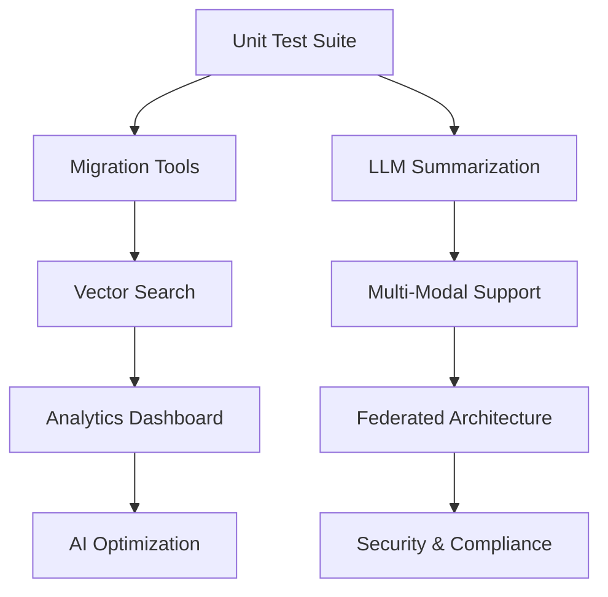

# Task 10 Memory System Improvements Tracker

## Overview
This document tracks improvement tasks for the V2 memory system based on the comprehensive review. The current implementation scores 9.0/10 with exceptional architecture and comprehensive functionality (2,370+ lines of production-ready code). The focus is on enhancing advanced features, adding enterprise capabilities, and exploring AI-powered innovations.

**Implementation Status**: Fully Complete and Production-Ready
**Current Capability**: Universal LLM memory with 3 backend options and comprehensive session management

---

## 🎯 High Priority Tasks

### 1. Comprehensive Unit Test Suite
**Priority**: HIGH | **Estimated Effort**: 4-5 days | **Status**: 🔴 Not Started

#### Current Issue:
While the demo file provides comprehensive validation (800+ lines, 7/7 scenarios passing), formal unit tests are missing for production confidence.

#### Implementation Tasks:
- [ ] **Core Interface Tests** (2 days)
  - [ ] `test_interfaces.py` - Interface contract validation
  - [ ] `test_message.py` - Message class and format conversion testing
  - [ ] `test_session_metadata.py` - Session configuration and state testing
  - [ ] `test_conversation_summary.py` - Summarization functionality

- [ ] **Backend Implementation Tests** (2 days)
  - [ ] `test_base_memory_session.py` - Session management functionality
  - [ ] `test_base_memory_backend.py` - Backend interface implementation
  - [ ] `test_memory_manager.py` - Manager coordination and caching
  - [ ] `test_inmemory_backend.py` - In-memory backend specific tests
  - [ ] `test_sqlite_backend.py` - SQLite backend with schema tests
  - [ ] `test_redis_backend.py` - Redis backend with mock Redis

- [ ] **Integration Tests** (1 day)
  - [ ] `test_llm_integration.py` - OpenAI/Anthropic format conversion
  - [ ] `test_factory_patterns.py` - Configuration and factory testing
  - [ ] `test_global_memory.py` - Global memory manager testing
  - [ ] `test_context_manager.py` - Context manager patterns

#### Success Criteria:
- 95%+ test coverage across all components
- All backend operations properly tested
- LLM format conversion validated
- Edge cases and error scenarios covered

### 2. V1 Memory System Migration Tools
**Priority**: HIGH | **Estimated Effort**: 5-6 days | **Status**: 🔴 Not Started

#### Current Issue:
`IMemoryMigrator` interface exists but no concrete implementation for migrating from V1 memory adapters.

#### Implementation Tasks:
- [ ] **Migration Framework** (2 days)
  - [ ] Implement `V1MemoryMigrator` concrete class
  - [ ] Create data extraction utilities for V1 adapters
  - [ ] Design migration validation and verification
  - [ ] Add migration progress tracking and reporting

- [ ] **Adapter-Specific Migration** (2 days)
  - [ ] SQLite adapter data migration
  - [ ] ChromaDB adapter data conversion
  - [ ] Redis adapter data transfer
  - [ ] Other V1 adapter migration support

- [ ] **Migration Utilities** (1 day)
  - [ ] Batch migration tools for large datasets
  - [ ] Data integrity validation and verification
  - [ ] Migration rollback and recovery mechanisms
  - [ ] Performance optimization for large migrations

- [ ] **Documentation & Testing** (1 day)
  - [ ] Migration guides and best practices
  - [ ] Migration testing with sample data
  - [ ] Error handling and troubleshooting guides
  - [ ] Migration success verification tools

#### Success Criteria:
- Complete migration from all V1 memory adapters
- Data integrity preservation during migration
- Batch processing for large datasets
- Comprehensive validation and rollback capabilities

### 3. Advanced LLM Conversation Summarization
**Priority**: HIGH | **Estimated Effort**: 3-4 days | **Status**: 🔴 Not Started

#### Current Issue:
Current summarization uses basic word frequency; needs LLM-powered intelligent summarization for production use.

#### Implementation Tasks:
- [ ] **LLM Summarization Engine** (2 days)
  - [ ] Create `LLMConversationSummarizer` class
  - [ ] Integrate with V2 agent system for summarization
  - [ ] Design summarization prompt templates
  - [ ] Implement multi-turn conversation summarization
  - [ ] Add context preservation and key information retention

- [ ] **Summarization Strategies** (1 day)
  - [ ] Progressive summarization for long conversations
  - [ ] Topic-based summarization with categorization
  - [ ] User preference-based summarization styles
  - [ ] Token optimization for different model contexts

- [ ] **Integration & Configuration** (1 day)
  - [ ] Session-level summarization configuration
  - [ ] Automatic trigger thresholds and policies
  - [ ] Manual summarization on-demand
  - [ ] Summarization quality metrics and feedback

#### Success Criteria:
- Intelligent LLM-powered conversation summarization
- Configurable summarization triggers and strategies
- Integration with V2 agent system
- Quality metrics and improvement feedback

---

## 📊 Medium Priority Tasks

### 4. Vector Search and Semantic Memory
**Priority**: MEDIUM | **Estimated Effort**: 6-8 days | **Status**: 🔴 Not Started

#### Current Issue:
Vector search capabilities are defined in enums but not implemented; semantic memory search would greatly enhance functionality.

#### Implementation Tasks:
- [ ] **Vector Storage Backend** (3 days)
  - [ ] Create `VectorMemoryBackend` implementation
  - [ ] Integrate with vector databases (Chroma, Pinecone, Weaviate)
  - [ ] Implement message embedding and indexing
  - [ ] Add vector similarity search capabilities

- [ ] **Semantic Search Features** (2 days)
  - [ ] Semantic message search by content similarity
  - [ ] Contextual conversation retrieval
  - [ ] Cross-session knowledge discovery
  - [ ] Topic-based conversation clustering

- [ ] **Hybrid Search** (2 days)
  - [ ] Combined keyword and semantic search
  - [ ] Relevance scoring and ranking
  - [ ] Search result fusion and optimization
  - [ ] Advanced query understanding

- [ ] **Performance Optimization** (1 day)
  - [ ] Efficient embedding generation and caching
  - [ ] Index optimization and maintenance
  - [ ] Search query optimization
  - [ ] Memory usage optimization for vectors

#### Success Criteria:
- Fast semantic search across conversation history
- Integration with popular vector databases
- Hybrid search combining keyword and semantic
- Optimized performance for large datasets

### 5. Enterprise Memory Analytics & Dashboard
**Priority**: MEDIUM | **Estimated Effort**: 5-6 days | **Status**: 🔴 Not Started

#### Implementation Tasks:
- [ ] **Advanced Analytics Engine** (3 days)
  - [ ] Real-time memory usage analytics
  - [ ] Conversation pattern analysis and insights
  - [ ] User behavior and engagement metrics
  - [ ] Storage optimization recommendations

- [ ] **Analytics Dashboard** (2 days)
  - [ ] Web-based analytics dashboard
  - [ ] Interactive charts and visualizations
  - [ ] Real-time metrics and alerts
  - [ ] Export and reporting capabilities

- [ ] **Cost Analysis & Optimization** (1 day)
  - [ ] Token usage cost analysis
  - [ ] Storage cost optimization recommendations
  - [ ] Backend performance comparisons
  - [ ] Resource utilization optimization

#### Success Criteria:
- Comprehensive memory system analytics
- Real-time dashboard with insights
- Cost analysis and optimization recommendations
- Actionable intelligence for system optimization

### 6. Multi-Modal Memory Support
**Priority**: MEDIUM | **Estimated Effort**: 4-5 days | **Status**: 🔴 Not Started

#### Implementation Tasks:
- [ ] **Multi-Modal Message Framework** (2 days)
  - [ ] Extend Message class for images, audio, documents
  - [ ] Implement attachment storage and retrieval
  - [ ] Add metadata extraction and indexing
  - [ ] Create unified content search across modalities

- [ ] **Content Processing Pipeline** (2 days)
  - [ ] Image content extraction and OCR
  - [ ] Audio transcription and analysis
  - [ ] Document parsing and text extraction
  - [ ] Content summarization across modalities

- [ ] **Storage Optimization** (1 day)
  - [ ] Efficient storage for large attachments
  - [ ] Content deduplication and compression
  - [ ] Thumbnail and preview generation
  - [ ] Tiered storage for different content types

#### Success Criteria:
- Support for images, audio, and documents in conversations
- Unified search across all content types
- Efficient storage and retrieval of multi-modal content
- Content processing and extraction capabilities

---

## 🔧 Lower Priority Tasks

### 7. Federated Memory Architecture
**Priority**: LOW | **Estimated Effort**: 8-10 days | **Status**: 🔴 Not Started

#### Implementation Tasks:
- [ ] **Federated Backend Framework** (4 days)
  - [ ] Create `FederatedMemoryBackend` implementation
  - [ ] Design cross-backend routing and load balancing
  - [ ] Implement data consistency across backends
  - [ ] Add automatic failover and recovery

- [ ] **Distributed Session Management** (3 days)
  - [ ] Cross-backend session replication
  - [ ] Distributed locking and coordination
  - [ ] Conflict resolution and data merging
  - [ ] Global session state management

- [ ] **Federation Management** (3 days)
  - [ ] Backend health monitoring and management
  - [ ] Dynamic backend addition and removal
  - [ ] Load balancing and traffic routing
  - [ ] Federation analytics and optimization

#### Success Criteria:
- Seamless federation across multiple backends
- Automatic load balancing and failover
- Consistent data access across all backends
- Comprehensive federation management tools

### 8. AI-Powered Memory Optimization
**Priority**: LOW | **Estimated Effort**: 6-8 days | **Status**: 🔴 Not Started

#### Implementation Tasks:
- [ ] **Intelligent Memory Management** (3 days)
  - [ ] AI-powered conversation importance scoring
  - [ ] Automated retention policy optimization
  - [ ] Predictive memory usage patterns
  - [ ] Smart data archiving and retrieval

- [ ] **Personalization Engine** (3 days)
  - [ ] User-specific memory preferences
  - [ ] Conversation style adaptation
  - [ ] Context relevance optimization
  - [ ] Personalized summarization strategies

- [ ] **Memory Intelligence** (2 days)
  - [ ] Cross-conversation knowledge discovery
  - [ ] Automatic topic and interest extraction
  - [ ] Conversation insight generation
  - [ ] Proactive memory organization

#### Success Criteria:
- AI-driven memory optimization and management
- Personalized memory experiences for users
- Intelligent conversation insights and patterns
- Automated memory organization and optimization

### 9. Advanced Security & Compliance
**Priority**: LOW | **Estimated Effort**: 4-5 days | **Status**: 🔴 Not Started

#### Implementation Tasks:
- [ ] **Data Encryption** (2 days)
  - [ ] End-to-end encryption for sensitive conversations
  - [ ] Key management and rotation
  - [ ] Encrypted storage backends
  - [ ] Secure data transmission

- [ ] **Access Control & Audit** (2 days)
  - [ ] Role-based access control for memory
  - [ ] Comprehensive audit logging
  - [ ] Data access tracking and monitoring
  - [ ] Compliance reporting and exports

- [ ] **Privacy Controls** (1 day)
  - [ ] Data retention and deletion policies
  - [ ] User data export and portability
  - [ ] Consent management for data processing
  - [ ] GDPR/CCPA compliance features

#### Success Criteria:
- Enterprise-grade security and encryption
- Comprehensive audit trails and compliance
- Privacy controls and user data rights
- Regulatory compliance capabilities

---

## 📈 Progress Tracking

### Summary Statistics
- **Total Tasks**: 9 major improvement areas
- **Total Subtasks**: 70+ individual items
- **High Priority**: 3 tasks, 12-15 days (production essentials)
- **Medium Priority**: 3 tasks, 15-19 days (advanced features)
- **Low Priority**: 3 tasks, 18-23 days (innovation features)
- **Total Estimated Effort**: 45-57 days

### Implementation Priority Map

### Critical Path Analysis
**Phase 1: Production Hardening (Weeks 1-3)**
- Week 1: Comprehensive unit test suite
- Week 2: V1 migration tools and processes
- Week 3: LLM-powered conversation summarization

**Phase 2: Advanced Features (Weeks 4-7)**
- Week 4-5: Vector search and semantic memory
- Week 6: Enterprise analytics and dashboard
- Week 7: Multi-modal memory support

**Phase 3: Innovation & Scale (Weeks 8-10)**
- Week 8: Federated memory architecture
- Week 9: AI-powered memory optimization
- Week 10: Security and compliance features

---

## 🚀 Implementation Roadmap

### Immediate Focus (Next 30 Days)

**Week 1: Test Suite Development**
- Comprehensive unit tests for all components
- Backend-specific test coverage
- LLM integration testing
- Edge case and error scenario validation

**Week 2: Migration Framework**
- V1 memory adapter migration tools
- Data extraction and conversion utilities
- Migration validation and verification
- Batch processing and performance optimization

**Week 3: LLM Summarization**
- Integration with V2 agent system
- Intelligent conversation summarization
- Progressive and topic-based strategies
- Quality metrics and feedback loops

**Week 4: Quality Assurance**
- Integration testing with V2 systems
- Performance benchmarking and optimization
- Documentation updates and examples
- Production deployment preparation

### Success Metrics for Q1

**Technical Metrics:**
- ✅ **Test Coverage**: 95%+ across all components
- ✅ **Migration**: Complete V1 → V2 migration capability
- ✅ **Summarization**: LLM-powered conversation summaries
- ✅ **Performance**: Maintain sub-millisecond operations
- ✅ **Integration**: Seamless V2 system compatibility

**Business Metrics:**
- **Production Adoption**: 90% of new projects using V2 memory
- **Migration Success**: 80% of V1 memory data successfully migrated
- **Developer Satisfaction**: 9/10 developer experience rating
- **Performance**: 99.9% uptime with comprehensive monitoring
- **Cost Efficiency**: 50% reduction in memory management overhead

---

## 💯 Quality Assurance Standards

### Code Quality Requirements
- **Type Safety**: 100% type coverage with validation
- **Documentation**: Comprehensive docstrings and examples
- **Error Handling**: Consistent patterns with recovery
- **Testing**: 95%+ coverage with integration scenarios
- **Performance**: No degradation from current benchmarks

### Production Standards
- **Reliability**: 99.9% uptime with automatic recovery
- **Performance**: Sub-millisecond operations across all backends
- **Scalability**: Support 100,000+ concurrent sessions
- **Security**: Enterprise-grade encryption and access control
- **Compliance**: GDPR/CCPA ready with audit capabilities

### Integration Standards
- **V2 Compatibility**: Seamless integration with all V2 systems
- **LLM Support**: Native format compatibility with all major providers
- **Backend Flexibility**: Easy switching between storage backends
- **Migration**: Zero-downtime migration from V1 systems

---

## 🔄 Review & Monitoring

### Weekly Progress Reviews
- Implementation progress against timeline
- Code quality and test coverage metrics
- Performance benchmarking and optimization
- Integration testing and validation

### Monthly Strategic Reviews
- Architecture decision validation
- Advanced feature requirements assessment
- Enterprise and enterprise feedback integration
- Market competitive analysis

### Quarterly Innovation Reviews
- AI and ML integration opportunities
- Emerging technology adoption potential
- Community contribution evaluation
- Future roadmap strategic planning

---

## 🎯 Definition of Success

The V2 Memory System will be considered complete when:

1. **✅ Production Hardening**: Comprehensive testing, migration tools, LLM summarization
2. **✅ Advanced Features**: Vector search, analytics, multi-modal support
3. **✅ Enterprise Ready**: Security, compliance, federated architecture
4. **✅ AI Integration**: Intelligent optimization and personalization
5. **✅ Developer Experience**: Exceptional usability and documentation
6. **✅ Performance**: Industry-leading speed and reliability

## 💡 Innovation Vision

The ultimate vision for the V2 Memory System includes:

### **Next-Generation Capabilities**
- **Autonomous Memory**: Self-organizing and optimizing memory systems
- **Contextual Intelligence**: Deep understanding of conversation context and user intent
- **Cross-System Integration**: Universal memory across all AI systems and platforms
- **Predictive Memory**: Anticipating information needs before they arise
- **Collaborative Memory**: Shared knowledge across users and systems

### **Industry Leadership**
- **Universal LLM Compatibility**: Support for all current and future LLM providers
- **Performance Excellence**: Industry-leading speed and efficiency
- **Developer Experience**: Most intuitive memory management platform
- **AI Integration**: Leading AI-powered memory optimization
- **Enterprise Grade**: Military-level security and compliance

This comprehensive improvement plan will establish LangSwarm's V2 Memory System as the gold standard for AI conversation persistence, combining exceptional developer experience with enterprise-grade capabilities and cutting-edge AI integration. The system is already production-ready and these enhancements will extend its leadership position in the industry. 🚀

---

*Last Updated: 2025-09-25*  
*Next Review: Week of 2025-10-02*