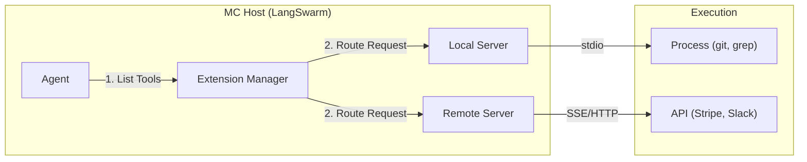

# 🏗️ Tool Architecture

LangSwarm adopts a unified tool architecture built primarily on the **Model Context Protocol (MCP)**. This decouples agents (clients) from the tools they use (servers), allowing for a flexible, secure, and scalable ecosystem.

## 🧩 Core Concepts

The system consists of three main components:

### 1. The Host (LangSwarm)
LangSwarm acts as the **MCP Host**. It manages connection lifecycles, security boundaries, and routes messages between Agents and Servers.

### 2. The Servers (Tools)
Tools run as independent **MCP Servers**. They can be:
- **Local Processes**: Running via `stdio` (e.g. `sqlite`, `filesystem`).
- **Remote Services**: Accessible via `SSE` (Server-Sent Events) over HTTP.

### 3. The Clients (Agents)
Agents are **MCP Clients**. They discover tools from connected servers and invoke them based on their reasoning.

## 🔄 Interaction Flow

When an Agent needs to use a tool, the following flow occurs:

1.  **Discovery**: On start, the Agent asks the Extension Manager for a list of available tools from all connected servers.
2.  **Reasoning**: The Agent (LLM) decides to call a specific tool (e.g., `git.commit`) and generates arguments.
3.  **Routing**: The Agent sends the call to the Extension Manager.
4.  **Execution**:
    *   **Local**: Request is serialized to JSON-RPC and sent to the server's `stdin`.
    *   **Remote**: Request is sent as an HTTP POST to the server's endpoint.
5.  **Result**: The server executes the logic and returns the result (stdout or HTTP response).
6.  **Observation**: The result is fed back to the Agent's context window.

## 🛡️ Security Model

LangSwarm enforces security at the **Host Level**:

*   **Isolation**: Local tools run in their own processes. Crashing a tool server does not crash the agent.
*   **Explicit Access**: Agents only see tools from servers explicitly added (via `add_mcp_server`).
*   **Authentication**: Credentials (API Keys) are managed by the Host and passed securely to Remote Servers via Headers, never exposed to the LLM directly.

## 🔌 Compatibility Layers

While MCP is the standard, LangSwarm maintains internal adapters for:

*   **Native Functions**: Python functions registered directly are wrapped as in-memory MCP servers.
*   **Vector Stores**: Retrievers are exposed as "Search" tools with standardized schemas.

This ensures a unified "Everything is a Tool" experience for the Agent.
