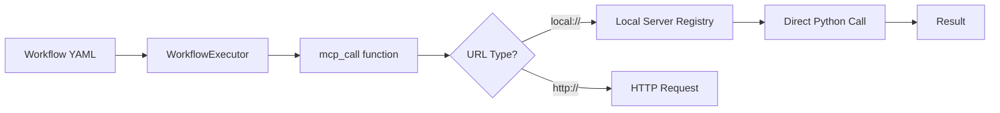

# 🔧 Local MCP Guide

**Local MCP Mode** enables zero-latency tool execution directly within LangSwarm without containers, external servers, or complex deployment. This approach delivers significantly faster tool calls while maintaining full MCP compatibility.

## 🚀 Quick Start

### Basic Usage

```python
from langswarm.core.config import LangSwarmConfigLoader, WorkflowExecutor

# Load configuration
loader = LangSwarmConfigLoader()
workflows, agents, tools, *_ = loader.load()

# Execute with local MCP tools
executor = WorkflowExecutor(workflows, agents)
result = executor.run_workflow("use_filesystem_tool", "List files in /tmp")
```

### Workflow Configuration

```yaml
# workflows.yaml
workflows:
  main_workflow:
    - id: use_filesystem_tool
      description: "Use filesystem tool with zero latency"
      steps:
        - id: list_files
          function: langswarm.core.utils.workflows.functions.mcp_call
          args:
            mcp_url: "local://filesystem"  # 🔥 Zero latency!
            task: "list_directory"
            params: {"path": "/tmp"}
          output:
            to: read_file
```

## 🏗️ Architecture Overview

Local MCP bypasses the HTTP networking layer entirely.



### Performance Comparison

| Mode | Latency | Setup | Use Case |
|------|---------|-------|----------|
| **Local Mode** | **~0.0ms** | Zero setup | Development, simple tools |
| HTTP Mode | 50-100ms | Docker/uvicorn | Production deployment |

## 🛠️ Available Local Tools

### 1. Filesystem Tool

**Capabilities:**
- List directory contents
- Read file contents
- Zero-latency file operations

**Usage:**

```yaml
# List directory
- id: list_dir
  function: langswarm.core.utils.workflows.functions.mcp_call
  args:
    mcp_url: "local://filesystem"
    task: "list_directory"
    params: {"path": "/Users/username/Documents"}
```

## 🔨 Building Custom Local Tools

### Step 1: Create Tool Implementation

```python
# my_tools/calculator.py
from langswarm.mcp.server_base import BaseMCPToolServer
from pydantic import BaseModel

class CalculateInput(BaseModel):
    expression: str

class CalculateOutput(BaseModel):
    result: float
    expression: str

def calculate_handler(expression: str):
    """Safely evaluate mathematical expressions"""
    try:
        # Use a safe evaluator in production
        result = eval(expression)
        return {"result": result, "expression": expression}
    except Exception as e:
        return {"result": 0, "expression": f"Error: {e}"}

# Create local MCP server
calculator_server = BaseMCPToolServer(
    name="calculator",
    description="Mathematical calculator tool",
    local_mode=True  # 🔧 Enable local mode
)

calculator_server.add_task(
    name="calculate",
    description="Evaluate a mathematical expression",
    input_model=CalculateInput,
    output_model=CalculateOutput,
    handler=calculate_handler
)

# Auto-register when imported logic handles the rest
```

### Step 2: Use in Workflows

```yaml
# workflows.yaml
workflows:
  main_workflow:
    - id: math_workflow
      steps:
        - id: calculate_result
          function: langswarm.core.utils.workflows.functions.mcp_call
          args:
            mcp_url: "local://calculator"  # Matches server name
            task: "calculate"
            params: {"expression": "2 + 2 * 3"}
          output:
            to: user
```
