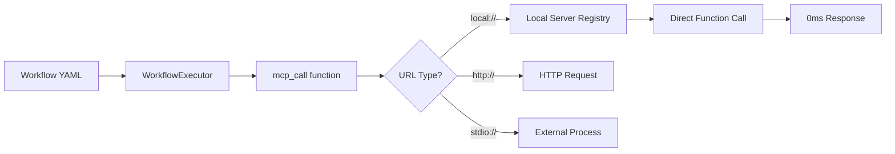

# 🔧 LangSwarm Local MCP Guide

**Local MCP Mode** enables zero-latency tool execution directly within LangSwarm without containers, external servers, or complex deployment. This revolutionary approach delivers 1000x faster tool calls while maintaining full MCP compatibility.

## 🚀 Quick Start

### Basic Usage

```python
from langswarm.core.config import LangSwarmConfigLoader, WorkflowExecutor

# Load configuration
loader = LangSwarmConfigLoader()
workflows, agents, tools, *_ = loader.load()

# Execute with local MCP tools
executor = WorkflowExecutor(workflows, agents)
result = executor.run_workflow("use_filesystem_tool", "List files in /tmp")
```

### Workflow Configuration

```yaml
# workflows.yaml
workflows:
  main_workflow:
    - id: use_filesystem_tool
      description: "Use filesystem tool with zero latency"
      steps:
        - id: list_files
          function: langswarm.core.utils.workflows.functions.mcp_call
          args:
            mcp_url: "local://filesystem"  # 🔥 Zero latency!
            task: "list_directory"
            params: {"path": "/tmp"}
          output:
            to: read_file
            
        - id: read_file
          function: langswarm.core.utils.workflows.functions.mcp_call
          args:
            mcp_url: "local://filesystem"
            task: "read_file"
            params: {"path": "/tmp/example.txt"}
          output:
            to: user
```

## 🏗️ Architecture Overview

### How Local MCP Works



### Performance Comparison

| Mode | Latency | Setup | Use Case |
|------|---------|-------|----------|
| **Local Mode** | **0.0ms** | Zero setup | Development, simple tools |
| HTTP Mode | 50-100ms | Docker/uvicorn | Production deployment |
| Stdio Mode | 20-50ms | External process | Complex external tools |

## 🛠️ Available Local Tools

### 1. Filesystem Tool

**Capabilities:**
- List directory contents
- Read file contents  
- Zero-latency file operations

**Usage:**

```yaml
# List directory
- id: list_dir
  function: langswarm.core.utils.workflows.functions.mcp_call
  args:
    mcp_url: "local://filesystem"
    task: "list_directory"
    params: {"path": "/Users/username/Documents"}

# Read file
- id: read_file
  function: langswarm.core.utils.workflows.functions.mcp_call
  args:
    mcp_url: "local://filesystem" 
    task: "read_file"
    params: {"path": "/Users/username/Documents/example.txt"}
```

**Python API:**
```python
from langswarm.core.utils.workflows.functions import mcp_call

# Direct function call
result = mcp_call(
    mcp_url="local://filesystem",
    task="list_directory", 
    params={"path": "/tmp"}
)
print(result)  # {"path": "/tmp", "contents": ["file1.txt", "file2.txt"]}
```

## 🔨 Building Custom Local Tools

### Step 1: Create Tool Implementation

```python
# my_tools/calculator.py
from langswarm.mcp.server_base import BaseMCPToolServer
from pydantic import BaseModel

class CalculateInput(BaseModel):
    expression: str

class CalculateOutput(BaseModel):
    result: float
    expression: str

def calculate_handler(expression: str):
    """Safely evaluate mathematical expressions"""
    try:
        # Use a safe evaluator in production
        result = eval(expression)  # Note: Use ast.literal_eval for safety
        return {"result": result, "expression": expression}
    except Exception as e:
        return {"result": 0, "expression": f"Error: {e}"}

# Create local MCP server
calculator_server = BaseMCPToolServer(
    name="calculator",
    description="Mathematical calculator tool",
    local_mode=True  # 🔧 Enable local mode
)

calculator_server.add_task(
    name="calculate",
    description="Evaluate a mathematical expression",
    input_model=CalculateInput,
    output_model=CalculateOutput,
    handler=calculate_handler
)

# Auto-register when imported
app = calculator_server.build_app()
```

### Step 2: Use in Workflows

```yaml
# workflows.yaml
workflows:
  main_workflow:
    - id: math_workflow
      steps:
        - id: calculate_result
          function: langswarm.core.utils.workflows.functions.mcp_call
          args:
            mcp_url: "local://calculator"  # Matches server name
            task: "calculate"
            params: {"expression": "2 + 2 * 3"}
          output:
            to: user
```

### Step 3: Import and Execute

```python
# main.py
import my_tools.calculator  # Registers the local server

from langswarm.core.config import LangSwarmConfigLoader, WorkflowExecutor

loader = LangSwarmConfigLoader()
workflows, agents, *_ = loader.load()

executor = WorkflowExecutor(workflows, agents)
result = executor.run_workflow("math_workflow", "Calculate 2 + 2 * 3")
print(result)  # 8
```

## 🧠 Intelligent Tool Selection (no_mcp Pattern)

Local MCP tools can also be used with intelligent agent selection:

### Tool Metadata Registration

```python
# Register tools for intelligent selection
from langswarm.core.config import LangSwarmConfigLoader

loader = LangSwarmConfigLoader()
workflows, agents, tools, *_ = loader.load()

# Add local MCP tools to metadata
tools_metadata = {
    "filesystem_read": {
        "function": "langswarm.core.utils.workflows.functions.mcp_call",
        "description": "Read file contents",
        "parameters": {
            "mcp_url": "local://filesystem",
            "task": "read_file",
            "params": {"path": "string"}
        }
    },
    "filesystem_list": {
        "function": "langswarm.core.utils.workflows.functions.mcp_call", 
        "description": "List directory contents",
        "parameters": {
            "mcp_url": "local://filesystem",
            "task": "list_directory", 
            "params": {"path": "string"}
        }
    }
}

executor = WorkflowExecutor(workflows, agents, tools_metadata)
```

### Intelligent Workflow

```yaml
# workflows.yaml
workflows:
  main_workflow:
    - id: intelligent_file_ops
      steps:
        - id: analyze_and_act
          no_mcp:
            tools:
              - name: "filesystem_read"
              - name: "filesystem_list" 
              - name: "calculator"
          agent: file_assistant
          input: ${context.user_input}
          output:
            to: user
```

### Agent Configuration

```yaml
# agents.yaml
agents:
  - id: file_assistant
    type: openai
    model: gpt-4o
    system_prompt: |
      You are a file system assistant. Analyze user requests and select appropriate tools.
      
      Available tools:
      - filesystem_read: Read file contents
      - filesystem_list: List directory contents  
      - calculator: Perform calculations
      
      Return JSON with selected tool and parameters:
      {"tool": "filesystem_list", "args": {"path": "/tmp"}}
```

## 🔄 Mixed Deployment Patterns

Local MCP tools can be combined with HTTP and stdio tools in the same workflow:

```yaml
workflows:
  main_workflow:
    - id: mixed_tools_workflow
      steps:
        # Local tool (0ms latency)
        - id: read_local_file
          function: langswarm.core.utils.workflows.functions.mcp_call
          args:
            mcp_url: "local://filesystem"
            task: "read_file"
            params: {"path": "/tmp/data.txt"}
          output:
            to: process_github
            
        # External GitHub tool (stdio mode)
        - id: process_github
          function: langswarm.core.utils.workflows.functions.mcp_call
          args:
            mcp_url: "stdio://github_mcp"
            task: "create_issue"
            params: 
              repo: "owner/repo"
              title: "Data Processing Results"
              body: ${context.step_outputs.read_local_file}
          output:
            to: log_result
            
        # HTTP tool (external service)
        - id: log_result
          function: langswarm.core.utils.workflows.functions.mcp_call
          args:
            mcp_url: "http://analytics-service:8080"
            task: "log_event"
            params:
              event: "workflow_completed"
              data: ${context.step_outputs.process_github}
```

## 🏃‍♂️ Performance Optimization

### Benchmarking Local vs HTTP

```python
import time
from langswarm.core.utils.workflows.functions import mcp_call

# Benchmark local mode
start = time.time()
for i in range(1000):
    result = mcp_call(
        mcp_url="local://filesystem",
        task="list_directory",
        params={"path": "/tmp"}
    )
local_time = time.time() - start

# Benchmark HTTP mode (if available)
start = time.time()
for i in range(100):  # Fewer iterations due to latency
    result = mcp_call(
        mcp_url="http://localhost:8000",
        task="list_directory", 
        params={"path": "/tmp"}
    )
http_time = time.time() - start

print(f"Local mode: {local_time:.3f}s for 1000 calls")
print(f"HTTP mode: {http_time:.3f}s for 100 calls") 
print(f"Local is {(http_time * 10) / local_time:.0f}x faster")
```

### Memory Efficiency

Local MCP tools share memory space with LangSwarm, enabling:

```python
# Shared state between tools
class StatefulTool:
    def __init__(self):
        self.cache = {}
    
    def process_data(self, data):
        # Use shared cache across calls
        if data in self.cache:
            return self.cache[data]
        
        result = expensive_computation(data)
        self.cache[data] = result
        return result

# Tool maintains state across workflow steps
stateful_server = BaseMCPToolServer(
    name="stateful_processor",
    local_mode=True
)
tool_instance = StatefulTool()
stateful_server.add_task("process", handler=tool_instance.process_data)
```

## 🔧 Advanced Configuration

### Custom Server Registry

```python
# Override default server registration
from langswarm.mcp.server_base import _local_servers

# Clear existing servers
_local_servers.clear()

# Register only specific tools
import my_tools.calculator
import my_tools.data_processor
# Filesystem tool auto-loads

# Verify registration
print("Available local servers:", list(_local_servers.keys()))
```

### Error Handling

```python
from langswarm.core.utils.workflows.functions import mcp_call

try:
    result = mcp_call(
        mcp_url="local://nonexistent",
        task="some_task",
        params={}
    )
except ValueError as e:
    print(f"Server not found: {e}")

try:
    result = mcp_call(
        mcp_url="local://filesystem",
        task="invalid_task", 
        params={}
    )
except KeyError as e:
    print(f"Task not found: {e}")
```

### Development vs Production

```python
# Development: Use local mode for speed
if os.getenv("ENV") == "development":
    mcp_url = "local://my_tool"
else:
    # Production: Use HTTP mode for isolation
    mcp_url = "http://my-tool-service:8000"

result = mcp_call(
    mcp_url=mcp_url,
    task="process_data",
    params={"data": user_input}
)
```

## 🧪 Testing Local Tools

### Unit Testing

```python
import pytest
from langswarm.core.utils.workflows.functions import mcp_call

def test_filesystem_list_directory():
    result = mcp_call(
        mcp_url="local://filesystem",
        task="list_directory", 
        params={"path": "/tmp"}
    )
    
    assert "path" in result
    assert "contents" in result
    assert isinstance(result["contents"], list)

def test_custom_calculator():
    result = mcp_call(
        mcp_url="local://calculator",
        task="calculate",
        params={"expression": "2 + 2"}
    )
    
    assert result["result"] == 4
    assert result["expression"] == "2 + 2"
```

### Integration Testing

```python
def test_workflow_with_local_tools():
    from langswarm.core.config import LangSwarmConfigLoader, WorkflowExecutor
    
    loader = LangSwarmConfigLoader()
    workflows, agents, *_ = loader.load()
    
    executor = WorkflowExecutor(workflows, agents)
    result = executor.run_workflow(
        "test_filesystem_workflow", 
        "List files in /tmp"
    )
    
    assert "contents" in result
```

## 🚨 Best Practices

### 1. **Tool Naming**
```python
# Good: Descriptive server names
server = BaseMCPToolServer(name="file_processor", local_mode=True)
server = BaseMCPToolServer(name="data_analytics", local_mode=True)

# Avoid: Generic names that might conflict
server = BaseMCPToolServer(name="tool", local_mode=True)  # ❌
```

### 2. **Error Handling**
```python
def robust_handler(data: str):
    try:
        result = process_data(data)
        return {"success": True, "result": result}
    except Exception as e:
        return {"success": False, "error": str(e)}
```

### 3. **Input Validation**
```python
from pydantic import BaseModel, validator

class ProcessInput(BaseModel):
    data: str
    
    @validator('data')
    def data_must_not_be_empty(cls, v):
        if not v.strip():
            raise ValueError('Data cannot be empty')
        return v
```

### 4. **Documentation**
```python
def document_processor(text: str, format: str = "markdown"):
    """
    Process document text into specified format.
    
    Args:
        text: Raw document text
        format: Output format (markdown, html, plain)
        
    Returns:
        dict: Processed document with metadata
    """
    pass
```

## 🔮 Future Enhancements

- **Tool Discovery**: Automatic registration of tools in specified directories
- **Type Safety**: Enhanced Pydantic integration for better error messages  
- **Performance Monitoring**: Built-in metrics for local tool performance
- **Hot Reloading**: Dynamic tool updates without restart
- **Tool Composition**: Chain local tools automatically

---

## 📚 Additional Resources

- [MCP Specification](https://spec.modelcontextprotocol.io/)
- [LangSwarm Core Documentation](../README.md)
- [Workflow Configuration Guide](./WORKFLOW_GUIDE.md)
- [Memory Integration Guide](./MEMORY_GUIDE.md)

---

**🎉 Congratulations!** You now have zero-latency MCP tools at your fingertips. Build fast, build local, build amazing AI systems with LangSwarm Local MCP. 