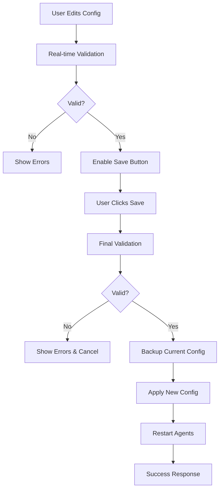

# LangSwarm Configuration Editor API

A comprehensive API for frontend applications to edit and manage LangSwarm YAML configurations with full workflow support.

## Overview

The Configuration Editor API provides a complete frontend-friendly interface for:
- ✅ **Visual Configuration Editing**: JSON Schema-based form generation
- ✅ **Real-time Validation**: Validate configurations before applying
- ✅ **Template System**: Predefined configurations for common use cases
- ✅ **Backup & Restore**: Configuration versioning and rollback
- ✅ **Live Updates**: Hot-reload configurations without downtime

## Authentication

All endpoints require Management API authentication:
```bash
Authorization: Bearer {MANAGEMENT_API_SECRET}
```

## Base URL
```
/api/config-editor/
```

---

## Core Endpoints

### 1. Get Current Configuration

**`GET /api/config-editor/current`**

Returns the current LangSwarm configuration in frontend-friendly format.

**Response:**
```json
{
  "version": "1.0",
  "agents": [
    {
      "id": "aaf_chatbot",
      "agent_type": "langchain-openai",
      "model": "gpt-4",
      "behavior": "helpful",
      "system_prompt": "You are a helpful AI assistant...",
      "is_conversational": true,
      "max_history_length": 20,
      "tools": [],
      "retrievers": [],
      "memory_enabled": true,
      "memory_backend": "bigquery",
      "temperature": 0.7,
      "max_tokens": 2000,
      "timeout": 30
    }
  ],
  "tools": [],
  "memory": {
    "backend": "bigquery",
    "enabled": true,
    "settings": {
      "project_id": "my-project",
      "dataset_id": "aaf_chatbot_memory"
    }
  },
  "session": {
    "provider": "bigquery",
    "ttl": 3600,
    "settings": {}
  },
  "logging": {}
}
```

### 2. Validate Configuration

**`POST /api/config-editor/validate`**

Validates a configuration without applying changes.

**Request:**
```json
{
  "version": "1.0",
  "agents": [...],
  "tools": [...],
  "memory": {...},
  "session": {...}
}
```

**Response:**
```json
{
  "valid": true,
  "errors": [],
  "warnings": [
    "Agent 'support_bot' references undefined tool 'web_search'"
  ],
  "affected_components": ["agents", "memory"]
}
```

### 3. Update Configuration

**`PUT /api/config-editor/update`**

Updates the LangSwarm configuration with full workflow support.

**Request:**
```json
{
  "config": {
    "version": "1.0",
    "agents": [...],
    "tools": [...]
  },
  "validate_only": false,
  "backup_current": true,
  "restart_agents": true
}
```

**Response:**
```json
{
  "success": true,
  "validation": {
    "valid": true,
    "errors": [],
    "warnings": [],
    "affected_components": ["agents"]
  },
  "backup_id": "backup_2024-01-15T10-30-00-123Z",
  "message": "Configuration updated successfully",
  "agents_reinitialized": 2
}
```

---

## Schema and Templates

### 4. Get Configuration Schema

**`GET /api/config-editor/schema`**

Returns JSON Schema for configuration validation and form generation.

**Response:**
```json
{
  "type": "object",
  "properties": {
    "agents": {
      "type": "array",
      "items": {
        "type": "object",
        "properties": {
          "id": {"type": "string", "description": "Unique agent identifier"},
          "model": {"type": "string", "description": "LLM model"},
          "behavior": {"type": "string", "enum": ["helpful", "support", "technical"]}
        }
      }
    }
  },
  "ui_metadata": {
    "agent_types": [
      {"value": "langchain-openai", "label": "OpenAI (GPT)"},
      {"value": "langchain-anthropic", "label": "Anthropic (Claude)"}
    ],
    "models": {
      "openai": ["gpt-4", "gpt-4-turbo", "gpt-3.5-turbo"],
      "anthropic": ["claude-3-opus", "claude-3-sonnet"]
    },
    "behaviors": [
      {"value": "helpful", "label": "Helpful Assistant"},
      {"value": "support", "label": "Customer Support"}
    ],
    "tool_types": [
      {"value": "web_search", "label": "Web Search"},
      {"value": "calculator", "label": "Calculator"}
    ]
  }
}
```

### 5. Get Configuration Templates

**`GET /api/config-editor/templates`**

Returns predefined configuration templates for common use cases.

**Response:**
```json
{
  "templates": {
    "basic_chatbot": {
      "name": "Basic Chatbot",
      "description": "Simple customer support chatbot",
      "config": {
        "version": "1.0",
        "agents": [
          {
            "id": "support_bot",
            "model": "gpt-3.5-turbo",
            "behavior": "support",
            "system_prompt": "You are a helpful customer support assistant."
          }
        ]
      }
    },
    "advanced_assistant": {
      "name": "Advanced AI Assistant",
      "description": "Multi-capability AI assistant with tools",
      "config": {
        "agents": [...],
        "tools": [...]
      }
    }
  }
}
```

---

## Agent Management

### 6. Get Agent Configurations

**`GET /api/config-editor/agents`**

Returns all agent configurations in frontend format.

**Response:**
```json
[
  {
    "id": "aaf_chatbot",
    "agent_type": "langchain-openai",
    "model": "gpt-4",
    "behavior": "helpful",
    "system_prompt": "You are a helpful AI assistant...",
    "is_conversational": true,
    "max_history_length": 20,
    "tools": [],
    "retrievers": [],
    "memory_enabled": true,
    "memory_backend": "bigquery",
    "temperature": 0.7,
    "max_tokens": 2000,
    "timeout": 30
  }
]
```

### 7. Create/Update Agent

**`POST /api/config-editor/agents`**

Creates or updates a single agent configuration.

**Request:**
```json
{
  "id": "new_agent",
  "agent_type": "langchain-openai",
  "model": "gpt-4",
  "behavior": "technical",
  "system_prompt": "You are a technical expert...",
  "is_conversational": true,
  "max_history_length": 20,
  "tools": ["web_search"],
  "retrievers": [],
  "memory_enabled": true,
  "memory_backend": "bigquery",
  "temperature": 0.5,
  "max_tokens": 1500
}
```

**Response:**
```json
{
  "success": true,
  "message": "Agent 'new_agent' updated successfully",
  "agent": {
    "id": "new_agent",
    "model": "gpt-4",
    ...
  }
}
```

### 8. Delete Agent

**`DELETE /api/config-editor/agents/{agent_id}`**

Deletes an agent configuration.

**Response:**
```json
{
  "success": true,
  "message": "Agent 'agent_id' deleted successfully"
}
```

---

## Frontend Integration Examples

### React Configuration Editor

```jsx
import React, { useState, useEffect } from 'react';

const ConfigEditor = () => {
  const [config, setConfig] = useState(null);
  const [schema, setSchema] = useState(null);
  const [templates, setTemplates] = useState(null);
  const [validation, setValidation] = useState(null);

  // Load current configuration
  useEffect(() => {
    fetch('/api/config-editor/current', {
      headers: { 'Authorization': `Bearer ${API_KEY}` }
    })
    .then(res => res.json())
    .then(setConfig);

    // Load schema for form generation
    fetch('/api/config-editor/schema', {
      headers: { 'Authorization': `Bearer ${API_KEY}` }
    })
    .then(res => res.json())
    .then(setSchema);

    // Load templates
    fetch('/api/config-editor/templates', {
      headers: { 'Authorization': `Bearer ${API_KEY}` }
    })
    .then(res => res.json())
    .then(setTemplates);
  }, []);

  const validateConfig = async (configData) => {
    const response = await fetch('/api/config-editor/validate', {
      method: 'POST',
      headers: {
        'Authorization': `Bearer ${API_KEY}`,
        'Content-Type': 'application/json'
      },
      body: JSON.stringify(configData)
    });
    
    const result = await response.json();
    setValidation(result);
    return result.valid;
  };

  const saveConfig = async (configData) => {
    const isValid = await validateConfig(configData);
    
    if (!isValid) {
      alert('Configuration has errors. Please fix them before saving.');
      return;
    }

    const response = await fetch('/api/config-editor/update', {
      method: 'PUT',
      headers: {
        'Authorization': `Bearer ${API_KEY}`,
        'Content-Type': 'application/json'
      },
      body: JSON.stringify({
        config: configData,
        validate_only: false,
        backup_current: true,
        restart_agents: true
      })
    });

    const result = await response.json();
    
    if (result.success) {
      alert('Configuration updated successfully!');
    } else {
      alert('Failed to update configuration: ' + result.message);
    }
  };

  return (
    <div className="config-editor">
      {/* Configuration form rendered from schema */}
      <ConfigForm 
        config={config}
        schema={schema}
        templates={templates}
        validation={validation}
        onSave={saveConfig}
        onValidate={validateConfig}
      />
    </div>
  );
};
```

### Vue.js Agent Editor

```vue
<template>
  <div class="agent-editor">
    <h2>Agent Configuration</h2>
    
    <form @submit.prevent="saveAgent">
      <div class="form-group">
        <label>Agent ID:</label>
        <input v-model="agent.id" required />
      </div>
      
      <div class="form-group">
        <label>Model:</label>
        <select v-model="agent.model">
          <option v-for="model in availableModels" :key="model" :value="model">
            {{ model }}
          </option>
        </select>
      </div>
      
      <div class="form-group">
        <label>Behavior:</label>
        <select v-model="agent.behavior">
          <option v-for="behavior in behaviors" :key="behavior.value" :value="behavior.value">
            {{ behavior.label }}
          </option>
        </select>
      </div>
      
      <div class="form-group">
        <label>System Prompt:</label>
        <textarea v-model="agent.system_prompt" rows="5"></textarea>
      </div>
      
      <div class="form-group">
        <label>Temperature:</label>
        <input v-model.number="agent.temperature" type="number" min="0" max="2" step="0.1" />
      </div>
      
      <button type="submit" :disabled="!isValid">Save Agent</button>
      <button type="button" @click="validateAgent">Validate</button>
    </form>
    
    <div v-if="validation" class="validation-results">
      <h3>Validation Results</h3>
      <div v-if="validation.errors.length" class="errors">
        <h4>Errors:</h4>
        <ul>
          <li v-for="error in validation.errors" :key="error">{{ error }}</li>
        </ul>
      </div>
      <div v-if="validation.warnings.length" class="warnings">
        <h4>Warnings:</h4>
        <ul>
          <li v-for="warning in validation.warnings" :key="warning">{{ warning }}</li>
        </ul>
      </div>
    </div>
  </div>
</template>

<script>
export default {
  data() {
    return {
      agent: {
        id: '',
        agent_type: 'langchain-openai',
        model: 'gpt-4',
        behavior: 'helpful',
        system_prompt: '',
        temperature: 0.7,
        max_tokens: 2000,
        tools: [],
        retrievers: []
      },
      schema: null,
      validation: null,
      isValid: false
    };
  },
  
  computed: {
    availableModels() {
      return this.schema?.ui_metadata?.models?.openai || [];
    },
    behaviors() {
      return this.schema?.ui_metadata?.behaviors || [];
    }
  },
  
  async mounted() {
    // Load schema
    const schemaResponse = await fetch('/api/config-editor/schema', {
      headers: { 'Authorization': `Bearer ${this.apiKey}` }
    });
    this.schema = await schemaResponse.json();
  },
  
  methods: {
    async validateAgent() {
      // Create temporary config for validation
      const tempConfig = {
        version: "1.0",
        agents: [this.agent],
        tools: [],
        memory: { backend: "bigquery", enabled: true, settings: {} },
        session: { provider: "bigquery", ttl: 3600, settings: {} }
      };
      
      const response = await fetch('/api/config-editor/validate', {
        method: 'POST',
        headers: {
          'Authorization': `Bearer ${this.apiKey}`,
          'Content-Type': 'application/json'
        },
        body: JSON.stringify(tempConfig)
      });
      
      this.validation = await response.json();
      this.isValid = this.validation.valid;
    },
    
    async saveAgent() {
      const response = await fetch('/api/config-editor/agents', {
        method: 'POST',
        headers: {
          'Authorization': `Bearer ${this.apiKey}`,
          'Content-Type': 'application/json'
        },
        body: JSON.stringify(this.agent)
      });
      
      const result = await response.json();
      
      if (result.success) {
        this.$emit('agent-saved', result.agent);
        alert('Agent saved successfully!');
      } else {
        alert('Failed to save agent: ' + result.message);
      }
    }
  }
};
</script>
```

---

## Workflow Patterns

### 1. **Configuration Validation Workflow**



### 2. **Template-Based Configuration**

```javascript
// Load template and customize
const loadTemplate = async (templateId) => {
  const response = await fetch('/api/config-editor/templates');
  const { templates } = await response.json();
  
  const template = templates[templateId];
  setConfig(template.config);
  
  // Allow user to customize
  showConfigEditor(template.config);
};

// Apply customized template
const applyTemplate = async (customizedConfig) => {
  await fetch('/api/config-editor/update', {
    method: 'PUT',
    headers: { 'Authorization': `Bearer ${API_KEY}`, 'Content-Type': 'application/json' },
    body: JSON.stringify({
      config: customizedConfig,
      backup_current: true,
      restart_agents: true
    })
  });
};
```

### 3. **Real-time Configuration Sync**

```javascript
// WebSocket for real-time config updates
const ws = new WebSocket('ws://localhost:8000/api/ws');

ws.onmessage = (event) => {
  const data = JSON.parse(event.data);
  
  if (data.type === 'config_updated') {
    // Refresh configuration in UI
    loadCurrentConfig();
    showNotification('Configuration updated by another user');
  }
};

// Send real-time validation requests
const validateInRealTime = debounce(async (config) => {
  const result = await validateConfig(config);
  updateValidationUI(result);
}, 500);
```

---

## Error Handling

### Common Error Responses

```json
{
  "detail": "Invalid API key",
  "status_code": 401
}
```

```json
{
  "detail": "Configuration validation failed",
  "status_code": 400
}
```

```json
{
  "success": false,
  "validation": {
    "valid": false,
    "errors": ["Agent 'test' must have a 'model' field"],
    "warnings": [],
    "affected_components": []
  },
  "message": "Configuration validation failed"
}
```

### Frontend Error Handling

```javascript
const handleConfigUpdate = async (config) => {
  try {
    const response = await fetch('/api/config-editor/update', {
      method: 'PUT',
      headers: {
        'Authorization': `Bearer ${API_KEY}`,
        'Content-Type': 'application/json'
      },
      body: JSON.stringify({
        config,
        backup_current: true,
        restart_agents: true
      })
    });
    
    const result = await response.json();
    
    if (!response.ok) {
      throw new Error(result.detail || 'Update failed');
    }
    
    if (!result.success) {
      // Show validation errors
      showValidationErrors(result.validation);
      return;
    }
    
    // Success
    showSuccessMessage('Configuration updated successfully!');
    
  } catch (error) {
    showErrorMessage('Failed to update configuration: ' + error.message);
  }
};
```

This Configuration Editor API provides a complete foundation for building sophisticated frontend interfaces for LangSwarm configuration management with real-time validation, templates, and full workflow support! 🚀
