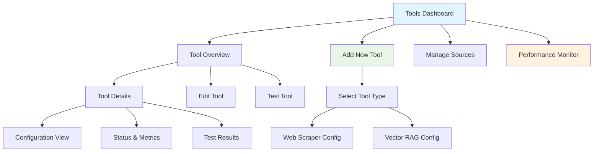

# Frontend Multi-Tool Management UI - Implementation Guide

This document provides comprehensive instructions for the frontend team to build the user interface for configuring and managing the AAF Multi-Tool System.

## Overview

The Multi-Tool Management UI enables users to:
- **View all configured tools** from different sources
- **Add new tools** with complete configuration
- **Edit existing tools** and their settings
- **Enable/disable tools** without removing them
- **Test tools** before deployment
- **Monitor tool performance** and health
- **Manage tool sources** dynamically

## UI Architecture

### Main Components

```
Multi-Tool Dashboard
├── Tool Overview (Cards/List View)
├── Tool Configuration Wizard
├── Source Management Panel
├── Performance Monitoring
├── Tool Testing Interface
└── Bulk Operations Panel
```

### Navigation Flow



## API Integration

### Base URLs and Authentication

```typescript
// API Base Configuration
const API_BASE = process.env.REACT_APP_API_BASE || 'http://localhost:8000/api';
const MULTI_TOOLS_API = `${API_BASE}/multi-tools`;

// API Client with error handling
class MultiToolsAPI {
  private async request<T>(
    endpoint: string, 
    options: RequestInit = {}
  ): Promise<T> {
    const response = await fetch(`${MULTI_TOOLS_API}${endpoint}`, {
      headers: {
        'Content-Type': 'application/json',
        ...options.headers,
      },
      ...options,
    });
    
    if (!response.ok) {
      const error = await response.json().catch(() => ({ 
        detail: 'Unknown error' 
      }));
      throw new Error(error.detail || `HTTP ${response.status}`);
    }
    
    return response.json();
  }
  
  // API methods will be defined below...
}
```

### Data Models (TypeScript)

```typescript
// Core tool configuration types
export interface ToolConfiguration {
  tool_id: string;
  tool_type: 'web_scraper' | 'vector_search_rag';
  name: string;
  description?: string;
  enabled: boolean;
  config: WebScraperConfig | VectorRAGConfig;
  tags: string[];
  priority: number;
}

export interface WebScraperConfig {
  mcp_server_url: string;
  api_key?: string;
  timeout?: number;
  retry_count?: number;
}

export interface VectorRAGConfig {
  project_id: string;
  dataset_id: string;
  embedding_model: string;
  table_prefix?: string;
}

export interface ToolSource {
  source_id: string;
  source_type: 'env' | 'file' | 'api' | 'dynamic';
  source_path?: string;
  tools: ToolConfiguration[];
  metadata?: Record<string, any>;
}

export interface ToolStatus {
  tool_id: string;
  name: string;
  tool_type: string;
  enabled: boolean;
  available: boolean;
  tags: string[];
  priority: number;
  source: {
    source_id: string;
    source_type: string;
    source_path?: string;
  };
  // Tool-specific status fields
  mcp_server_url?: string;
  authenticated?: boolean;
  project_id?: string;
  dataset_id?: string;
  collections_loaded?: number;
}

export interface ToolMetrics {
  tool_id: string;
  requests_processed: number;
  average_response_time: number;
  success_rate: number;
  last_used: string;
  error_count: number;
  uptime_percentage: number;
}

// API request/response types
export interface ToolCallRequest {
  tool_id: string;
  function_name: string;
  arguments: Record<string, any>;
}

export interface WebScrapingRequest {
  url: string;
  tool_id?: string;
  prefer_tags?: string[];
  extract_text?: boolean;
  extract_links?: boolean;
  extract_images?: boolean;
  extract_metadata?: boolean;
  css_selector?: string;
  remove_ads?: boolean;
  remove_navigation?: boolean;
}

export interface VectorSearchRequest {
  query: string;
  tool_id?: string;
  prefer_tags?: string[];
  collection_name?: string;
  limit?: number;
  similarity_threshold?: number;
  include_metadata?: boolean;
}

export interface DocumentLoadRequest {
  source_type: 'file' | 'url' | 'text' | 'web';
  source_path?: string;
  content?: string;
  collection_name: string;
  tool_id?: string;
  prefer_tags?: string[];
  title?: string;
  description?: string;
  tags?: string[];
}
```

### API Methods

```typescript
export class MultiToolsAPI {
  // Tool listing and discovery
  async listAllTools(): Promise<{
    success: boolean;
    tools: Record<string, ToolStatus>;
    total_tools: number;
    total_sources: number;
    tools_by_type: Record<string, number>;
  }> {
    return this.request('/');
  }

  async getToolsByType(toolType: string): Promise<{
    success: boolean;
    tool_type: string;
    tools: Record<string, ToolStatus>;
    count: number;
  }> {
    return this.request(`/by-type/${toolType}`);
  }

  async getToolsByTag(tag: string): Promise<{
    success: boolean;
    tag: string;
    tools: Record<string, ToolStatus>;
    count: number;
  }> {
    return this.request(`/by-tag/${tag}`);
  }

  async getToolStatus(toolId: string): Promise<{
    success: boolean;
    status: ToolStatus;
  }> {
    return this.request(`/${toolId}/status`);
  }

  // Tool operations
  async callSpecificTool(request: ToolCallRequest): Promise<any> {
    return this.request('/call', {
      method: 'POST',
      body: JSON.stringify(request),
    });
  }

  async scrapeWithSelection(request: WebScrapingRequest): Promise<any> {
    return this.request('/web-scraper/scrape', {
      method: 'POST',
      body: JSON.stringify(request),
    });
  }

  async searchWithSelection(request: VectorSearchRequest): Promise<any> {
    return this.request('/vector-rag/search', {
      method: 'POST',
      body: JSON.stringify(request),
    });
  }

  async loadDocumentWithSelection(request: DocumentLoadRequest): Promise<any> {
    return this.request('/vector-rag/load', {
      method: 'POST',
      body: JSON.stringify(request),
    });
  }

  // Source management
  async addToolSource(source: ToolSource): Promise<{
    success: boolean;
    message: string;
    tools_added: number;
  }> {
    return this.request('/sources', {
      method: 'POST',
      body: JSON.stringify({ source }),
    });
  }

  async removeToolSource(sourceId: string): Promise<{
    success: boolean;
    message: string;
  }> {
    return this.request(`/sources/${sourceId}`, {
      method: 'DELETE',
    });
  }

  async listToolSources(): Promise<{
    success: boolean;
    sources: Record<string, any>;
    total_sources: number;
  }> {
    return this.request('/sources');
  }

  // Batch operations
  async scrapeMultipleUrls(
    urls: string[],
    options: {
      tool_id?: string;
      prefer_tags?: string[];
      extract_text?: boolean;
      extract_links?: boolean;
      extract_images?: boolean;
    } = {}
  ): Promise<{
    success: boolean;
    tool_used: string;
    results: any[];
    total_processed: number;
    successful: number;
    failed: number;
  }> {
    const params = new URLSearchParams();
    if (options.tool_id) params.append('tool_id', options.tool_id);
    if (options.prefer_tags) {
      options.prefer_tags.forEach(tag => params.append('prefer_tags', tag));
    }
    if (options.extract_text !== undefined) {
      params.append('extract_text', options.extract_text.toString());
    }
    if (options.extract_links !== undefined) {
      params.append('extract_links', options.extract_links.toString());
    }
    if (options.extract_images !== undefined) {
      params.append('extract_images', options.extract_images.toString());
    }

    return this.request(`/web-scraper/batch?${params}`, {
      method: 'POST',
      body: JSON.stringify(urls),
    });
  }
}
```

## UI Components

### 1. Tools Dashboard (Main View)

```tsx
import React, { useState, useEffect } from 'react';
import { MultiToolsAPI, ToolStatus } from '../api/multitools';

interface ToolsDashboardProps {
  api: MultiToolsAPI;
}

export const ToolsDashboard: React.FC<ToolsDashboardProps> = ({ api }) => {
  const [tools, setTools] = useState<Record<string, ToolStatus>>({});
  const [loading, setLoading] = useState(true);
  const [error, setError] = useState<string | null>(null);
  const [selectedView, setSelectedView] = useState<'all' | 'web_scraper' | 'vector_search_rag'>('all');
  const [selectedTags, setSelectedTags] = useState<string[]>([]);

  useEffect(() => {
    loadTools();
  }, [selectedView, selectedTags]);

  const loadTools = async () => {
    try {
      setLoading(true);
      let response;
      
      if (selectedView === 'all') {
        response = await api.listAllTools();
        setTools(response.tools);
      } else {
        response = await api.getToolsByType(selectedView);
        setTools(response.tools);
      }
      
      setError(null);
    } catch (err) {
      setError(err instanceof Error ? err.message : 'Failed to load tools');
    } finally {
      setLoading(false);
    }
  };

  const handleToolToggle = async (toolId: string, enabled: boolean) => {
    try {
      // Implementation for enabling/disabling tools
      // This would require an additional API endpoint
      await api.updateToolStatus(toolId, { enabled });
      await loadTools();
    } catch (err) {
      console.error('Failed to toggle tool:', err);
    }
  };

  const handleDeleteTool = async (toolId: string) => {
    if (!confirm(`Are you sure you want to delete tool "${toolId}"?`)) return;
    
    try {
      // Implementation for deleting tools
      await api.deleteTool(toolId);
      await loadTools();
    } catch (err) {
      console.error('Failed to delete tool:', err);
    }
  };

  if (loading) {
    return (
      <div className="flex justify-center items-center h-64">
        <div className="animate-spin rounded-full h-12 w-12 border-b-2 border-blue-500"></div>
        <span className="ml-3 text-gray-600">Loading tools...</span>
      </div>
    );
  }

  if (error) {
    return (
      <div className="bg-red-50 border border-red-200 rounded-md p-4">
        <div className="flex">
          <div className="ml-3">
            <h3 className="text-sm font-medium text-red-800">Error Loading Tools</h3>
            <div className="mt-2 text-sm text-red-700">{error}</div>
            <button 
              onClick={loadTools}
              className="mt-3 bg-red-100 hover:bg-red-200 text-red-800 px-3 py-1 rounded text-sm"
            >
              Retry
            </button>
          </div>
        </div>
      </div>
    );
  }

  return (
    <div className="space-y-6">
      {/* Header with actions */}
      <div className="flex justify-between items-center">
        <h1 className="text-2xl font-bold text-gray-900">Multi-Tool Management</h1>
        <div className="flex space-x-3">
          <button 
            onClick={() => {/* Open add tool wizard */}}
            className="bg-blue-600 hover:bg-blue-700 text-white px-4 py-2 rounded-md flex items-center"
          >
            <PlusIcon className="h-5 w-5 mr-2" />
            Add New Tool
          </button>
          <button 
            onClick={() => {/* Open source management */}}
            className="bg-gray-600 hover:bg-gray-700 text-white px-4 py-2 rounded-md"
          >
            Manage Sources
          </button>
        </div>
      </div>

      {/* Filter controls */}
      <div className="bg-white p-4 rounded-lg shadow border">
        <div className="flex flex-wrap gap-4 items-center">
          <div className="flex space-x-2">
            <span className="text-sm font-medium text-gray-700">View:</span>
            {(['all', 'web_scraper', 'vector_search_rag'] as const).map((view) => (
              <button
                key={view}
                onClick={() => setSelectedView(view)}
                className={`px-3 py-1 rounded text-sm ${
                  selectedView === view
                    ? 'bg-blue-100 text-blue-800 border border-blue-200'
                    : 'bg-gray-100 text-gray-700 hover:bg-gray-200'
                }`}
              >
                {view === 'all' ? 'All Tools' : 
                 view === 'web_scraper' ? 'Web Scrapers' : 'Vector RAG'}
              </button>
            ))}
          </div>
          
          <TagFilter 
            selectedTags={selectedTags}
            onTagsChange={setSelectedTags}
            availableTags={extractAllTags(tools)}
          />
        </div>
      </div>

      {/* Tools grid */}
      <div className="grid grid-cols-1 md:grid-cols-2 lg:grid-cols-3 gap-6">
        {Object.values(tools)
          .filter(tool => selectedTags.length === 0 || 
                          selectedTags.some(tag => tool.tags.includes(tag)))
          .map((tool) => (
          <ToolCard
            key={tool.tool_id}
            tool={tool}
            onToggle={handleToolToggle}
            onDelete={handleDeleteTool}
            onEdit={() => {/* Open edit dialog */}}
            onTest={() => {/* Open test dialog */}}
          />
        ))}
      </div>

      {Object.keys(tools).length === 0 && (
        <div className="text-center py-12">
          <div className="text-gray-400 text-lg mb-4">No tools configured</div>
          <button 
            onClick={() => {/* Open add tool wizard */}}
            className="bg-blue-600 hover:bg-blue-700 text-white px-6 py-3 rounded-md"
          >
            Add Your First Tool
          </button>
        </div>
      )}
    </div>
  );
};
```

### 2. Tool Card Component

```tsx
import React from 'react';
import { ToolStatus } from '../api/multitools';

interface ToolCardProps {
  tool: ToolStatus;
  onToggle: (toolId: string, enabled: boolean) => void;
  onDelete: (toolId: string) => void;
  onEdit: (toolId: string) => void;
  onTest: (toolId: string) => void;
}

export const ToolCard: React.FC<ToolCardProps> = ({
  tool,
  onToggle,
  onDelete,
  onEdit,
  onTest
}) => {
  const getToolTypeIcon = (type: string) => {
    switch (type) {
      case 'web_scraper':
        return '🌐';
      case 'vector_search_rag':
        return '🧠';
      default:
        return '🛠️';
    }
  };

  const getStatusColor = (available: boolean, enabled: boolean) => {
    if (!enabled) return 'bg-gray-100 text-gray-600';
    return available ? 'bg-green-100 text-green-800' : 'bg-red-100 text-red-800';
  };

  const getStatusText = (available: boolean, enabled: boolean) => {
    if (!enabled) return 'Disabled';
    return available ? 'Online' : 'Offline';
  };

  return (
    <div className="bg-white rounded-lg shadow border hover:shadow-md transition-shadow">
      <div className="p-6">
        {/* Header */}
        <div className="flex items-start justify-between mb-4">
          <div className="flex items-center">
            <span className="text-2xl mr-3">{getToolTypeIcon(tool.tool_type)}</span>
            <div>
              <h3 className="text-lg font-semibold text-gray-900">{tool.name}</h3>
              <p className="text-sm text-gray-500">{tool.tool_id}</p>
            </div>
          </div>
          <div className="flex items-center space-x-2">
            <span className={`px-2 py-1 rounded-full text-xs font-medium ${
              getStatusColor(tool.available, tool.enabled)
            }`}>
              {getStatusText(tool.available, tool.enabled)}
            </span>
          </div>
        </div>

        {/* Tool details */}
        <div className="space-y-3">
          <div>
            <span className="text-sm font-medium text-gray-600">Type:</span>
            <span className="ml-2 text-sm text-gray-900">
              {tool.tool_type === 'web_scraper' ? 'Web Scraper' : 'Vector Search RAG'}
            </span>
          </div>
          
          <div>
            <span className="text-sm font-medium text-gray-600">Priority:</span>
            <span className="ml-2 text-sm text-gray-900">{tool.priority}</span>
          </div>

          <div>
            <span className="text-sm font-medium text-gray-600">Source:</span>
            <span className="ml-2 text-sm text-gray-900">
              {tool.source.source_id} ({tool.source.source_type})
            </span>
          </div>

          {/* Tags */}
          {tool.tags.length > 0 && (
            <div>
              <span className="text-sm font-medium text-gray-600">Tags:</span>
              <div className="flex flex-wrap gap-1 mt-1">
                {tool.tags.map((tag) => (
                  <span
                    key={tag}
                    className="px-2 py-1 bg-blue-100 text-blue-800 text-xs rounded-full"
                  >
                    {tag}
                  </span>
                ))}
              </div>
            </div>
          )}

          {/* Tool-specific info */}
          {tool.tool_type === 'web_scraper' && tool.mcp_server_url && (
            <div>
              <span className="text-sm font-medium text-gray-600">Server:</span>
              <span className="ml-2 text-sm text-gray-900 break-all">
                {tool.mcp_server_url}
              </span>
            </div>
          )}

          {tool.tool_type === 'vector_search_rag' && (
            <div className="space-y-2">
              <div>
                <span className="text-sm font-medium text-gray-600">Project:</span>
                <span className="ml-2 text-sm text-gray-900">{tool.project_id}</span>
              </div>
              <div>
                <span className="text-sm font-medium text-gray-600">Dataset:</span>
                <span className="ml-2 text-sm text-gray-900">{tool.dataset_id}</span>
              </div>
              {tool.collections_loaded !== undefined && (
                <div>
                  <span className="text-sm font-medium text-gray-600">Collections:</span>
                  <span className="ml-2 text-sm text-gray-900">{tool.collections_loaded}</span>
                </div>
              )}
            </div>
          )}
        </div>
      </div>

      {/* Actions */}
      <div className="px-6 py-3 bg-gray-50 border-t flex justify-between items-center">
        <div className="flex space-x-2">
          <button
            onClick={() => onTest(tool.tool_id)}
            className="text-blue-600 hover:text-blue-800 text-sm font-medium"
          >
            Test
          </button>
          <button
            onClick={() => onEdit(tool.tool_id)}
            className="text-gray-600 hover:text-gray-800 text-sm font-medium"
          >
            Edit
          </button>
        </div>
        
        <div className="flex items-center space-x-3">
          <label className="flex items-center">
            <input
              type="checkbox"
              checked={tool.enabled}
              onChange={(e) => onToggle(tool.tool_id, e.target.checked)}
              className="h-4 w-4 text-blue-600 focus:ring-blue-500 border-gray-300 rounded"
            />
            <span className="ml-2 text-sm text-gray-700">Enabled</span>
          </label>
          
          <button
            onClick={() => onDelete(tool.tool_id)}
            className="text-red-600 hover:text-red-800 text-sm font-medium"
          >
            Delete
          </button>
        </div>
      </div>
    </div>
  );
};
```

### 3. Add Tool Wizard

```tsx
import React, { useState } from 'react';
import { ToolConfiguration, WebScraperConfig, VectorRAGConfig } from '../api/multitools';

interface AddToolWizardProps {
  isOpen: boolean;
  onClose: () => void;
  onSubmit: (tool: ToolConfiguration) => Promise<void>;
}

export const AddToolWizard: React.FC<AddToolWizardProps> = ({
  isOpen,
  onClose,
  onSubmit
}) => {
  const [step, setStep] = useState(1);
  const [toolType, setToolType] = useState<'web_scraper' | 'vector_search_rag' | null>(null);
  const [formData, setFormData] = useState<Partial<ToolConfiguration>>({
    enabled: true,
    priority: 5,
    tags: []
  });
  const [loading, setLoading] = useState(false);
  const [errors, setErrors] = useState<Record<string, string>>({});

  const resetForm = () => {
    setStep(1);
    setToolType(null);
    setFormData({ enabled: true, priority: 5, tags: [] });
    setErrors({});
  };

  const handleClose = () => {
    resetForm();
    onClose();
  };

  const validateStep = (currentStep: number): boolean => {
    const newErrors: Record<string, string> = {};

    if (currentStep === 1) {
      if (!toolType) {
        newErrors.toolType = 'Please select a tool type';
      }
    } else if (currentStep === 2) {
      if (!formData.tool_id) {
        newErrors.tool_id = 'Tool ID is required';
      } else if (!/^[a-z0-9_]+$/.test(formData.tool_id)) {
        newErrors.tool_id = 'Tool ID must contain only lowercase letters, numbers, and underscores';
      }
      
      if (!formData.name) {
        newErrors.name = 'Tool name is required';
      }
      
      if (formData.priority === undefined || formData.priority < 0 || formData.priority > 10) {
        newErrors.priority = 'Priority must be between 0 and 10';
      }
    } else if (currentStep === 3) {
      if (toolType === 'web_scraper') {
        const config = formData.config as WebScraperConfig;
        if (!config?.mcp_server_url) {
          newErrors.mcp_server_url = 'MCP Server URL is required';
        } else if (!/^https?:\/\/.+/.test(config.mcp_server_url)) {
          newErrors.mcp_server_url = 'Please enter a valid URL';
        }
      } else if (toolType === 'vector_search_rag') {
        const config = formData.config as VectorRAGConfig;
        if (!config?.project_id) {
          newErrors.project_id = 'Project ID is required';
        }
        if (!config?.dataset_id) {
          newErrors.dataset_id = 'Dataset ID is required';
        }
        if (!config?.embedding_model) {
          newErrors.embedding_model = 'Embedding model is required';
        }
      }
    }

    setErrors(newErrors);
    return Object.keys(newErrors).length === 0;
  };

  const handleNext = () => {
    if (validateStep(step)) {
      setStep(step + 1);
    }
  };

  const handleSubmit = async () => {
    if (!validateStep(step)) return;

    setLoading(true);
    try {
      const toolConfig: ToolConfiguration = {
        tool_id: formData.tool_id!,
        tool_type: toolType!,
        name: formData.name!,
        description: formData.description,
        enabled: formData.enabled!,
        config: formData.config!,
        tags: formData.tags!,
        priority: formData.priority!
      };

      await onSubmit(toolConfig);
      handleClose();
    } catch (error) {
      setErrors({ submit: error instanceof Error ? error.message : 'Failed to create tool' });
    } finally {
      setLoading(false);
    }
  };

  if (!isOpen) return null;

  return (
    <div className="fixed inset-0 bg-black bg-opacity-50 flex items-center justify-center z-50">
      <div className="bg-white rounded-lg shadow-xl max-w-2xl w-full mx-4 max-h-[90vh] overflow-y-auto">
        <div className="p-6">
          {/* Header */}
          <div className="flex justify-between items-center mb-6">
            <h2 className="text-xl font-semibold text-gray-900">Add New Tool</h2>
            <button
              onClick={handleClose}
              className="text-gray-400 hover:text-gray-600"
            >
              <XIcon className="h-6 w-6" />
            </button>
          </div>

          {/* Progress indicator */}
          <div className="mb-8">
            <div className="flex items-center">
              {[1, 2, 3].map((stepNumber) => (
                <React.Fragment key={stepNumber}>
                  <div className={`flex items-center justify-center w-8 h-8 rounded-full ${
                    step >= stepNumber 
                      ? 'bg-blue-600 text-white' 
                      : 'bg-gray-200 text-gray-600'
                  }`}>
                    {stepNumber}
                  </div>
                  {stepNumber < 3 && (
                    <div className={`flex-1 h-1 mx-2 ${
                      step > stepNumber ? 'bg-blue-600' : 'bg-gray-200'
                    }`} />
                  )}
                </React.Fragment>
              ))}
            </div>
            <div className="flex justify-between mt-2 text-sm text-gray-600">
              <span>Select Type</span>
              <span>Basic Info</span>
              <span>Configuration</span>
            </div>
          </div>

          {/* Step 1: Tool Type Selection */}
          {step === 1 && (
            <div className="space-y-6">
              <h3 className="text-lg font-medium text-gray-900">Select Tool Type</h3>
              
              <div className="grid grid-cols-1 md:grid-cols-2 gap-4">
                <div
                  onClick={() => setToolType('web_scraper')}
                  className={`p-6 border-2 rounded-lg cursor-pointer transition-colors ${
                    toolType === 'web_scraper'
                      ? 'border-blue-500 bg-blue-50'
                      : 'border-gray-200 hover:border-gray-300'
                  }`}
                >
                  <div className="text-center">
                    <div className="text-4xl mb-3">🌐</div>
                    <h4 className="text-lg font-medium text-gray-900">Web Scraper</h4>
                    <p className="text-sm text-gray-600 mt-2">
                      Extract content from websites using remote MCP servers
                    </p>
                  </div>
                </div>

                <div
                  onClick={() => setToolType('vector_search_rag')}
                  className={`p-6 border-2 rounded-lg cursor-pointer transition-colors ${
                    toolType === 'vector_search_rag'
                      ? 'border-blue-500 bg-blue-50'
                      : 'border-gray-200 hover:border-gray-300'
                  }`}
                >
                  <div className="text-center">
                    <div className="text-4xl mb-3">🧠</div>
                    <h4 className="text-lg font-medium text-gray-900">Vector Search RAG</h4>
                    <p className="text-sm text-gray-600 mt-2">
                      Semantic search and retrieval using BigQuery Vector Search
                    </p>
                  </div>
                </div>
              </div>

              {errors.toolType && (
                <p className="text-red-600 text-sm">{errors.toolType}</p>
              )}
            </div>
          )}

          {/* Step 2: Basic Information */}
          {step === 2 && (
            <div className="space-y-6">
              <h3 className="text-lg font-medium text-gray-900">Basic Information</h3>
              
              <div className="grid grid-cols-1 md:grid-cols-2 gap-4">
                <div>
                  <label className="block text-sm font-medium text-gray-700 mb-2">
                    Tool ID *
                  </label>
                  <input
                    type="text"
                    value={formData.tool_id || ''}
                    onChange={(e) => setFormData({ ...formData, tool_id: e.target.value })}
                    placeholder="e.g., news_scraper_primary"
                    className={`w-full px-3 py-2 border rounded-md focus:outline-none focus:ring-2 focus:ring-blue-500 ${
                      errors.tool_id ? 'border-red-300' : 'border-gray-300'
                    }`}
                  />
                  {errors.tool_id && (
                    <p className="text-red-600 text-sm mt-1">{errors.tool_id}</p>
                  )}
                </div>

                <div>
                  <label className="block text-sm font-medium text-gray-700 mb-2">
                    Display Name *
                  </label>
                  <input
                    type="text"
                    value={formData.name || ''}
                    onChange={(e) => setFormData({ ...formData, name: e.target.value })}
                    placeholder="e.g., Primary News Scraper"
                    className={`w-full px-3 py-2 border rounded-md focus:outline-none focus:ring-2 focus:ring-blue-500 ${
                      errors.name ? 'border-red-300' : 'border-gray-300'
                    }`}
                  />
                  {errors.name && (
                    <p className="text-red-600 text-sm mt-1">{errors.name}</p>
                  )}
                </div>
              </div>

              <div>
                <label className="block text-sm font-medium text-gray-700 mb-2">
                  Description
                </label>
                <textarea
                  value={formData.description || ''}
                  onChange={(e) => setFormData({ ...formData, description: e.target.value })}
                  placeholder="Brief description of this tool's purpose..."
                  rows={3}
                  className="w-full px-3 py-2 border border-gray-300 rounded-md focus:outline-none focus:ring-2 focus:ring-blue-500"
                />
              </div>

              <div className="grid grid-cols-1 md:grid-cols-2 gap-4">
                <div>
                  <label className="block text-sm font-medium text-gray-700 mb-2">
                    Priority (0-10) *
                  </label>
                  <input
                    type="number"
                    min="0"
                    max="10"
                    value={formData.priority || 5}
                    onChange={(e) => setFormData({ ...formData, priority: parseInt(e.target.value) })}
                    className={`w-full px-3 py-2 border rounded-md focus:outline-none focus:ring-2 focus:ring-blue-500 ${
                      errors.priority ? 'border-red-300' : 'border-gray-300'
                    }`}
                  />
                  <p className="text-xs text-gray-500 mt-1">Higher numbers = higher priority</p>
                  {errors.priority && (
                    <p className="text-red-600 text-sm mt-1">{errors.priority}</p>
                  )}
                </div>

                <div>
                  <label className="block text-sm font-medium text-gray-700 mb-2">
                    Tags
                  </label>
                  <TagInput
                    tags={formData.tags || []}
                    onChange={(tags) => setFormData({ ...formData, tags })}
                    placeholder="Add tags..."
                  />
                  <p className="text-xs text-gray-500 mt-1">e.g., production, news, specialized</p>
                </div>
              </div>

              <div className="flex items-center">
                <input
                  type="checkbox"
                  id="enabled"
                  checked={formData.enabled}
                  onChange={(e) => setFormData({ ...formData, enabled: e.target.checked })}
                  className="h-4 w-4 text-blue-600 focus:ring-blue-500 border-gray-300 rounded"
                />
                <label htmlFor="enabled" className="ml-2 text-sm text-gray-700">
                  Enable tool immediately
                </label>
              </div>
            </div>
          )}

          {/* Step 3: Tool Configuration */}
          {step === 3 && toolType === 'web_scraper' && (
            <WebScraperConfigForm
              config={formData.config as WebScraperConfig}
              onChange={(config) => setFormData({ ...formData, config })}
              errors={errors}
            />
          )}

          {step === 3 && toolType === 'vector_search_rag' && (
            <VectorRAGConfigForm
              config={formData.config as VectorRAGConfig}
              onChange={(config) => setFormData({ ...formData, config })}
              errors={errors}
            />
          )}

          {/* Error display */}
          {errors.submit && (
            <div className="bg-red-50 border border-red-200 rounded-md p-4">
              <p className="text-red-800">{errors.submit}</p>
            </div>
          )}

          {/* Actions */}
          <div className="flex justify-between pt-6 border-t">
            <button
              onClick={step === 1 ? handleClose : () => setStep(step - 1)}
              className="px-4 py-2 text-gray-600 hover:text-gray-800"
            >
              {step === 1 ? 'Cancel' : 'Back'}
            </button>
            
            <div className="space-x-3">
              {step < 3 ? (
                <button
                  onClick={handleNext}
                  disabled={step === 1 && !toolType}
                  className="bg-blue-600 hover:bg-blue-700 disabled:bg-gray-300 text-white px-4 py-2 rounded-md"
                >
                  Next
                </button>
              ) : (
                <button
                  onClick={handleSubmit}
                  disabled={loading}
                  className="bg-green-600 hover:bg-green-700 disabled:bg-gray-300 text-white px-4 py-2 rounded-md flex items-center"
                >
                  {loading && <Spinner className="h-4 w-4 mr-2" />}
                  Create Tool
                </button>
              )}
            </div>
          </div>
        </div>
      </div>
    </div>
  );
};
```

### 4. Configuration Forms

```tsx
// Web Scraper Configuration Form
interface WebScraperConfigFormProps {
  config: WebScraperConfig;
  onChange: (config: WebScraperConfig) => void;
  errors: Record<string, string>;
}

export const WebScraperConfigForm: React.FC<WebScraperConfigFormProps> = ({
  config,
  onChange,
  errors
}) => {
  const updateConfig = (updates: Partial<WebScraperConfig>) => {
    onChange({ ...config, ...updates });
  };

  return (
    <div className="space-y-6">
      <h3 className="text-lg font-medium text-gray-900">Web Scraper Configuration</h3>
      
      <div>
        <label className="block text-sm font-medium text-gray-700 mb-2">
          MCP Server URL *
        </label>
        <input
          type="url"
          value={config?.mcp_server_url || ''}
          onChange={(e) => updateConfig({ mcp_server_url: e.target.value })}
          placeholder="https://your-crawl4ai-server.com"
          className={`w-full px-3 py-2 border rounded-md focus:outline-none focus:ring-2 focus:ring-blue-500 ${
            errors.mcp_server_url ? 'border-red-300' : 'border-gray-300'
          }`}
        />
        {errors.mcp_server_url && (
          <p className="text-red-600 text-sm mt-1">{errors.mcp_server_url}</p>
        )}
      </div>

      <div>
        <label className="block text-sm font-medium text-gray-700 mb-2">
          API Key
        </label>
        <input
          type="password"
          value={config?.api_key || ''}
          onChange={(e) => updateConfig({ api_key: e.target.value })}
          placeholder="Optional API key for authentication"
          className="w-full px-3 py-2 border border-gray-300 rounded-md focus:outline-none focus:ring-2 focus:ring-blue-500"
        />
        <p className="text-xs text-gray-500 mt-1">Leave empty if no authentication required</p>
      </div>

      <div className="grid grid-cols-1 md:grid-cols-2 gap-4">
        <div>
          <label className="block text-sm font-medium text-gray-700 mb-2">
            Timeout (seconds)
          </label>
          <input
            type="number"
            min="10"
            max="300"
            value={config?.timeout || 60}
            onChange={(e) => updateConfig({ timeout: parseInt(e.target.value) })}
            className="w-full px-3 py-2 border border-gray-300 rounded-md focus:outline-none focus:ring-2 focus:ring-blue-500"
          />
        </div>

        <div>
          <label className="block text-sm font-medium text-gray-700 mb-2">
            Retry Count
          </label>
          <input
            type="number"
            min="0"
            max="10"
            value={config?.retry_count || 3}
            onChange={(e) => updateConfig({ retry_count: parseInt(e.target.value) })}
            className="w-full px-3 py-2 border border-gray-300 rounded-md focus:outline-none focus:ring-2 focus:ring-blue-500"
          />
        </div>
      </div>
    </div>
  );
};

// Vector RAG Configuration Form
interface VectorRAGConfigFormProps {
  config: VectorRAGConfig;
  onChange: (config: VectorRAGConfig) => void;
  errors: Record<string, string>;
}

export const VectorRAGConfigForm: React.FC<VectorRAGConfigFormProps> = ({
  config,
  onChange,
  errors
}) => {
  const updateConfig = (updates: Partial<VectorRAGConfig>) => {
    onChange({ ...config, ...updates });
  };

  const embeddingModels = [
    'text-embedding-3-small',
    'text-embedding-3-large',
    'text-embedding-ada-002'
  ];

  return (
    <div className="space-y-6">
      <h3 className="text-lg font-medium text-gray-900">Vector Search RAG Configuration</h3>
      
      <div>
        <label className="block text-sm font-medium text-gray-700 mb-2">
          Google Cloud Project ID *
        </label>
        <input
          type="text"
          value={config?.project_id || ''}
          onChange={(e) => updateConfig({ project_id: e.target.value })}
          placeholder="your-gcp-project-id"
          className={`w-full px-3 py-2 border rounded-md focus:outline-none focus:ring-2 focus:ring-blue-500 ${
            errors.project_id ? 'border-red-300' : 'border-gray-300'
          }`}
        />
        {errors.project_id && (
          <p className="text-red-600 text-sm mt-1">{errors.project_id}</p>
        )}
      </div>

      <div>
        <label className="block text-sm font-medium text-gray-700 mb-2">
          BigQuery Dataset ID *
        </label>
        <input
          type="text"
          value={config?.dataset_id || ''}
          onChange={(e) => updateConfig({ dataset_id: e.target.value })}
          placeholder="vector_search_dataset"
          className={`w-full px-3 py-2 border rounded-md focus:outline-none focus:ring-2 focus:ring-blue-500 ${
            errors.dataset_id ? 'border-red-300' : 'border-gray-300'
          }`}
        />
        {errors.dataset_id && (
          <p className="text-red-600 text-sm mt-1">{errors.dataset_id}</p>
        )}
      </div>

      <div>
        <label className="block text-sm font-medium text-gray-700 mb-2">
          Embedding Model *
        </label>
        <select
          value={config?.embedding_model || 'text-embedding-3-small'}
          onChange={(e) => updateConfig({ embedding_model: e.target.value })}
          className={`w-full px-3 py-2 border rounded-md focus:outline-none focus:ring-2 focus:ring-blue-500 ${
            errors.embedding_model ? 'border-red-300' : 'border-gray-300'
          }`}
        >
          {embeddingModels.map((model) => (
            <option key={model} value={model}>
              {model}
            </option>
          ))}
        </select>
        {errors.embedding_model && (
          <p className="text-red-600 text-sm mt-1">{errors.embedding_model}</p>
        )}
        <p className="text-xs text-gray-500 mt-1">
          text-embedding-3-large provides higher quality but costs more
        </p>
      </div>

      <div>
        <label className="block text-sm font-medium text-gray-700 mb-2">
          Table Prefix (Optional)
        </label>
        <input
          type="text"
          value={config?.table_prefix || ''}
          onChange={(e) => updateConfig({ table_prefix: e.target.value })}
          placeholder="e.g., support_ (will create support_vectors, support_metadata)"
          className="w-full px-3 py-2 border border-gray-300 rounded-md focus:outline-none focus:ring-2 focus:ring-blue-500"
        />
        <p className="text-xs text-gray-500 mt-1">
          Prefix for BigQuery table names to organize multiple RAG instances
        </p>
      </div>
    </div>
  );
};
```

### 5. Tool Testing Interface

```tsx
import React, { useState } from 'react';
import { MultiToolsAPI } from '../api/multitools';

interface ToolTestDialogProps {
  isOpen: boolean;
  onClose: () => void;
  toolId: string;
  toolType: string;
  api: MultiToolsAPI;
}

export const ToolTestDialog: React.FC<ToolTestDialogProps> = ({
  isOpen,
  onClose,
  toolId,
  toolType,
  api
}) => {
  const [testType, setTestType] = useState<string>('');
  const [testParams, setTestParams] = useState<Record<string, any>>({});
  const [result, setResult] = useState<any>(null);
  const [loading, setLoading] = useState(false);
  const [error, setError] = useState<string | null>(null);

  const resetTest = () => {
    setTestType('');
    setTestParams({});
    setResult(null);
    setError(null);
  };

  const runTest = async () => {
    setLoading(true);
    setError(null);
    
    try {
      let testResult;
      
      if (toolType === 'web_scraper' && testType === 'scrape') {
        testResult = await api.scrapeWithSelection({
          url: testParams.url,
          tool_id: toolId,
          extract_text: true,
          extract_metadata: true
        });
      } else if (toolType === 'vector_search_rag' && testType === 'search') {
        testResult = await api.searchWithSelection({
          query: testParams.query,
          tool_id: toolId,
          limit: 3
        });
      } else if (toolType === 'vector_search_rag' && testType === 'load') {
        testResult = await api.loadDocumentWithSelection({
          source_type: 'text',
          content: testParams.content,
          collection_name: testParams.collection_name || 'test_collection',
          tool_id: toolId,
          title: 'Test Document'
        });
      }
      
      setResult(testResult);
    } catch (err) {
      setError(err instanceof Error ? err.message : 'Test failed');
    } finally {
      setLoading(false);
    }
  };

  if (!isOpen) return null;

  return (
    <div className="fixed inset-0 bg-black bg-opacity-50 flex items-center justify-center z-50">
      <div className="bg-white rounded-lg shadow-xl max-w-4xl w-full mx-4 max-h-[90vh] overflow-y-auto">
        <div className="p-6">
          <div className="flex justify-between items-center mb-6">
            <h2 className="text-xl font-semibold text-gray-900">
              Test Tool: {toolId}
            </h2>
            <button
              onClick={onClose}
              className="text-gray-400 hover:text-gray-600"
            >
              <XIcon className="h-6 w-6" />
            </button>
          </div>

          <div className="grid grid-cols-1 lg:grid-cols-2 gap-6">
            {/* Test Configuration */}
            <div className="space-y-4">
              <h3 className="text-lg font-medium text-gray-900">Test Configuration</h3>
              
              {/* Test Type Selection */}
              <div>
                <label className="block text-sm font-medium text-gray-700 mb-2">
                  Test Type
                </label>
                <select
                  value={testType}
                  onChange={(e) => {
                    setTestType(e.target.value);
                    setTestParams({});
                    setResult(null);
                    setError(null);
                  }}
                  className="w-full px-3 py-2 border border-gray-300 rounded-md focus:outline-none focus:ring-2 focus:ring-blue-500"
                >
                  <option value="">Select a test...</option>
                  {toolType === 'web_scraper' && (
                    <option value="scrape">Scrape URL</option>
                  )}
                  {toolType === 'vector_search_rag' && (
                    <>
                      <option value="search">Search Documents</option>
                      <option value="load">Load Test Document</option>
                    </>
                  )}
                </select>
              </div>

              {/* Test Parameters */}
              {testType === 'scrape' && (
                <div>
                  <label className="block text-sm font-medium text-gray-700 mb-2">
                    URL to Scrape
                  </label>
                  <input
                    type="url"
                    value={testParams.url || ''}
                    onChange={(e) => setTestParams({ ...testParams, url: e.target.value })}
                    placeholder="https://example.com"
                    className="w-full px-3 py-2 border border-gray-300 rounded-md focus:outline-none focus:ring-2 focus:ring-blue-500"
                  />
                </div>
              )}

              {testType === 'search' && (
                <div>
                  <label className="block text-sm font-medium text-gray-700 mb-2">
                    Search Query
                  </label>
                  <input
                    type="text"
                    value={testParams.query || ''}
                    onChange={(e) => setTestParams({ ...testParams, query: e.target.value })}
                    placeholder="What is the refund policy?"
                    className="w-full px-3 py-2 border border-gray-300 rounded-md focus:outline-none focus:ring-2 focus:ring-blue-500"
                  />
                </div>
              )}

              {testType === 'load' && (
                <div className="space-y-4">
                  <div>
                    <label className="block text-sm font-medium text-gray-700 mb-2">
                      Test Content
                    </label>
                    <textarea
                      value={testParams.content || ''}
                      onChange={(e) => setTestParams({ ...testParams, content: e.target.value })}
                      placeholder="Enter some test content to load..."
                      rows={4}
                      className="w-full px-3 py-2 border border-gray-300 rounded-md focus:outline-none focus:ring-2 focus:ring-blue-500"
                    />
                  </div>
                  <div>
                    <label className="block text-sm font-medium text-gray-700 mb-2">
                      Collection Name
                    </label>
                    <input
                      type="text"
                      value={testParams.collection_name || ''}
                      onChange={(e) => setTestParams({ ...testParams, collection_name: e.target.value })}
                      placeholder="test_collection"
                      className="w-full px-3 py-2 border border-gray-300 rounded-md focus:outline-none focus:ring-2 focus:ring-blue-500"
                    />
                  </div>
                </div>
              )}

              {/* Run Test Button */}
              <button
                onClick={runTest}
                disabled={!testType || loading || (testType === 'scrape' && !testParams.url) || 
                         (testType === 'search' && !testParams.query) ||
                         (testType === 'load' && (!testParams.content || !testParams.collection_name))}
                className="w-full bg-blue-600 hover:bg-blue-700 disabled:bg-gray-300 text-white px-4 py-2 rounded-md flex items-center justify-center"
              >
                {loading && <Spinner className="h-4 w-4 mr-2" />}
                {loading ? 'Running Test...' : 'Run Test'}
              </button>
            </div>

            {/* Test Results */}
            <div className="space-y-4">
              <h3 className="text-lg font-medium text-gray-900">Test Results</h3>
              
              {error && (
                <div className="bg-red-50 border border-red-200 rounded-md p-4">
                  <h4 className="text-red-800 font-medium">Test Failed</h4>
                  <p className="text-red-700 text-sm mt-1">{error}</p>
                </div>
              )}

              {result && (
                <div className="bg-green-50 border border-green-200 rounded-md p-4">
                  <h4 className="text-green-800 font-medium">Test Successful</h4>
                  <div className="mt-3">
                    <pre className="text-xs text-gray-800 bg-white p-3 rounded border overflow-auto max-h-96">
                      {JSON.stringify(result, null, 2)}
                    </pre>
                  </div>
                </div>
              )}

              {!result && !error && !loading && (
                <div className="text-center py-8 text-gray-500">
                  Configure and run a test to see results here
                </div>
              )}
            </div>
          </div>

          {/* Actions */}
          <div className="flex justify-between pt-6 border-t mt-6">
            <button
              onClick={resetTest}
              className="text-gray-600 hover:text-gray-800"
            >
              Reset Test
            </button>
            <button
              onClick={onClose}
              className="bg-gray-600 hover:bg-gray-700 text-white px-4 py-2 rounded-md"
            >
              Close
            </button>
          </div>
        </div>
      </div>
    </div>
  );
};
```

### 6. Utility Components

```tsx
// Tag Input Component
interface TagInputProps {
  tags: string[];
  onChange: (tags: string[]) => void;
  placeholder?: string;
}

export const TagInput: React.FC<TagInputProps> = ({ tags, onChange, placeholder }) => {
  const [inputValue, setInputValue] = useState('');

  const addTag = (tag: string) => {
    const trimmedTag = tag.trim();
    if (trimmedTag && !tags.includes(trimmedTag)) {
      onChange([...tags, trimmedTag]);
    }
    setInputValue('');
  };

  const removeTag = (tagToRemove: string) => {
    onChange(tags.filter(tag => tag !== tagToRemove));
  };

  const handleKeyDown = (e: React.KeyboardEvent) => {
    if (e.key === 'Enter' || e.key === ',') {
      e.preventDefault();
      addTag(inputValue);
    } else if (e.key === 'Backspace' && !inputValue && tags.length > 0) {
      removeTag(tags[tags.length - 1]);
    }
  };

  return (
    <div className="flex flex-wrap gap-2 p-2 border border-gray-300 rounded-md focus-within:ring-2 focus-within:ring-blue-500 focus-within:border-blue-500">
      {tags.map((tag) => (
        <span
          key={tag}
          className="flex items-center px-2 py-1 bg-blue-100 text-blue-800 text-sm rounded-full"
        >
          {tag}
          <button
            onClick={() => removeTag(tag)}
            className="ml-1 text-blue-600 hover:text-blue-800"
          >
            ×
          </button>
        </span>
      ))}
      <input
        type="text"
        value={inputValue}
        onChange={(e) => setInputValue(e.target.value)}
        onKeyDown={handleKeyDown}
        onBlur={() => {
          if (inputValue.trim()) addTag(inputValue);
        }}
        placeholder={tags.length === 0 ? placeholder : ''}
        className="flex-1 outline-none min-w-0"
      />
    </div>
  );
};

// Tag Filter Component
interface TagFilterProps {
  selectedTags: string[];
  onTagsChange: (tags: string[]) => void;
  availableTags: string[];
}

export const TagFilter: React.FC<TagFilterProps> = ({
  selectedTags,
  onTagsChange,
  availableTags
}) => {
  const toggleTag = (tag: string) => {
    if (selectedTags.includes(tag)) {
      onTagsChange(selectedTags.filter(t => t !== tag));
    } else {
      onTagsChange([...selectedTags, tag]);
    }
  };

  return (
    <div className="flex flex-wrap gap-2">
      <span className="text-sm font-medium text-gray-700">Filter by tags:</span>
      {availableTags.map((tag) => (
        <button
          key={tag}
          onClick={() => toggleTag(tag)}
          className={`px-2 py-1 text-xs rounded-full ${
            selectedTags.includes(tag)
              ? 'bg-blue-600 text-white'
              : 'bg-gray-200 text-gray-700 hover:bg-gray-300'
          }`}
        >
          {tag}
        </button>
      ))}
    </div>
  );
};

// Helper function to extract all tags from tools
export const extractAllTags = (tools: Record<string, ToolStatus>): string[] => {
  const tagSet = new Set<string>();
  Object.values(tools).forEach(tool => {
    tool.tags.forEach(tag => tagSet.add(tag));
  });
  return Array.from(tagSet).sort();
};
```

## Implementation Priority

### Phase 1: Core Views (Week 1-2)
1. **Tools Dashboard** - Main overview with tool cards
2. **Basic Tool Management** - Enable/disable, delete tools
3. **Tool Status Display** - Show tool health and configuration

### Phase 2: Tool Creation (Week 3-4)
1. **Add Tool Wizard** - Step-by-step tool creation
2. **Configuration Forms** - Web scraper and Vector RAG forms
3. **Form Validation** - Client-side validation with error handling

### Phase 3: Advanced Features (Week 5-6)
1. **Tool Testing Interface** - Test tools before deployment
2. **Source Management** - Add/remove tool sources dynamically
3. **Performance Monitoring** - Tool metrics and health monitoring

### Phase 4: Polish & Optimization (Week 7-8)
1. **Bulk Operations** - Batch enable/disable, bulk testing
2. **Export/Import** - Configuration backup and restore
3. **Advanced Filtering** - Complex filtering and search
4. **Responsive Design** - Mobile and tablet optimization

This comprehensive UI system will provide users with complete control over the multi-tool system, making it easy to configure, test, and manage multiple tool instances efficiently! 🛠️✨

<function_calls>
<invoke name="todo_write">
<parameter name="merge">true
