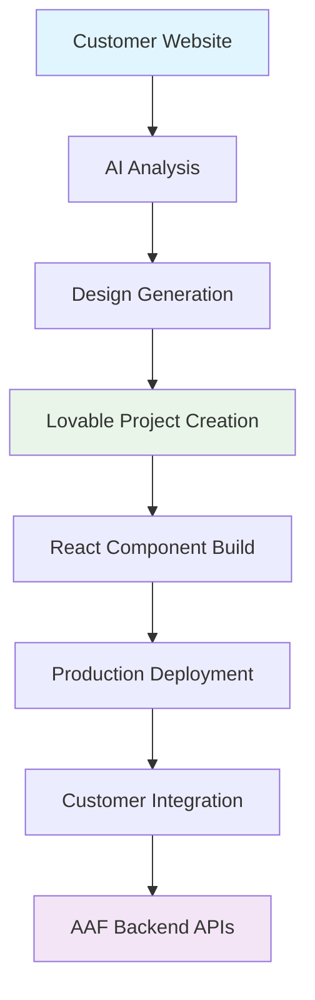
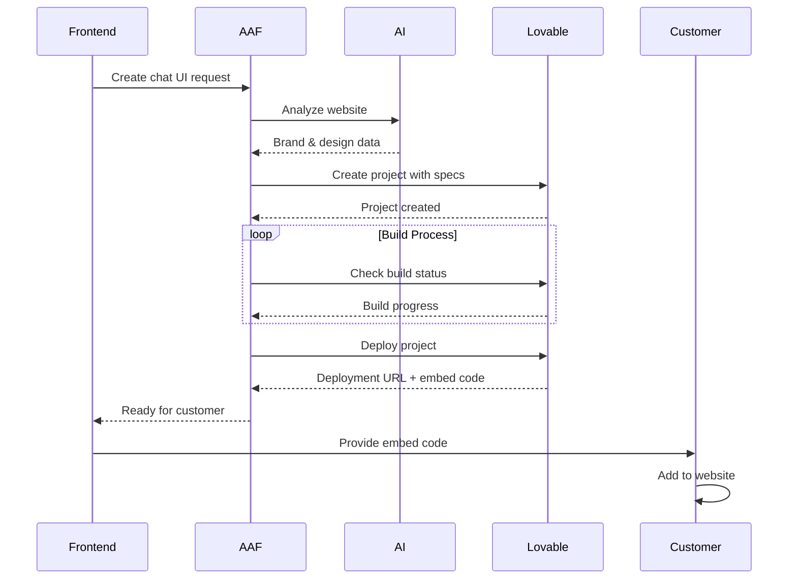

# Lovable Integration Guide

The Lovable integration allows you to generate production-ready chat UIs that customers can actually deploy on their websites, going beyond demos to real implementations.

## Overview

This integration combines:
- **AAF Backend**: Your LangSwarm-powered chat logic and AI agents
- **AI Design System**: Automatic website analysis and brand matching
- **Lovable Platform**: Production-ready React component generation
- **Customer Deployment**: Ready-to-embed chat widgets

## Architecture



## Features

### 🎨 **AI-Powered UI Generation**
- Automatic website analysis and brand extraction
- Custom React components that match brand identity
- TypeScript support with full type safety
- Tailwind CSS for modern styling

### 🚀 **Production-Ready Components**
- Real-time messaging with WebSocket support
- Message history and session management
- File upload capabilities (optional)
- Emoji support and typing indicators
- Mobile-responsive design
- Accessibility compliance (WCAG 2.1)

### 🔧 **Seamless Integration**
- Direct connection to AAF backend APIs
- Session-based authentication
- Error handling and retry logic
- Custom domain support
- CDN optimization

---

## API Endpoints

### 1. Create Lovable Project

**`POST /api/lovable/create-project`**

Create a production-ready chat UI project.

**Request Body:**
```json
{
  "company_name": "TechCorp Solutions",
  "website_url": "https://techcorp.com",
  "use_ai_design": true,
  "primary_color": "#2563eb",
  "secondary_color": "#64748b",
  "font_family": "Inter, sans-serif",
  "chat_title": "TechCorp Support",
  "welcome_message": "Hi! How can we help you today?",
  "enable_file_upload": true,
  "enable_emoji": true,
  "enable_typing_indicator": true,
  "enable_message_history": true,
  "aaf_backend_url": "https://your-aaf-backend.com",
  "agent_id": "support_agent"
}
```

**Response:**
```json
{
  "project_id": "proj_abc123",
  "project_url": "https://lovable.dev/projects/proj_abc123",
  "build_status": "building",
  "preview_url": "https://preview.lovable.dev/proj_abc123",
  "metadata": {
    "lovable_project_id": "proj_abc123",
    "company_name": "TechCorp Solutions",
    "aaf_backend_url": "https://your-aaf-backend.com",
    "ai_design_used": true,
    "ai_prompt_used": true
  },
  "estimated_build_time": "2-3 minutes",
  "next_steps": [
    "Monitor build status",
    "Deploy when ready",
    "Integrate embed code"
  ]
}
```

### 2. Check Build Status

**`GET /api/lovable/projects/{project_id}/status`**

Monitor the build progress of your chat UI.

**Response:**
```json
{
  "project_id": "proj_abc123",
  "status": "building",
  "build_progress": 75,
  "preview_url": "https://preview.lovable.dev/proj_abc123",
  "logs": [
    "Installing dependencies...",
    "Generating components...",
    "Building TypeScript...",
    "Optimizing bundle..."
  ],
  "estimated_completion": "2024-01-15T10:30:00Z"
}
```

### 3. Deploy Project

**`POST /api/lovable/deploy`**

Deploy the chat UI to production.

**Request Body:**
```json
{
  "project_id": "proj_abc123",
  "deployment_name": "techcorp-chat-prod",
  "environment": "production",
  "custom_domain": "chat.techcorp.com"
}
```

**Response:**
```json
{
  "deployment_id": "dep_xyz789",
  "deployment_url": "https://chat.techcorp.com",
  "custom_domain": "chat.techcorp.com",
  "ssl_certificate": true,
  "cdn_enabled": true,
  "deployment_status": "deploying",
  "embed_code": "<script src=\"https://chat.techcorp.com/widget.js\"></script>",
  "integration_guide": {
    "html": "<script src=\"https://chat.techcorp.com/widget.js\"></script>",
    "react": "import ChatWidget from \"https://chat.techcorp.com/react\"",
    "vue": "import ChatWidget from \"https://chat.techcorp.com/vue\""
  }
}
```

### 4. List Projects

**`GET /api/lovable/projects`**

List all your Lovable chat UI projects.

**Response:**
```json
{
  "projects": [
    {
      "id": "proj_abc123",
      "name": "TechCorp Solutions Chat UI",
      "status": "deployed",
      "created_at": "2024-01-15T10:00:00Z",
      "deployment_url": "https://chat.techcorp.com"
    }
  ],
  "total": 1
}
```

### 5. Delete Project

**`DELETE /api/lovable/projects/{project_id}`**

Delete a Lovable project and its deployments.

---

## Setup Guide

### 1. **Lovable Account Setup**

1. **Create Lovable Account**: Sign up at [lovable.dev](https://lovable.dev)
2. **Get API Credentials**:
   ```bash
   # Get your API key from Lovable dashboard
   LOVABLE_API_KEY=your-api-key-here
   
   # Get your workspace ID
   LOVABLE_WORKSPACE_ID=your-workspace-id
   ```

3. **Configure Environment**:
   ```bash
   # Add to your .env file
   LOVABLE_API_KEY=your-lovable-api-key-here
   LOVABLE_WORKSPACE_ID=your-lovable-workspace-id
   ```

### 2. **Integration Workflow**



---

## Frontend Integration Examples

### React Admin Dashboard

```jsx
import React, { useState, useEffect } from 'react';

const LovableChatManager = () => {
  const [projects, setProjects] = useState([]);
  const [loading, setLoading] = useState(false);
  const [selectedProject, setSelectedProject] = useState(null);

  // Create new chat UI project
  const createProject = async (formData) => {
    setLoading(true);
    try {
      const response = await fetch('/api/lovable/create-project', {
        method: 'POST',
        headers: { 'Content-Type': 'application/json' },
        body: JSON.stringify({
          company_name: formData.companyName,
          website_url: formData.websiteUrl,
          use_ai_design: true,
          aaf_backend_url: process.env.REACT_APP_AAF_BACKEND_URL,
          ...formData
        })
      });

      const project = await response.json();
      setProjects([...projects, project]);
      
      // Start monitoring build status
      monitorBuildStatus(project.project_id);
      
    } catch (error) {
      console.error('Failed to create project:', error);
    } finally {
      setLoading(false);
    }
  };

  // Monitor build status
  const monitorBuildStatus = async (projectId) => {
    const checkStatus = async () => {
      try {
        const response = await fetch(`/api/lovable/projects/${projectId}/status`);
        const status = await response.json();
        
        // Update project in state
        setProjects(prev => prev.map(p => 
          p.project_id === projectId 
            ? { ...p, ...status }
            : p
        ));
        
        // Continue monitoring if still building
        if (status.status === 'building') {
          setTimeout(checkStatus, 5000); // Check every 5 seconds
        }
        
      } catch (error) {
        console.error('Status check failed:', error);
      }
    };
    
    checkStatus();
  };

  // Deploy project
  const deployProject = async (projectId, deploymentConfig) => {
    try {
      const response = await fetch('/api/lovable/deploy', {
        method: 'POST',
        headers: { 'Content-Type': 'application/json' },
        body: JSON.stringify({
          project_id: projectId,
          deployment_name: `${deploymentConfig.companyName}-chat`,
          environment: 'production',
          custom_domain: deploymentConfig.customDomain
        })
      });

      const deployment = await response.json();
      
      // Update project with deployment info
      setProjects(prev => prev.map(p => 
        p.project_id === projectId 
          ? { ...p, deployment }
          : p
      ));
      
      return deployment;
      
    } catch (error) {
      console.error('Deployment failed:', error);
    }
  };

  return (
    <div className="lovable-chat-manager">
      <div className="header">
        <h2>🚀 Production Chat UI Generator</h2>
        <button onClick={() => setShowCreateForm(true)}>
          Create New Chat UI
        </button>
      </div>

      <div className="projects-grid">
        {projects.map(project => (
          <ProjectCard 
            key={project.project_id}
            project={project}
            onDeploy={deployProject}
            onSelect={setSelectedProject}
          />
        ))}
      </div>

      {selectedProject && (
        <ProjectDetails 
          project={selectedProject}
          onClose={() => setSelectedProject(null)}
        />
      )}
    </div>
  );
};

const ProjectCard = ({ project, onDeploy, onSelect }) => {
  const getStatusColor = (status) => {
    switch (status) {
      case 'building': return 'orange';
      case 'ready': return 'green';
      case 'deployed': return 'blue';
      case 'failed': return 'red';
      default: return 'gray';
    }
  };

  return (
    <div className="project-card" onClick={() => onSelect(project)}>
      <div className="project-header">
        <h3>{project.metadata?.company_name}</h3>
        <span 
          className={`status-badge ${getStatusColor(project.build_status)}`}
        >
          {project.build_status}
        </span>
      </div>
      
      <div className="project-info">
        <p>Project ID: {project.project_id}</p>
        <p>AI Design: {project.metadata?.ai_design_used ? '✅' : '❌'}</p>
        
        {project.build_progress && (
          <div className="progress-bar">
            <div 
              className="progress-fill"
              style={{ width: `${project.build_progress}%` }}
            />
            <span>{project.build_progress}%</span>
          </div>
        )}
      </div>

      <div className="project-actions">
        {project.preview_url && (
          <a href={project.preview_url} target="_blank" rel="noopener">
            👀 Preview
          </a>
        )}
        
        {project.build_status === 'ready' && (
          <button onClick={(e) => {
            e.stopPropagation();
            onDeploy(project.project_id, project.metadata);
          }}>
            🚀 Deploy
          </button>
        )}
        
        {project.deployment?.deployment_url && (
          <a href={project.deployment.deployment_url} target="_blank" rel="noopener">
            🌐 Live Site
          </a>
        )}
      </div>
    </div>
  );
};

const ProjectDetails = ({ project, onClose }) => {
  const [embedCode, setEmbedCode] = useState('');

  useEffect(() => {
    if (project.deployment?.embed_code) {
      setEmbedCode(project.deployment.embed_code);
    }
  }, [project]);

  const copyEmbedCode = () => {
    navigator.clipboard.writeText(embedCode);
    // Show success toast
  };

  return (
    <div className="project-details-modal">
      <div className="modal-content">
        <div className="modal-header">
          <h2>{project.metadata?.company_name} - Chat UI Details</h2>
          <button onClick={onClose}>✕</button>
        </div>

        <div className="details-grid">
          <div className="detail-section">
            <h3>📊 Project Info</h3>
            <ul>
              <li>Status: {project.build_status}</li>
              <li>AI Design: {project.metadata?.ai_design_used ? 'Used' : 'Manual'}</li>
              <li>Backend: {project.metadata?.aaf_backend_url}</li>
              <li>Agent: {project.metadata?.agent_id || 'Default'}</li>
            </ul>
          </div>

          {project.deployment && (
            <div className="detail-section">
              <h3>🌐 Deployment</h3>
              <ul>
                <li>URL: <a href={project.deployment.deployment_url} target="_blank" rel="noopener">
                  {project.deployment.deployment_url}
                </a></li>
                <li>SSL: {project.deployment.ssl_certificate ? '✅' : '❌'}</li>
                <li>CDN: {project.deployment.cdn_enabled ? '✅' : '❌'}</li>
              </ul>
            </div>
          )}

          {embedCode && (
            <div className="detail-section full-width">
              <h3>📋 Embed Code</h3>
              <div className="embed-code-container">
                <pre><code>{embedCode}</code></pre>
                <button onClick={copyEmbedCode}>Copy Code</button>
              </div>
              
              <div className="integration-examples">
                <h4>Integration Examples:</h4>
                <div className="code-tabs">
                  <div className="tab-content">
                    <strong>HTML:</strong>
                    <pre><code>{project.deployment?.integration_guide?.html}</code></pre>
                  </div>
                  <div className="tab-content">
                    <strong>React:</strong>
                    <pre><code>{project.deployment?.integration_guide?.react}</code></pre>
                  </div>
                  <div className="tab-content">
                    <strong>Vue:</strong>
                    <pre><code>{project.deployment?.integration_guide?.vue}</code></pre>
                  </div>
                </div>
              </div>
            </div>
          )}

          {project.logs && (
            <div className="detail-section full-width">
              <h3>📝 Build Logs</h3>
              <div className="logs-container">
                {project.logs.map((log, index) => (
                  <div key={index} className="log-entry">
                    {log}
                  </div>
                ))}
              </div>
            </div>
          )}
        </div>
      </div>
    </div>
  );
};

export default LovableChatManager;
```

### Vue.js Implementation

```vue
<template>
  <div class="lovable-integration">
    <div class="control-panel">
      <h2>🎨 Production Chat UI Generator</h2>
      
      <form @submit.prevent="createChatUI" class="creation-form">
        <div class="form-grid">
          <div class="form-group">
            <label>Company Name:</label>
            <input v-model="form.companyName" required>
          </div>
          
          <div class="form-group">
            <label>Website URL:</label>
            <input v-model="form.websiteUrl" type="url">
          </div>
          
          <div class="form-group">
            <label>
              <input type="checkbox" v-model="form.useAiDesign">
              Use AI Design Analysis
            </label>
          </div>
          
          <div class="form-group">
            <label>Chat Title:</label>
            <input v-model="form.chatTitle" :placeholder="`${form.companyName} Support`">
          </div>
        </div>
        
        <div class="feature-toggles">
          <label><input type="checkbox" v-model="form.enableFileUpload"> File Upload</label>
          <label><input type="checkbox" v-model="form.enableEmoji"> Emoji Support</label>
          <label><input type="checkbox" v-model="form.enableTyping"> Typing Indicators</label>
        </div>
        
        <button type="submit" :disabled="loading">
          {{ loading ? '⏳ Creating...' : '🚀 Create Chat UI' }}
        </button>
      </form>
    </div>

    <div class="projects-section">
      <h3>📋 Your Chat UI Projects</h3>
      
      <div class="projects-list">
        <div 
          v-for="project in projects" 
          :key="project.project_id"
          class="project-item"
          :class="{ 'selected': selectedProject?.project_id === project.project_id }"
          @click="selectProject(project)"
        >
          <div class="project-header">
            <h4>{{ project.metadata?.company_name }}</h4>
            <StatusBadge :status="project.build_status" />
          </div>
          
          <div class="project-meta">
            <span>ID: {{ project.project_id.slice(0, 8) }}...</span>
            <span>AI: {{ project.metadata?.ai_design_used ? '🤖' : '👤' }}</span>
          </div>
          
          <ProgressBar 
            v-if="project.build_status === 'building'"
            :progress="project.build_progress || 0"
          />
          
          <div class="project-actions">
            <button 
              v-if="project.preview_url"
              @click.stop="openPreview(project.preview_url)"
              class="preview-btn"
            >
              👀 Preview
            </button>
            
            <button 
              v-if="project.build_status === 'ready'"
              @click.stop="deployProject(project)"
              class="deploy-btn"
            >
              🚀 Deploy
            </button>
            
            <button 
              v-if="project.deployment?.deployment_url"
              @click.stop="openDeployment(project.deployment.deployment_url)"
              class="live-btn"
            >
              🌐 Live
            </button>
          </div>
        </div>
      </div>
    </div>

    <ProjectDetailsPanel 
      v-if="selectedProject"
      :project="selectedProject"
      @close="selectedProject = null"
      @deploy="deployProject"
    />

    <DeploymentModal
      v-if="showDeployModal"
      :project="deployingProject"
      @close="showDeployModal = false"
      @deploy="handleDeploy"
    />
  </div>
</template>

<script>
export default {
  data() {
    return {
      form: {
        companyName: '',
        websiteUrl: '',
        useAiDesign: true,
        chatTitle: '',
        enableFileUpload: false,
        enableEmoji: true,
        enableTyping: true
      },
      projects: [],
      selectedProject: null,
      loading: false,
      showDeployModal: false,
      deployingProject: null
    };
  },
  
  async mounted() {
    await this.loadProjects();
  },
  
  methods: {
    async createChatUI() {
      this.loading = true;
      
      try {
        const response = await fetch('/api/lovable/create-project', {
          method: 'POST',
          headers: { 'Content-Type': 'application/json' },
          body: JSON.stringify({
            company_name: this.form.companyName,
            website_url: this.form.websiteUrl || null,
            use_ai_design: this.form.useAiDesign,
            chat_title: this.form.chatTitle || `${this.form.companyName} Support`,
            enable_file_upload: this.form.enableFileUpload,
            enable_emoji: this.form.enableEmoji,
            enable_typing_indicator: this.form.enableTyping,
            aaf_backend_url: process.env.VUE_APP_AAF_BACKEND_URL
          })
        });
        
        const project = await response.json();
        this.projects.unshift(project);
        
        // Start monitoring
        this.monitorProject(project.project_id);
        
        // Reset form
        this.form = {
          companyName: '',
          websiteUrl: '',
          useAiDesign: true,
          chatTitle: '',
          enableFileUpload: false,
          enableEmoji: true,
          enableTyping: true
        };
        
        this.$toast.success('Chat UI project created successfully!');
        
      } catch (error) {
        this.$toast.error('Failed to create project: ' + error.message);
      } finally {
        this.loading = false;
      }
    },
    
    async loadProjects() {
      try {
        const response = await fetch('/api/lovable/projects');
        const data = await response.json();
        this.projects = data.projects;
      } catch (error) {
        this.$toast.error('Failed to load projects');
      }
    },
    
    async monitorProject(projectId) {
      const checkStatus = async () => {
        try {
          const response = await fetch(`/api/lovable/projects/${projectId}/status`);
          const status = await response.json();
          
          // Update project
          const projectIndex = this.projects.findIndex(p => p.project_id === projectId);
          if (projectIndex !== -1) {
            this.projects[projectIndex] = { ...this.projects[projectIndex], ...status };
          }
          
          // Continue monitoring
          if (status.status === 'building') {
            setTimeout(checkStatus, 3000);
          } else if (status.status === 'ready') {
            this.$toast.success('Project build completed!');
          }
          
        } catch (error) {
          console.error('Status check failed:', error);
        }
      };
      
      checkStatus();
    },
    
    selectProject(project) {
      this.selectedProject = project;
    },
    
    deployProject(project) {
      this.deployingProject = project;
      this.showDeployModal = true;
    },
    
    async handleDeploy(deploymentConfig) {
      try {
        const response = await fetch('/api/lovable/deploy', {
          method: 'POST',
          headers: { 'Content-Type': 'application/json' },
          body: JSON.stringify({
            project_id: this.deployingProject.project_id,
            deployment_name: deploymentConfig.name,
            environment: 'production',
            custom_domain: deploymentConfig.customDomain
          })
        });
        
        const deployment = await response.json();
        
        // Update project
        const projectIndex = this.projects.findIndex(p => p.project_id === this.deployingProject.project_id);
        if (projectIndex !== -1) {
          this.projects[projectIndex].deployment = deployment;
        }
        
        this.showDeployModal = false;
        this.$toast.success('Deployment started successfully!');
        
      } catch (error) {
        this.$toast.error('Deployment failed: ' + error.message);
      }
    },
    
    openPreview(url) {
      window.open(url, '_blank');
    },
    
    openDeployment(url) {
      window.open(url, '_blank');
    }
  }
};
</script>
```

---

## Generated Code Structure

When you create a Lovable project, it generates a complete React application with this structure:

```
lovable-chat-widget/
├── src/
│   ├── components/
│   │   ├── ChatWidget.tsx          # Main widget component
│   │   ├── MessageList.tsx         # Message display
│   │   ├── MessageInput.tsx        # Input component
│   │   ├── TypingIndicator.tsx     # Typing animation
│   │   └── FileUpload.tsx          # File upload (if enabled)
│   │
│   ├── hooks/
│   │   ├── useChat.ts              # Chat functionality
│   │   ├── useWebSocket.ts         # WebSocket connection
│   │   └── useLocalStorage.ts      # Local storage management
│   │
│   ├── services/
│   │   ├── chatAPI.ts              # AAF backend integration
│   │   ├── websocketService.ts     # WebSocket service
│   │   └── errorHandler.ts         # Error handling
│   │
│   ├── types/
│   │   ├── chat.ts                 # Type definitions
│   │   ├── api.ts                  # API types
│   │   └── websocket.ts            # WebSocket types
│   │
│   ├── styles/
│   │   ├── globals.css             # Global styles
│   │   ├── theme.ts                # Theme configuration
│   │   └── animations.css          # CSS animations
│   │
│   └── utils/
│       ├── formatters.ts           # Text formatting
│       ├── validators.ts           # Input validation
│       └── constants.ts            # App constants
│
├── public/
│   ├── widget.js                   # Standalone widget script
│   ├── widget.css                  # Widget styles
│   └── embed.html                  # Integration example
│
├── package.json                    # Dependencies
├── tailwind.config.js              # Tailwind configuration
├── tsconfig.json                   # TypeScript configuration
└── vite.config.ts                  # Build configuration
```

## Key Benefits

### 🚀 **For You (Service Provider)**
- **No Frontend Development**: Lovable generates production-ready React components
- **Brand Consistency**: AI ensures each widget matches customer branding
- **Scalable Solution**: One backend supports unlimited custom frontends
- **Time Savings**: Minutes instead of weeks for custom chat implementations

### 💼 **For Your Customers**
- **Professional Integration**: Production-ready, not just demos
- **Brand Native**: Feels like part of their website
- **Full Ownership**: They get the complete source code
- **Customizable**: Can modify and extend as needed
- **Performance Optimized**: CDN delivery and mobile optimization

### 🔧 **For Developers**
- **Type Safety**: Full TypeScript support
- **Modern Stack**: React, Tailwind, Vite
- **Best Practices**: Clean architecture and error handling
- **Accessibility**: WCAG 2.1 compliant
- **Testing Ready**: Jest and testing utilities included

This integration transforms AAF from a backend service into a **complete chat solution platform** where customers get production-ready, brand-matched chat interfaces that they can deploy and customize! 🎨🚀
