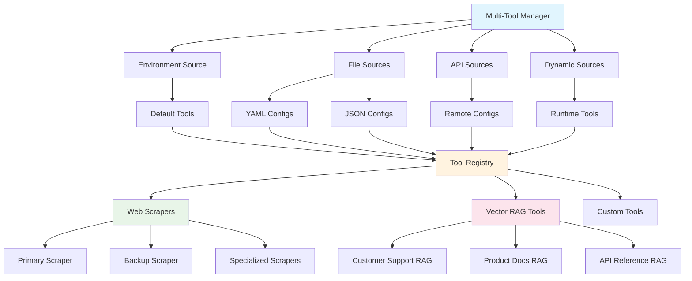

# Multi-Tool System

The AAF Multi-Tool System enables you to configure and manage multiple instances of tools from different sources, providing flexibility, redundancy, and specialization for various use cases.

## Overview

### Why Multiple Tools?

**Single Tool Limitations:**
- Single point of failure
- One-size-fits-all approach
- Limited specialization
- No failover capabilities

**Multi-Tool Benefits:**
- **Redundancy**: Multiple scrapers for high availability
- **Specialization**: Different tools for different content types
- **Load Distribution**: Spread requests across multiple instances
- **Flexible Configuration**: Environment-specific setups
- **Gradual Migration**: Deploy new tools alongside existing ones

## Architecture



## Tool Configuration

### Configuration Sources

1. **Environment Variables** (Legacy compatibility)
2. **YAML/JSON Files** (Structured configuration)
3. **API Endpoints** (Remote configuration)
4. **Dynamic Sources** (Runtime addition)

### Tool Configuration Schema

```yaml
# Basic tool configuration
tool_id: "unique_identifier"           # Required: Unique tool ID
tool_type: "web_scraper"              # Required: Tool type
name: "Display Name"                  # Required: Human-readable name
description: "Tool description"       # Optional: Description
enabled: true                         # Optional: Enable/disable tool
config:                               # Required: Tool-specific config
  # Tool-specific parameters
tags: ["tag1", "tag2"]               # Optional: Categorization tags
priority: 10                         # Optional: Tool priority (higher = preferred)
```

### Source Configuration Schema

```yaml
source:
  source_id: "unique_source_id"       # Required: Unique source ID
  description: "Source description"   # Optional: Description
  
tools:
  - tool_id: "tool1"
    # ... tool configuration
  - tool_id: "tool2"
    # ... tool configuration
```

## Configuration Examples

### Multiple Web Scrapers

**File: `config/tools/web_scrapers.yaml`**

```yaml
source:
  source_id: "web_scrapers_config"
  description: "Multiple web scraper tools"

tools:
  - tool_id: "crawl4ai_primary"
    tool_type: "web_scraper"
    name: "Primary Crawl4AI Scraper"
    enabled: true
    config:
      mcp_server_url: "https://primary-crawl4ai.company.com"
      api_key: "${CRAWL4AI_PRIMARY_API_KEY}"
    tags: ["primary", "production"]
    priority: 10

  - tool_id: "crawl4ai_backup"
    tool_type: "web_scraper" 
    name: "Backup Crawl4AI Scraper"
    enabled: true
    config:
      mcp_server_url: "https://backup-crawl4ai.company.com"
      api_key: "${CRAWL4AI_BACKUP_API_KEY}"
    tags: ["backup", "failover"]
    priority: 5

  - tool_id: "news_scraper"
    tool_type: "web_scraper"
    name: "News-Specialized Scraper"
    enabled: true
    config:
      mcp_server_url: "https://news-scraper.company.com"
      api_key: "${NEWS_SCRAPER_API_KEY}"
    tags: ["news", "specialized"]
    priority: 8
```

### Multiple Vector RAG Tools

**File: `config/tools/vector_rag_tools.yaml`**

```yaml
source:
  source_id: "vector_rag_config"
  description: "Multiple vector search RAG tools"

tools:
  - tool_id: "customer_support_rag"
    tool_type: "vector_search_rag"
    name: "Customer Support Knowledge Base"
    enabled: true
    config:
      project_id: "${GOOGLE_CLOUD_PROJECT}"
      dataset_id: "customer_support_vectors"
      embedding_model: "text-embedding-3-small"
    tags: ["customer_support", "documentation"]
    priority: 10

  - tool_id: "api_reference_rag"
    tool_type: "vector_search_rag"
    name: "API Reference Documentation"
    enabled: true
    config:
      project_id: "${GOOGLE_CLOUD_PROJECT}"
      dataset_id: "api_reference_vectors"
      embedding_model: "text-embedding-3-large"
    tags: ["api", "developer", "technical"]
    priority: 9

  - tool_id: "legal_documents_rag"
    tool_type: "vector_search_rag"
    name: "Legal Documents Archive"
    enabled: true
    config:
      project_id: "${LEGAL_PROJECT_ID}"
      dataset_id: "legal_documents_vectors"
      embedding_model: "text-embedding-3-large"
    tags: ["legal", "compliance", "secure"]
    priority: 5
```

## API Usage

### List All Tools

**`GET /api/multi-tools/`**

```json
{
  "success": true,
  "tools": {
    "crawl4ai_primary": {
      "tool_id": "crawl4ai_primary",
      "tool_type": "web_scraper",
      "name": "Primary Crawl4AI Scraper",
      "enabled": true,
      "tags": ["primary", "production"],
      "priority": 10,
      "source": {
        "source_id": "web_scrapers_config",
        "source_type": "file"
      }
    }
  },
  "total_tools": 8,
  "total_sources": 3,
  "tools_by_type": {
    "web_scraper": 4,
    "vector_search_rag": 4
  }
}
```

### Get Tools by Type

**`GET /api/multi-tools/by-type/web_scraper`**

```json
{
  "success": true,
  "tool_type": "web_scraper",
  "tools": {
    "crawl4ai_primary": {
      "tool_id": "crawl4ai_primary",
      "name": "Primary Crawl4AI Scraper",
      "priority": 10,
      "tags": ["primary", "production"]
    },
    "news_scraper": {
      "tool_id": "news_scraper", 
      "name": "News-Specialized Scraper",
      "priority": 8,
      "tags": ["news", "specialized"]
    }
  },
  "count": 2
}
```

### Get Tools by Tag

**`GET /api/multi-tools/by-tag/customer_support`**

```json
{
  "success": true,
  "tag": "customer_support",
  "tools": {
    "customer_support_rag": {
      "tool_id": "customer_support_rag",
      "name": "Customer Support Knowledge Base",
      "tool_type": "vector_search_rag",
      "tags": ["customer_support", "documentation"]
    }
  },
  "count": 1
}
```

### Call Specific Tool

**`POST /api/multi-tools/call`**

```json
{
  "tool_id": "news_scraper",
  "function_name": "scrape_url",
  "arguments": {
    "url": "https://news.example.com/article",
    "extract_text": true,
    "remove_ads": true
  }
}
```

### Call Tool by Type with Preferences

**`POST /api/multi-tools/call-by-type`**

```json
{
  "tool_type": "web_scraper",
  "function_name": "scrape_url", 
  "arguments": {
    "url": "https://news.site.com/breaking",
    "extract_text": true
  },
  "prefer_tags": ["news", "specialized"]
}
```

### Smart Web Scraping

**`POST /api/multi-tools/web-scraper/scrape`**

```json
{
  "url": "https://ecommerce.site.com/product/123",
  "prefer_tags": ["ecommerce", "products"],
  "extract_text": true,
  "extract_images": true,
  "css_selector": ".product-description"
}
```

### Smart Vector Search

**`POST /api/multi-tools/vector-rag/search`**

```json
{
  "query": "How do I authenticate API requests?",
  "prefer_tags": ["api", "developer"],
  "limit": 5,
  "similarity_threshold": 0.8
}
```

### Smart Document Loading

**`POST /api/multi-tools/vector-rag/load`**

```json
{
  "source_type": "file",
  "source_path": "/docs/customer-faq.md",
  "collection_name": "support_docs",
  "prefer_tags": ["customer_support"],
  "title": "Customer FAQ"
}
```

## Tool Selection Logic

### Automatic Tool Selection

When no specific `tool_id` is provided, the system uses this selection logic:

1. **Filter by Type**: Get all tools of the requested type
2. **Apply Tag Preferences**: Prioritize tools with preferred tags
3. **Sort by Priority**: Use tools with higher priority values
4. **Select Best Match**: Choose the highest-priority, tag-matching tool

### Priority System

```python
# Tool priority levels
CRITICAL = 10      # Production, primary tools
HIGH = 8-9         # Important, specialized tools  
MEDIUM = 5-7       # Standard, backup tools
LOW = 1-4          # Development, testing tools
DISABLED = 0       # Disabled tools
```

### Tag-Based Selection

```python
# Example tag strategies
content_based = ["news", "ecommerce", "technical", "legal"]
purpose_based = ["production", "development", "testing", "backup"]
quality_based = ["primary", "secondary", "specialized", "general"]
access_based = ["public", "internal", "secure", "restricted"]
```

## Dynamic Tool Management

### Add Tool Source at Runtime

**`POST /api/multi-tools/sources`**

```json
{
  "source": {
    "source_id": "emergency_scrapers",
    "source_type": "api",
    "tools": [
      {
        "tool_id": "emergency_scraper_1",
        "tool_type": "web_scraper",
        "name": "Emergency Backup Scraper",
        "enabled": true,
        "config": {
          "mcp_server_url": "https://emergency.scraper.com",
          "api_key": "emergency-key"
        },
        "tags": ["emergency", "backup"],
        "priority": 3
      }
    ]
  }
}
```

### Remove Tool Source

**`DELETE /api/multi-tools/sources/emergency_scrapers`**

```json
{
  "success": true,
  "message": "Tool source emergency_scrapers removed successfully"
}
```

## Use Cases and Strategies

### High Availability Web Scraping

```yaml
# Primary scraper (highest priority)
- tool_id: "primary_scraper"
  priority: 10
  tags: ["primary", "production"]

# Backup scraper (medium priority)  
- tool_id: "backup_scraper"
  priority: 5
  tags: ["backup", "production"]

# Emergency scraper (low priority)
- tool_id: "emergency_scraper"
  priority: 2
  tags: ["emergency", "backup"]
```

**Usage:**
```python
# Always uses the highest priority available scraper
result = await call_tool_by_type("web_scraper", "scrape_url", {"url": url})

# Prefers production tools, falls back to backup
result = await call_tool_by_type(
    "web_scraper", 
    "scrape_url", 
    {"url": url},
    prefer_tags=["production"]
)
```

### Content-Specialized Scraping

```yaml
# News content scraper
- tool_id: "news_scraper"
  tags: ["news", "media", "articles"]
  
# E-commerce scraper  
- tool_id: "ecommerce_scraper"
  tags: ["ecommerce", "products", "shopping"]

# Technical documentation scraper
- tool_id: "docs_scraper"
  tags: ["documentation", "technical", "api"]
```

**Usage:**
```python
# Automatically uses news-optimized scraper
await scrape_with_selection({
    "url": "https://news.site.com/article",
    "prefer_tags": ["news"]
})

# Uses e-commerce optimized scraper
await scrape_with_selection({
    "url": "https://shop.site.com/product/123", 
    "prefer_tags": ["ecommerce", "products"]
})
```

### Domain-Specific Vector Search

```yaml
# Customer support knowledge base
- tool_id: "support_rag"
  tags: ["customer_support", "faq"]
  config:
    dataset_id: "support_vectors"

# Developer documentation  
- tool_id: "dev_docs_rag"
  tags: ["developer", "api", "technical"]
  config:
    dataset_id: "dev_docs_vectors"
    embedding_model: "text-embedding-3-large"

# Legal documents
- tool_id: "legal_rag"
  tags: ["legal", "compliance", "contracts"]
  config:
    project_id: "${LEGAL_PROJECT_ID}"
    dataset_id: "legal_vectors"
```

**Usage:**
```python
# Customer support query - uses support-specific RAG
await search_with_selection({
    "query": "How do I reset my password?",
    "prefer_tags": ["customer_support"]
})

# Developer query - uses technical documentation RAG
await search_with_selection({
    "query": "How do I authenticate API requests?", 
    "prefer_tags": ["developer", "api"]
})

# Legal query - uses legal documents RAG
await search_with_selection({
    "query": "What are the data retention requirements?",
    "prefer_tags": ["legal", "compliance"]
})
```

### Environment-Based Configuration

```yaml
# Production tools
- tool_id: "prod_scraper"
  enabled: true
  tags: ["production"]
  config:
    mcp_server_url: "https://prod-scraper.company.com"

# Development tools  
- tool_id: "dev_scraper"
  enabled: false  # Disabled in production
  tags: ["development", "testing"]
  config:
    mcp_server_url: "https://dev-scraper.company.com"
```

## LangSwarm Agent Integration

### Agent Tool Access

Agents automatically have access to all enabled tools through the enhanced tool manager:

```python
# Agent can use any available scraper
"Please scrape the latest news from https://news.example.com"

# Agent automatically uses best RAG tool for the domain
"Search our customer support docs for password reset instructions"

# Agent can request specific specialization
"Use the e-commerce scraper to get product details from this shopping site"
```

### Intelligent Tool Selection

The multi-tool system enables agents to:

1. **Automatic Failover**: If primary tool fails, try backup tools
2. **Content-Aware Selection**: Choose specialized tools based on content type
3. **Performance Optimization**: Distribute load across multiple tools
4. **Quality Enhancement**: Use higher-quality tools for important tasks

## Monitoring and Management

### Tool Health Monitoring

```python
# Check all tools status
GET /api/multi-tools/

# Check specific tool
GET /api/multi-tools/crawl4ai_primary/status

# Check tools by type
GET /api/multi-tools/by-type/web_scraper
```

### Performance Metrics

```python
# Tools provide performance metrics
{
  "tool_id": "primary_scraper",
  "status": {
    "available": true,
    "requests_processed": 1543,
    "average_response_time": 2.3,
    "success_rate": 0.98,
    "last_used": "2024-01-15T14:30:00Z"
  }
}
```

### Configuration Validation

```python
# Validate tool configurations before deployment
POST /api/multi-tools/validate-config
{
  "config": {...},
  "dry_run": true
}
```

## Best Practices

### Tool Organization

1. **Logical Grouping**: Group tools by purpose, not just type
2. **Clear Naming**: Use descriptive names and consistent conventions
3. **Proper Tagging**: Apply relevant tags for easy discovery
4. **Priority Management**: Set priorities based on quality and importance

### Configuration Management

1. **Environment Variables**: Use environment variables for secrets
2. **Version Control**: Store configuration files in version control
3. **Documentation**: Document each tool's purpose and configuration
4. **Testing**: Test tool configurations in development environments

### Deployment Strategies

1. **Blue-Green Deployment**: Deploy new tools alongside existing ones
2. **Gradual Rollout**: Enable new tools with low priority, increase gradually
3. **Monitoring**: Monitor tool performance and adjust priorities
4. **Rollback Plan**: Keep backup tools available for quick rollback

The Multi-Tool System transforms AAF into a flexible, resilient platform that can adapt to changing requirements, handle failures gracefully, and optimize performance through intelligent tool selection! 🛠️🚀✨
