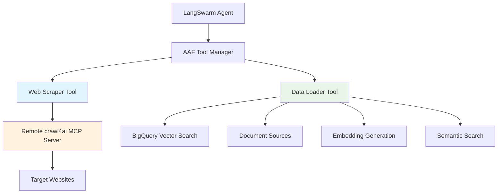

# AAF Tools Integration

This document describes the custom tools integrated with the AAF backend, including web scraping and data loading capabilities.

## Overview

AAF provides two custom tools that extend LangSwarm's capabilities:

1. **Web Scraper Tool**: Remote MCP integration with crawl4ai for web content extraction
2. **Vector Search RAG Tool**: Local MCP for semantic search using BigQuery Vector Search

Both tools are automatically registered with LangSwarm and can be used by agents for enhanced functionality.

## Architecture



---

## Web Scraper Tool

### Purpose
Extracts content from web pages using the hosted crawl4ai MCP server. Provides advanced web scraping capabilities with content cleaning and structured extraction.

### Configuration

```bash
# Environment variables
CRAWL4AI_MCP_URL=https://your-crawl4ai-mcp-server.com
CRAWL4AI_API_KEY=your-api-key-here
```

### Features

- **Text Extraction**: Clean text content with ad/navigation removal
- **Link Extraction**: Extract all hyperlinks from pages
- **Image Extraction**: Get image URLs and metadata
- **Metadata Extraction**: Page title, description, structured data
- **CSS Selectors**: Target specific content using CSS selectors
- **Batch Processing**: Scrape multiple URLs concurrently
- **Error Handling**: Robust error handling with retry logic

### API Endpoints

#### Single URL Scraping

**`POST /api/tools/web-scraper/scrape`**

```json
{
  "url": "https://example.com",
  "extract_text": true,
  "extract_links": false,
  "extract_images": false,
  "extract_metadata": true,
  "css_selector": ".main-content",
  "remove_ads": true,
  "remove_navigation": true
}
```

**Response:**
```json
{
  "success": true,
  "content": {
    "url": "https://example.com",
    "title": "Example Domain",
    "text": "This domain is for use in illustrative examples...",
    "links": ["https://www.iana.org/domains/example"],
    "images": ["https://example.com/logo.png"],
    "metadata": {
      "description": "Example domain for documentation",
      "keywords": ["example", "documentation"]
    },
    "word_count": 123,
    "processing_time": 2.45
  }
}
```

#### Batch URL Scraping

**`POST /api/tools/web-scraper/batch`**

```json
{
  "urls": [
    "https://example.com",
    "https://test.com",
    "https://demo.org"
  ],
  "extract_text": true,
  "extract_links": false
}
```

### LangSwarm Integration

Agents can use the web scraper tool directly:

```python
# In agent conversation
"Please scrape https://example.com and summarize the main content"

# Agent internally calls:
result = await tool_manager.call_tool(
    "web_scraper", 
    "scrape_url", 
    {"url": "https://example.com", "extract_text": True}
)
```

---

## Data Loader Tool

### Purpose
Loads data from various sources (files, URLs, databases, APIs) into a local database and makes it queryable by LangSwarm agents.

### Configuration

```bash
# Environment variables
DATA_STORAGE_BACKEND=sqlite  # Options: sqlite, postgresql, bigquery
DATA_CONNECTION_STRING=sqlite:///aaf_data.db
```

### Supported Data Sources

#### File Sources
- **CSV**: Comma-separated values with custom delimiters
- **JSON**: Nested JSON objects and arrays
- **Excel**: XLSX/XLS files with sheet selection
- **Parquet**: Columnar storage format

#### URL Sources
- **Remote CSV/JSON**: Download and process remote files
- **API Endpoints**: REST APIs returning JSON data

#### Database Sources
- **SQL Queries**: Connect to external databases
- **Data Warehouses**: BigQuery, PostgreSQL, etc.

### API Endpoints

#### Load Data

**`POST /api/tools/data-loader/load`**

```json
{
  "source_type": "file",
  "source_path": "/path/to/data.csv",
  "data_format": "csv",
  "table_name": "customer_data",
  "description": "Customer information dataset",
  "tags": ["customers", "sales"],
  "encoding": "utf-8",
  "delimiter": ",",
  "transformation_rules": {
    "rename_columns": {"old_name": "new_name"},
    "select_columns": ["id", "name", "email"],
    "convert_types": {"age": "int64"},
    "drop_nulls": true
  }
}
```

**Response:**
```json
{
  "success": true,
  "content": {
    "load_id": "load_abc123",
    "table_name": "customer_data",
    "rows_loaded": 1000,
    "columns": ["id", "name", "email", "age"],
    "processing_time": 3.2,
    "sample_data": [
      {"id": 1, "name": "John Doe", "email": "john@example.com", "age": 30},
      {"id": 2, "name": "Jane Smith", "email": "jane@example.com", "age": 25}
    ]
  }
}
```

#### Query Data

**`POST /api/tools/data-loader/query`**

```json
{
  "table_name": "customer_data",
  "query_type": "select",
  "columns": ["name", "email"],
  "filters": {"age": 30},
  "limit": 10,
  "offset": 0,
  "order_by": "name"
}
```

**Response:**
```json
{
  "success": true,
  "data": {
    "rows": [
      {"name": "John Doe", "email": "john@example.com"},
      {"name": "John Smith", "email": "johns@example.com"}
    ],
    "count": 2,
    "query": "SELECT name, email FROM customer_data WHERE age = 30 ORDER BY name LIMIT 10 OFFSET 0"
  }
}
```

#### List Tables

**`GET /api/tools/data-loader/tables`**

```json
{
  "success": true,
  "data": {
    "tables": ["customer_data", "product_catalog", "sales_records"],
    "metadata": {
      "customer_data": {
        "rows": 1000,
        "columns": ["id", "name", "email", "age"],
        "description": "Customer information dataset",
        "created_at": "2024-01-15T10:30:00Z"
      }
    }
  }
}
```

#### Get Table Schema

**`GET /api/tools/data-loader/tables/{table_name}/schema`**

```json
{
  "success": true,
  "data": {
    "table_name": "customer_data",
    "columns": ["id", "name", "email", "age"],
    "data_types": {
      "id": "int64",
      "name": "object",
      "email": "object", 
      "age": "int64"
    },
    "row_count": 1000,
    "description": "Customer information dataset"
  }
}
```

### Data Transformation

The data loader supports various transformation rules:

```json
{
  "transformation_rules": {
    "rename_columns": {
      "customer_id": "id",
      "full_name": "name"
    },
    "select_columns": ["id", "name", "email", "age"],
    "convert_types": {
      "age": "int64",
      "created_date": "datetime64"
    },
    "filters": [
      {"column": "age", "operator": ">", "value": 18},
      {"column": "email", "operator": "contains", "value": "@"}
    ],
    "fill_nulls": {
      "age": 0,
      "city": "Unknown"
    },
    "drop_nulls": true
  }
}
```

### LangSwarm Integration

Agents can load and query data:

```python
# Load data
"Please load the customer data from /path/to/customers.csv"

# Query data
"Show me all customers from California"

# Agent internally calls:
await tool_manager.call_tool(
    "data_loader",
    "query_data", 
    {
        "table_name": "customers",
        "filters": {"state": "California"},
        "limit": 100
    }
)
```

---

## Tool Management

### List All Tools

**`GET /api/tools/`**

```json
{
  "success": true,
  "tools": {
    "web_scraper": {
      "name": "web_scraper",
      "description": "Extract content from web pages using advanced scraping",
      "type": "remote_mcp",
      "functions": []
    },
    "data_loader": {
      "name": "data_loader", 
      "description": "Load and query data from various sources",
      "type": "local_mcp",
      "functions": [
        {"name": "load_data", "description": "Load data from sources"},
        {"name": "query_data", "description": "Query loaded data"},
        {"name": "list_tables", "description": "List available tables"}
      ]
    }
  },
  "count": 2
}
```

### Tool Status

**`GET /api/tools/{tool_name}/status`**

```json
{
  "success": true,
  "status": {
    "name": "web_scraper",
    "available": true,
    "type": "remote_mcp",
    "mcp_server_url": "https://crawl4ai-server.com",
    "authenticated": true
  }
}
```

### Generic Tool Call

**`POST /api/tools/call`**

```json
{
  "tool_name": "web_scraper",
  "function_name": "scrape_url",
  "arguments": {
    "url": "https://example.com",
    "extract_text": true
  }
}
```

---

## Frontend Integration Examples

### React Tool Management Dashboard

```jsx
import React, { useState, useEffect } from 'react';

const ToolsDashboard = () => {
  const [tools, setTools] = useState({});
  const [loading, setLoading] = useState(true);

  useEffect(() => {
    loadTools();
  }, []);

  const loadTools = async () => {
    try {
      const response = await fetch('/api/tools/');
      const data = await response.json();
      setTools(data.tools);
    } catch (error) {
      console.error('Failed to load tools:', error);
    } finally {
      setLoading(false);
    }
  };

  const scrapeUrl = async (url) => {
    try {
      const response = await fetch('/api/tools/web-scraper/scrape', {
        method: 'POST',
        headers: { 'Content-Type': 'application/json' },
        body: JSON.stringify({
          url,
          extract_text: true,
          extract_metadata: true
        })
      });
      
      const result = await response.json();
      return result.content;
    } catch (error) {
      console.error('Scraping failed:', error);
    }
  };

  const loadData = async (file) => {
    try {
      const formData = new FormData();
      formData.append('file', file);
      
      const response = await fetch('/api/tools/data-loader/load', {
        method: 'POST',
        body: JSON.stringify({
          source_type: 'file',
          source_path: file.name,
          data_format: 'csv',
          table_name: `table_${Date.now()}`
        })
      });
      
      const result = await response.json();
      return result.content;
    } catch (error) {
      console.error('Data loading failed:', error);
    }
  };

  if (loading) return <div>Loading tools...</div>;

  return (
    <div className="tools-dashboard">
      <h2>🛠️ AAF Tools Dashboard</h2>
      
      <div className="tools-grid">
        {Object.entries(tools).map(([name, tool]) => (
          <ToolCard 
            key={name}
            name={name}
            tool={tool}
            onScrape={scrapeUrl}
            onLoadData={loadData}
          />
        ))}
      </div>
    </div>
  );
};

const ToolCard = ({ name, tool, onScrape, onLoadData }) => {
  const [status, setStatus] = useState(null);

  useEffect(() => {
    loadStatus();
  }, [name]);

  const loadStatus = async () => {
    try {
      const response = await fetch(`/api/tools/${name}/status`);
      const data = await response.json();
      setStatus(data.status);
    } catch (error) {
      console.error(`Failed to load ${name} status:`, error);
    }
  };

  return (
    <div className="tool-card">
      <div className="tool-header">
        <h3>{tool.name}</h3>
        <span className={`status ${status?.available ? 'online' : 'offline'}`}>
          {status?.available ? '🟢 Online' : '🔴 Offline'}
        </span>
      </div>
      
      <p>{tool.description}</p>
      
      <div className="tool-actions">
        {name === 'web_scraper' && (
          <div>
            <input 
              type="url" 
              placeholder="Enter URL to scrape..."
              onKeyPress={(e) => {
                if (e.key === 'Enter') {
                  onScrape(e.target.value);
                }
              }}
            />
          </div>
        )}
        
        {name === 'data_loader' && (
          <div>
            <input 
              type="file" 
              accept=".csv,.json,.xlsx"
              onChange={(e) => {
                if (e.target.files[0]) {
                  onLoadData(e.target.files[0]);
                }
              }}
            />
          </div>
        )}
      </div>
      
      {tool.functions && (
        <div className="tool-functions">
          <h4>Available Functions:</h4>
          <ul>
            {tool.functions.map((func, index) => (
              <li key={index}>
                <strong>{func.name}</strong>: {func.description}
              </li>
            ))}
          </ul>
        </div>
      )}
    </div>
  );
};

export default ToolsDashboard;
```

### Vue.js Data Explorer

```vue
<template>
  <div class="data-explorer">
    <h2>📊 Data Explorer</h2>
    
    <div class="data-controls">
      <div class="load-section">
        <h3>Load Data</h3>
        <form @submit.prevent="loadData">
          <div class="form-group">
            <label>Source Type:</label>
            <select v-model="loadForm.source_type">
              <option value="file">File</option>
              <option value="url">URL</option>
              <option value="api">API</option>
            </select>
          </div>
          
          <div class="form-group">
            <label>Source Path:</label>
            <input v-model="loadForm.source_path" required>
          </div>
          
          <div class="form-group">
            <label>Data Format:</label>
            <select v-model="loadForm.data_format">
              <option value="csv">CSV</option>
              <option value="json">JSON</option>
              <option value="xlsx">Excel</option>
            </select>
          </div>
          
          <div class="form-group">
            <label>Table Name:</label>
            <input v-model="loadForm.table_name" required>
          </div>
          
          <button type="submit" :disabled="loading">
            {{ loading ? 'Loading...' : 'Load Data' }}
          </button>
        </form>
      </div>
      
      <div class="query-section">
        <h3>Query Data</h3>
        <div class="table-selector">
          <label>Table:</label>
          <select v-model="selectedTable" @change="loadTableSchema">
            <option value="">Select a table...</option>
            <option v-for="table in tables" :key="table" :value="table">
              {{ table }}
            </option>
          </select>
        </div>
        
        <div v-if="selectedTable" class="query-builder">
          <div class="columns-selector">
            <label>Columns:</label>
            <div class="checkbox-group">
              <label v-for="column in tableSchema?.columns" :key="column">
                <input 
                  type="checkbox" 
                  :value="column"
                  v-model="queryForm.columns"
                >
                {{ column }}
              </label>
            </div>
          </div>
          
          <div class="filters">
            <label>Filters:</label>
            <div v-for="(filter, index) in queryForm.filters" :key="index" class="filter-row">
              <select v-model="filter.column">
                <option v-for="column in tableSchema?.columns" :key="column" :value="column">
                  {{ column }}
                </option>
              </select>
              <select v-model="filter.operator">
                <option value="==">=</option>
                <option value="!=">!=</option>
                <option value=">">></option>
                <option value="<"><</option>
                <option value="contains">contains</option>
              </select>
              <input v-model="filter.value" placeholder="Value">
              <button @click="removeFilter(index)">Remove</button>
            </div>
            <button @click="addFilter">Add Filter</button>
          </div>
          
          <div class="query-controls">
            <label>Limit:</label>
            <input type="number" v-model="queryForm.limit" min="1" max="1000">
            
            <button @click="executeQuery" :disabled="!selectedTable">
              Execute Query
            </button>
          </div>
        </div>
      </div>
    </div>
    
    <div v-if="queryResults" class="results-section">
      <h3>Query Results ({{ queryResults.count }} rows)</h3>
      <div class="results-table">
        <table>
          <thead>
            <tr>
              <th v-for="column in Object.keys(queryResults.rows[0] || {})" :key="column">
                {{ column }}
              </th>
            </tr>
          </thead>
          <tbody>
            <tr v-for="(row, index) in queryResults.rows" :key="index">
              <td v-for="(value, column) in row" :key="column">
                {{ value }}
              </td>
            </tr>
          </tbody>
        </table>
      </div>
    </div>
  </div>
</template>

<script>
export default {
  data() {
    return {
      loading: false,
      tables: [],
      selectedTable: '',
      tableSchema: null,
      queryResults: null,
      
      loadForm: {
        source_type: 'file',
        source_path: '',
        data_format: 'csv',
        table_name: ''
      },
      
      queryForm: {
        columns: [],
        filters: [],
        limit: 100
      }
    };
  },
  
  async mounted() {
    await this.loadTables();
  },
  
  methods: {
    async loadTables() {
      try {
        const response = await fetch('/api/tools/data-loader/tables');
        const data = await response.json();
        this.tables = data.data.tables;
      } catch (error) {
        console.error('Failed to load tables:', error);
      }
    },
    
    async loadTableSchema() {
      if (!this.selectedTable) return;
      
      try {
        const response = await fetch(`/api/tools/data-loader/tables/${this.selectedTable}/schema`);
        const data = await response.json();
        this.tableSchema = data.data;
        this.queryForm.columns = [];
        this.queryForm.filters = [];
      } catch (error) {
        console.error('Failed to load schema:', error);
      }
    },
    
    async loadData() {
      this.loading = true;
      
      try {
        const response = await fetch('/api/tools/data-loader/load', {
          method: 'POST',
          headers: { 'Content-Type': 'application/json' },
          body: JSON.stringify(this.loadForm)
        });
        
        const result = await response.json();
        if (result.success) {
          this.$toast.success('Data loaded successfully!');
          await this.loadTables();
        } else {
          this.$toast.error('Data loading failed: ' + result.error);
        }
      } catch (error) {
        this.$toast.error('Data loading failed: ' + error.message);
      } finally {
        this.loading = false;
      }
    },
    
    async executeQuery() {
      try {
        const queryPayload = {
          table_name: this.selectedTable,
          query_type: 'select',
          columns: this.queryForm.columns.length > 0 ? this.queryForm.columns : null,
          filters: this.buildFilters(),
          limit: this.queryForm.limit
        };
        
        const response = await fetch('/api/tools/data-loader/query', {
          method: 'POST',
          headers: { 'Content-Type': 'application/json' },
          body: JSON.stringify(queryPayload)
        });
        
        const result = await response.json();
        if (result.success) {
          this.queryResults = result.data;
        } else {
          this.$toast.error('Query failed: ' + result.error);
        }
      } catch (error) {
        this.$toast.error('Query failed: ' + error.message);
      }
    },
    
    buildFilters() {
      const filters = {};
      this.queryForm.filters.forEach(filter => {
        if (filter.column && filter.value) {
          filters[filter.column] = filter.value;
        }
      });
      return Object.keys(filters).length > 0 ? filters : null;
    },
    
    addFilter() {
      this.queryForm.filters.push({
        column: '',
        operator: '==',
        value: ''
      });
    },
    
    removeFilter(index) {
      this.queryForm.filters.splice(index, 1);
    }
  }
};
</script>
```

This comprehensive tools integration provides AAF with powerful web scraping and data loading capabilities that seamlessly integrate with LangSwarm agents, enabling sophisticated data-driven conversations and analysis! 🛠️🚀
