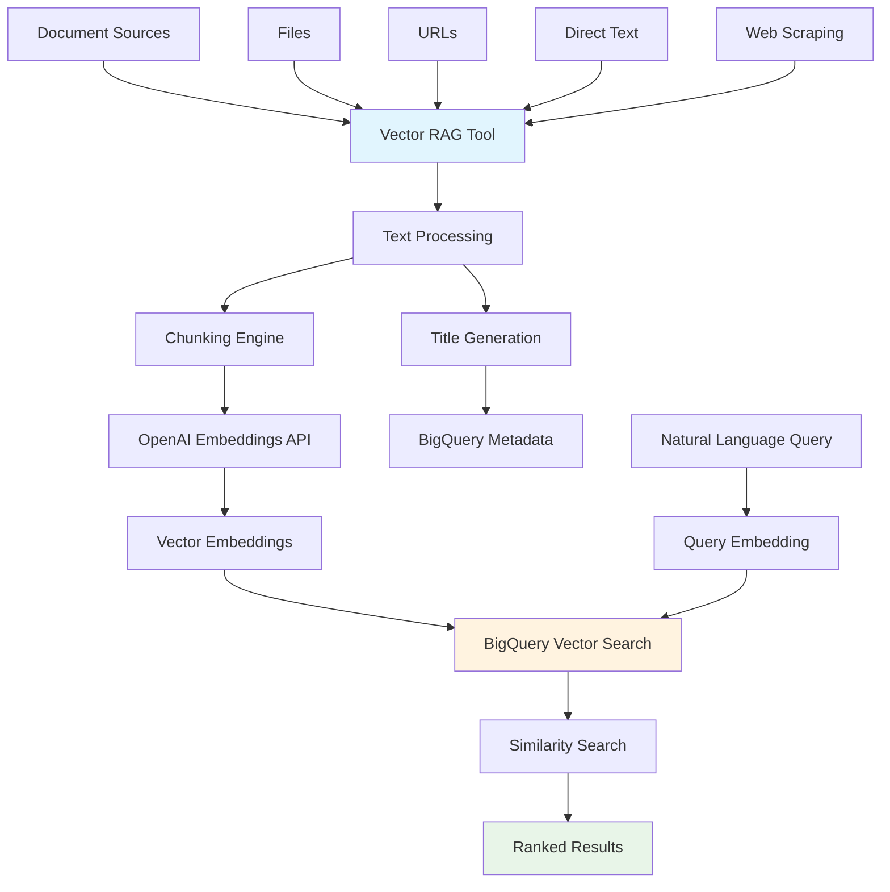

# Vector Search RAG Tool

The Vector Search RAG (Retrieval-Augmented Generation) tool provides semantic search capabilities using BigQuery Vector Search. This tool enables LangSwarm agents to load documents, generate embeddings, and perform natural language searches without requiring SQL knowledge.

## Overview

The Vector Search RAG tool transforms the AAF backend into a powerful knowledge retrieval system by:

- **Document Loading**: Load content from files, URLs, direct text, or web scraping
- **Automatic Chunking**: Split large documents into manageable chunks with overlap
- **Embedding Generation**: Create vector embeddings using OpenAI's embedding models
- **BigQuery Storage**: Store vectors and metadata in BigQuery for scalable search
- **Semantic Search**: Find relevant documents using natural language queries
- **Collection Management**: Organize documents into logical collections

## Architecture



## BigQuery Schema

### Vector Embeddings Table (`document_vectors`)

| Column | Type | Description |
|--------|------|-------------|
| `document_id` | STRING | Unique document identifier |
| `collection_name` | STRING | Collection organization |
| `chunk_index` | INTEGER | Chunk position in document |
| `content` | STRING | Text content of chunk |
| `embedding` | FLOAT (REPEATED) | Vector embedding array |
| `created_at` | TIMESTAMP | Creation timestamp |

### Document Metadata Table (`document_metadata`)

| Column | Type | Description |
|--------|------|-------------|
| `document_id` | STRING | Unique document identifier |
| `collection_name` | STRING | Collection organization |
| `title` | STRING | Document title |
| `description` | STRING | Document description |
| `source_type` | STRING | Source type (file, url, text, web) |
| `source_path` | STRING | Original source path |
| `tags` | STRING (REPEATED) | Document tags |
| `total_chunks` | INTEGER | Number of chunks created |
| `content_size` | INTEGER | Original content size |
| `metadata_json` | STRING | Additional metadata as JSON |
| `checksum` | STRING | Content checksum |
| `created_at` | TIMESTAMP | Creation timestamp |

## API Endpoints

### Load Documents

**`POST /api/tools/vector-rag/load`**

Load documents into BigQuery Vector Search for semantic retrieval.

**Request:**
```json
{
  "source_type": "file",
  "source_path": "/path/to/document.txt",
  "collection_name": "knowledge_base",
  "title": "Product Documentation",
  "description": "Complete product setup and configuration guide",
  "tags": ["documentation", "setup", "configuration"],
  "chunk_size": 1000,
  "chunk_overlap": 200,
  "auto_title": true,
  "extract_metadata": true
}
```

**Response:**
```json
{
  "success": true,
  "content": {
    "load_id": "load_abc123",
    "collection_name": "knowledge_base",
    "documents_loaded": 1,
    "chunks_created": 15,
    "embeddings_generated": 15,
    "processing_time": 8.5,
    "sample_chunks": [
      "This guide covers the complete setup process...",
      "Configuration parameters can be set in...",
      "For advanced users, the following options..."
    ]
  }
}
```

**Source Types:**
- **`file`**: Load from local file system (supports .txt, .md, .json)
- **`url`**: Download content from URL
- **`text`**: Direct text content in request
- **`web`**: Use integrated web scraper tool

### Semantic Search

**`POST /api/tools/vector-rag/search`**

Perform semantic search across loaded documents using natural language.

**Request:**
```json
{
  "query": "How do I configure the payment gateway settings?",
  "collection_name": "knowledge_base",
  "limit": 5,
  "similarity_threshold": 0.7,
  "include_metadata": true,
  "tags_filter": ["configuration", "payments"],
  "rerank": true
}
```

**Response:**
```json
{
  "success": true,
  "content": {
    "query": "How do I configure the payment gateway settings?",
    "results": [
      {
        "document_id": "doc_xyz789",
        "collection_name": "knowledge_base",
        "title": "Payment Gateway Setup",
        "content": "To configure payment gateway settings, navigate to the admin panel and select...",
        "similarity_score": 0.95,
        "metadata": {
          "author": "Tech Team",
          "version": "2.1"
        },
        "tags": ["configuration", "payments"],
        "created_at": "2024-01-15T10:30:00Z",
        "source_path": "/docs/payment-setup.md"
      }
    ],
    "total_results": 3,
    "search_time": 0.45,
    "collections_searched": ["knowledge_base"]
  }
}
```

### Collection Management

**`GET /api/tools/vector-rag/collections`**

List all available document collections.

**Response:**
```json
{
  "success": true,
  "collections": {
    "knowledge_base": {
      "document_count": 25,
      "total_chunks": 150,
      "last_updated": "2024-01-15T14:30:00Z"
    },
    "support_docs": {
      "document_count": 12,
      "total_chunks": 89,
      "last_updated": "2024-01-14T09:15:00Z"
    }
  },
  "total_collections": 2
}
```

**`GET /api/tools/vector-rag/collections/{collection_name}`**

Get detailed information about a specific collection.

**Response:**
```json
{
  "success": true,
  "collection": {
    "document_count": 25,
    "total_chunks": 150,
    "last_updated": "2024-01-15T14:30:00Z",
    "sample_documents": [
      {
        "title": "Getting Started Guide",
        "description": "Initial setup and configuration",
        "tags": ["setup", "beginner"],
        "created_at": "2024-01-15T10:00:00Z"
      }
    ]
  }
}
```

**`POST /api/tools/vector-rag/collections/{collection_name}/search`**

Search within a specific collection.

## LangSwarm Integration

### Agent Usage Examples

Agents can use the Vector Search RAG tool through natural conversation:

```python
# Load knowledge base
"Please load our product documentation from /docs/product-guide.md into the 'product_help' collection"

# Search for information
"Find information about user authentication in our knowledge base"

# Collection-specific search
"Search the support_docs collection for troubleshooting payment issues"

# Load from web
"Scrape and load the FAQ page from our website into the customer_support collection"
```

### Tool Schema

The tool provides these functions to LangSwarm agents:

#### `load_document`
```json
{
  "name": "load_document",
  "description": "Load a document into vector search for semantic retrieval",
  "parameters": {
    "type": "object",
    "properties": {
      "source_type": {
        "type": "string",
        "enum": ["file", "url", "text", "web"]
      },
      "source_path": {
        "type": "string",
        "description": "Path or URL to data source"
      },
      "content": {
        "type": "string", 
        "description": "Direct text content"
      },
      "collection_name": {
        "type": "string",
        "description": "Collection for organizing documents"
      },
      "title": {
        "type": "string",
        "description": "Document title"
      },
      "tags": {
        "type": "array",
        "items": {"type": "string"}
      }
    },
    "required": ["source_type", "collection_name"]
  }
}
```

#### `search_documents`
```json
{
  "name": "search_documents",
  "description": "Search documents using natural language queries",
  "parameters": {
    "type": "object",
    "properties": {
      "query": {
        "type": "string",
        "description": "Natural language search query"
      },
      "collection_name": {
        "type": "string",
        "description": "Specific collection to search (optional)"
      },
      "limit": {
        "type": "integer",
        "default": 5
      },
      "similarity_threshold": {
        "type": "number",
        "default": 0.7
      },
      "tags_filter": {
        "type": "array",
        "items": {"type": "string"}
      }
    },
    "required": ["query"]
  }
}
```

#### `list_collections`
```json
{
  "name": "list_collections",
  "description": "List all available document collections",
  "parameters": {
    "type": "object",
    "properties": {}
  }
}
```

## Configuration

### Environment Variables

```bash
# Required: BigQuery configuration
GOOGLE_CLOUD_PROJECT=your-project-id
BIGQUERY_DATASET_ID=aaf_vectors
GOOGLE_APPLICATION_CREDENTIALS=/path/to/service-account.json

# Required: OpenAI API for embeddings
OPENAI_API_KEY=your-openai-api-key

# Optional: Embedding model configuration
EMBEDDING_MODEL=text-embedding-3-small

# Optional: Web scraper integration
CRAWL4AI_MCP_URL=https://your-crawl4ai-server.com
CRAWL4AI_API_KEY=your-crawl4ai-api-key
```

### BigQuery Setup

1. **Create Dataset:**
```sql
CREATE SCHEMA IF NOT EXISTS `your-project.aaf_vectors`
OPTIONS (
  description = "AAF Vector Search RAG storage",
  location = "US"
);
```

2. **Enable Required APIs:**
```bash
gcloud services enable bigquery.googleapis.com
gcloud services enable bigqueryml.googleapis.com
```

3. **Service Account Permissions:**
```bash
# Grant BigQuery permissions
gcloud projects add-iam-policy-binding your-project-id \
    --member="serviceAccount:aaf-backend@your-project.iam.gserviceaccount.com" \
    --role="roles/bigquery.dataEditor"

gcloud projects add-iam-policy-binding your-project-id \
    --member="serviceAccount:aaf-backend@your-project.iam.gserviceaccount.com" \
    --role="roles/bigquery.jobUser"
```

## Advanced Features

### Automatic Text Chunking

The tool automatically splits large documents into chunks with configurable size and overlap:

```python
# Default chunking parameters
chunk_size = 1000        # Characters per chunk
chunk_overlap = 200      # Overlap between chunks

# Smart boundary detection
# 1. Sentence boundaries (preferred)
# 2. Word boundaries (fallback)
# 3. Character boundaries (last resort)
```

### Smart Title Generation

When `auto_title: true`, the tool uses OpenAI to generate descriptive titles:

```python
# AI-generated titles based on content
content_sample = "This guide covers the complete setup process for configuring..."
generated_title = "Complete Setup and Configuration Guide"
```

### Semantic Reranking

When `rerank: true`, results are reranked using multiple signals:

```python
def rerank_score(result):
    # Combine multiple ranking factors
    similarity_weight = 0.7     # Original vector similarity
    keyword_weight = 0.2        # Keyword overlap with query
    content_quality_weight = 0.1 # Content length and quality
    
    return (result.similarity_score * similarity_weight) + \
           (keyword_overlap * keyword_weight) + \
           (content_quality * content_quality_weight)
```

### Collection Organization

Best practices for organizing documents:

```python
# By business function
collections = [
    "customer_support",     # Support documentation
    "product_docs",         # Product manuals
    "api_reference",        # Technical documentation
    "company_policies",     # Internal policies
    "training_materials"    # Employee training
]

# By content type
collections = [
    "faqs",                 # Frequently asked questions
    "tutorials",            # Step-by-step guides
    "troubleshooting",      # Error resolution
    "reference",            # Quick reference materials
]

# By access level
collections = [
    "public_docs",          # Customer-facing content
    "internal_docs",        # Employee-only content
    "admin_docs"            # Administrator content
]
```

## Use Cases

### Customer Support RAG

```python
# Load support documentation
await load_document({
    "source_type": "web",
    "source_path": "https://company.com/support/faq",
    "collection_name": "customer_support",
    "tags": ["faq", "support"]
})

# Agent responds to customer queries
query = "My payment failed, what should I do?"
results = await search_documents({
    "query": query,
    "collection_name": "customer_support",
    "limit": 3
})
```

### Technical Documentation

```python
# Load API documentation
await load_document({
    "source_type": "file", 
    "source_path": "/docs/api-reference.md",
    "collection_name": "api_docs",
    "title": "REST API Reference",
    "tags": ["api", "reference", "technical"]
})

# Developer support queries
query = "How do I authenticate API requests?"
results = await search_documents({
    "query": query,
    "collection_name": "api_docs"
})
```

### Knowledge Base Integration

```python
# Load multiple knowledge sources
sources = [
    {"source_type": "file", "source_path": "/kb/setup.md"},
    {"source_type": "file", "source_path": "/kb/troubleshooting.md"},
    {"source_type": "url", "source_path": "https://wiki.company.com/best-practices"}
]

for source in sources:
    source["collection_name"] = "knowledge_base"
    await load_document(source)

# General knowledge queries
query = "What are the system requirements for installation?"
results = await search_documents({
    "query": query,
    "collection_name": "knowledge_base",
    "similarity_threshold": 0.8
})
```

## Performance Considerations

### Embedding Generation
- **Batch Processing**: Embeddings are generated in batches of 100 texts
- **Rate Limiting**: Built-in rate limiting for OpenAI API calls
- **Cost Optimization**: Use `text-embedding-3-small` for cost-effective embeddings

### BigQuery Optimization
- **Partitioning**: Tables are partitioned by creation date
- **Clustering**: Clustered by collection_name for faster collection searches
- **Batch Inserts**: Vector data inserted in batches of 1000 rows

### Search Performance
- **Vector Similarity**: Uses BigQuery ML.DISTANCE with cosine similarity
- **Parallel Processing**: Multiple collections searched in parallel
- **Result Caching**: Frequent queries can be cached at application level

## Monitoring and Debugging

### Logging
```python
# Tool initialization
logger.info("Vector search RAG tool initialized with BigQuery dataset: {dataset_id}")

# Document loading
logger.info("Successfully loaded document {document_id} with {chunks} chunks")

# Search operations
logger.info("Vector search completed in {search_time}s, found {results} results")
```

### Error Handling
```python
# Common error scenarios
try:
    result = await search_documents(request)
except Exception as e:
    if "permission denied" in str(e).lower():
        return {"error": "BigQuery access denied - check service account permissions"}
    elif "quota exceeded" in str(e).lower():
        return {"error": "API quota exceeded - try again later"}
    else:
        return {"error": f"Search failed: {str(e)}"}
```

### Health Checks
```python
# Check tool status
GET /api/tools/vector_search_rag/status

# Response includes:
{
  "available": true,
  "project_id": "your-project",
  "dataset_id": "aaf_vectors", 
  "collections_loaded": 5,
  "bigquery_connected": true,
  "openai_configured": true
}
```

This Vector Search RAG tool transforms AAF into a powerful knowledge retrieval system, enabling agents to provide accurate, contextual responses based on your organization's documentation and knowledge base! 🧠🔍✨
