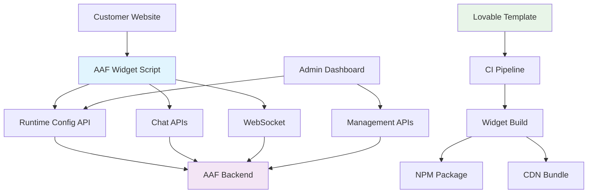
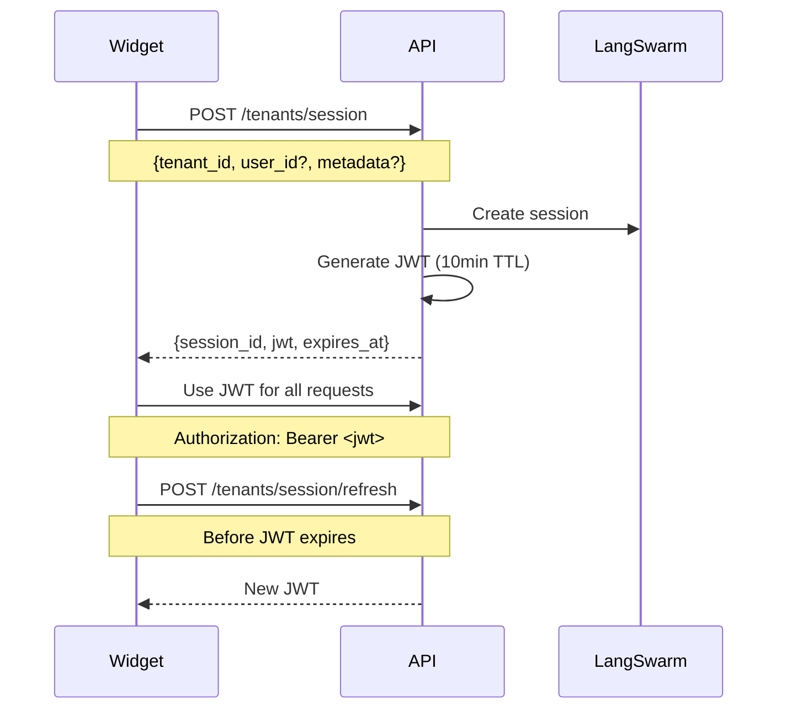

# AAF Widget Architecture

This document describes the new unified widget architecture that supports both embeddable widgets and standalone SPAs with centralized governance and Lovable template-based generation.

## Architecture Overview



## Components

### 1. Frontend Widget (Lovable-Generated)

**Repository**: `aaf-ui-template` (internal) → `aaf-ui-reference` (published)

**Features**:
- React 18 + TypeScript + Tailwind CSS
- Two build targets: embeddable widget and standalone SPA
- Runtime configuration loading
- JWT-based authentication
- WebSocket + HTTP chat clients
- File upload support
- Accessibility compliance (WCAG 2.1)
- Multi-language support (en, sv, de, fr)

**Delivery**:
- NPM Package: `@algorithma/aaf-widget`
- CDN Bundle: `https://cdn.algorithma.dev/aaf/aaf.js`

### 2. Backend APIs

**Runtime Configuration**:
- `GET /api/tenants/{tenant_id}/ui-config` - Widget configuration
- `POST /api/tenants/session` - Session creation with JWT
- `POST /api/tenants/session/refresh` - JWT renewal

**Chat APIs**:
- `POST /api/chat/send` - Send message (HTTP)
- `POST /api/chat/send/stream` - Send message (SSE)
- `WebSocket /api/chat/ws` - Real-time chat
- `POST /api/chat/typing` - Typing indicators
- `POST /api/chat/read-receipt` - Read receipts

**File Upload**:
- `POST /api/uploads/` - Upload files
- `GET /api/uploads/{file_id}/download` - Download files
- `GET /api/uploads/session/files` - List session files

---

## Integration Methods

### Method 1: Embeddable Widget (Recommended)

**Customer Implementation**:
```html
<!-- Add to customer website -->
<script
  src="https://cdn.algorithma.dev/aaf/aaf.js"
  async
  data-tenant="customer_tenant_id"
  data-env="prod"
  data-mount="#aaf-chat"
></script>

<div id="aaf-chat"></div>
```

**Widget Behavior**:
1. Fetches runtime config from `/api/tenants/{tenant_id}/ui-config`
2. Mounts React component to DOM element
3. Creates session via `/api/tenants/session`
4. Opens WebSocket connection for real-time chat

### Method 2: Standalone SPA

**Deployment Options**:
- Hosted by us: `https://chat.algorithma.dev/{tenant_id}`
- Customer domain: `https://chat.customer.com`
- Custom deployment: Customer hosts built assets

**Configuration**:
```javascript
// Runtime config loaded at startup
window.AAF_CONFIG = {
  tenant_id: "customer_tenant_id",
  api_base: "https://api.algorithma.dev",
  environment: "production"
};
```

---

## Configuration System

### UI Config Schema

```json
{
  "brand": {
    "primary": "#1C55FF",
    "accent": "#64748b", 
    "font": "Inter",
    "logoUrl": "https://customer.com/logo.png",
    "cornerRadius": 12
  },
  "features": {
    "attachments": true,
    "allowedFileTypes": ["pdf", "png", "jpg", "txt"],
    "downloadTranscripts": false,
    "suggestedPrompts": [
      "How can I get started?",
      "What services do you offer?"
    ],
    "showTyping": true,
    "i18n": "en"
  },
  "copy": {
    "title": "How can we help?",
    "subtitle": null,
    "inputPlaceholder": "Type your message...",
    "emptyState": "Start a conversation"
  },
  "endpoints": {
    "apiBase": "https://api.algorithma.dev",
    "wsBase": "wss://api.algorithma.dev"
  },
  "compliance": {
    "piiConsentBanner": true,
    "telemetryOptIn": false,
    "termsUrl": null,
    "privacyUrl": null
  },
  "flags": {
    "betaFeatures": [],
    "maxToolCalls": 3
  }
}
```

### Tenant-Specific Overrides

```python
# Backend configuration per tenant
tenant_config = {
    "enterprise": {
        "brand": {"primary": "#059669", "font": "system-ui"},
        "features": {"attachments": True, "downloadTranscripts": True},
        "compliance": {"piiConsentBanner": True, "telemetryOptIn": True}
    },
    "demo": {
        "brand": {"primary": "#2563eb"},
        "features": {"suggestedPrompts": ["Try the demo", "What can you do?"]},
        "copy": {"title": "Demo Chat Assistant"}
    }
}
```

---

## Authentication Flow

### Session Creation



### JWT Payload

```json
{
  "sid": "sess_tenant123_abc123",
  "tid": "tenant123", 
  "uid": "user456",
  "exp": 1642694400,
  "iat": 1642694100,
  "iss": "aaf-backend",
  "aud": "aaf-widget",
  "metadata": {
    "user_agent": "Mozilla/5.0...",
    "ip_address": "192.168.1.1"
  }
}
```

---

## Lovable CI/CD Integration

### Template Repository Structure

```
aaf-ui-template/
├── src/
│   ├── components/
│   │   ├── ChatWidget.tsx
│   │   ├── MessageList.tsx
│   │   ├── MessageInput.tsx
│   │   └── FileUpload.tsx
│   ├── hooks/
│   │   ├── useChat.ts
│   │   ├── useWebSocket.ts
│   │   └── useConfig.ts
│   ├── services/
│   │   ├── api.ts
│   │   ├── websocket.ts
│   │   └── auth.ts
│   └── styles/
│       ├── globals.css
│       └── theme.ts
├── templates/
│   ├── widget.config.js.template
│   ├── theme.css.template
│   └── branding.config.js.template
├── scripts/
│   ├── build-widget.js
│   ├── build-spa.js
│   └── generate-types.js
└── tests/
    ├── unit/
    ├── integration/
    └── e2e/
```

### CI Pipeline Process

```yaml
# .github/workflows/widget-build.yml
name: Build AAF Widget

on:
  push:
    branches: [main]
  workflow_dispatch:
    inputs:
      tenant_config:
        description: 'Tenant-specific configuration'
        required: false

jobs:
  build:
    runs-on: ubuntu-latest
    steps:
      - uses: actions/checkout@v3
      
      - name: Setup Node.js
        uses: actions/setup-node@v3
        with:
          node-version: '18'
          
      - name: Install dependencies
        run: npm ci
        
      - name: Generate from template
        run: |
          # Apply tenant-specific tokens if provided
          npm run generate-config -- --tenant="${{ github.event.inputs.tenant_config }}"
        
      - name: Run tests
        run: |
          npm run test:unit
          npm run test:integration
          npm run test:e2e
          
      - name: Build widget
        run: |
          npm run build:widget
          npm run build:spa
          
      - name: Publish to NPM
        if: github.ref == 'refs/heads/main'
        run: |
          npm publish --access public
        env:
          NPM_TOKEN: ${{ secrets.NPM_TOKEN }}
          
      - name: Upload to CDN
        if: github.ref == 'refs/heads/main'
        run: |
          aws s3 sync dist/widget/ s3://cdn.algorithma.dev/aaf/
        env:
          AWS_ACCESS_KEY_ID: ${{ secrets.AWS_ACCESS_KEY_ID }}
          AWS_SECRET_ACCESS_KEY: ${{ secrets.AWS_SECRET_ACCESS_KEY }}
```

---

## Security Considerations

### CORS Configuration

```python
# Backend CORS settings
CORS_ORIGINS = [
    "https://*.algorithma.dev",
    "https://cdn.algorithma.dev",
    # Customer domains (configured per tenant)
    "https://customer1.com",
    "https://chat.customer2.com"
]
```

### Content Security Policy

```html
<!-- Recommended CSP for customer sites -->
<meta http-equiv="Content-Security-Policy" content="
  default-src 'self';
  script-src 'self' https://cdn.algorithma.dev;
  connect-src 'self' https://api.algorithma.dev wss://api.algorithma.dev;
  img-src 'self' data: https:;
  style-src 'self' 'unsafe-inline' https://cdn.algorithma.dev;
  font-src 'self' https://fonts.gstatic.com;
">
```

### File Upload Security

- File type validation (extension + MIME type)
- Virus scanning for enterprise tenants
- Size limits per tenant tier
- Automatic cleanup after 24 hours
- Sandboxed file serving

---

## Deployment Guide

### Backend Deployment

```bash
# Environment variables
export TENANT_CONFIG_CACHE_TTL=900  # 15 minutes
export JWT_SECRET_KEY="your-secret-key"
export UPLOAD_MAX_SIZE=52428800     # 50MB
export CORS_ORIGINS="https://cdn.algorithma.dev,https://*.customer.com"

# Deploy to Cloud Run
gcloud run deploy aaf-backend \
  --image gcr.io/project/aaf-backend \
  --platform managed \
  --region us-central1 \
  --allow-unauthenticated \
  --set-env-vars TENANT_CONFIG_CACHE_TTL=900
```

### CDN Deployment

```bash
# Upload widget assets
aws s3 sync dist/widget/ s3://cdn.algorithma.dev/aaf/ \
  --cache-control "public, max-age=31536000, immutable"

# Create CloudFront distribution
aws cloudfront create-distribution \
  --distribution-config file://cloudfront-config.json
```

### Customer Integration

**Standard Integration**:
```html
<script
  src="https://cdn.algorithma.dev/aaf/aaf.js"
  async
  data-tenant="customer_123"
  data-env="prod"
  data-mount="#chat-container"
  data-position="bottom-right"
></script>
<div id="chat-container"></div>
```

**Advanced Integration**:
```javascript
import { AAFWidget } from '@algorithma/aaf-widget';

const widget = new AAFWidget({
  tenant: 'customer_123',
  environment: 'production',
  container: '#chat-container',
  config: {
    // Override default config
    brand: { primary: '#custom-color' },
    features: { attachments: false }
  }
});

await widget.initialize();
```

---

## Monitoring & Observability

### Metrics Collection

```javascript
// Widget-side telemetry
const telemetry = {
  time_to_first_token: performance.now() - startTime,
  message_count: messagesSent,
  session_duration: Date.now() - sessionStart,
  file_uploads: uploadsCount,
  errors: errorEvents
};

// Send to analytics endpoint
await fetch('/api/telemetry', {
  method: 'POST',
  body: JSON.stringify(telemetry)
});
```

### Backend Logging

```python
# Structured logging with trace IDs
logger.info(
    "Chat interaction",
    extra={
        "tenant_id": tenant_id,
        "session_id": session_id,
        "turn_id": turn_id,
        "trace_id": request.headers.get("x-aaf-trace-id"),
        "user_agent": request.headers.get("user-agent"),
        "response_time_ms": response_time
    }
)
```

---

## Migration Notes

### From Current Demo System

1. **No Breaking Changes**: Current demo endpoints remain functional
2. **Gradual Migration**: New widget APIs run alongside existing ones
3. **Tenant Configuration**: Migrate to new config system progressively
4. **Security Enhancement**: JWT authentication for all new integrations

### Lovable Integration Changes

1. **No Public APIs**: Remove `/api/lovable/*` endpoints
2. **CI-Only Generation**: Lovable runs in internal CI pipeline
3. **Template-Based**: Standardized template with tenant customization
4. **Quality Control**: All generated UIs pass same test suite

This architecture provides a scalable, secure, and maintainable foundation for AAF widget deployment while maintaining the flexibility to customize for enterprise customers through the CI-based Lovable integration. 🚀
