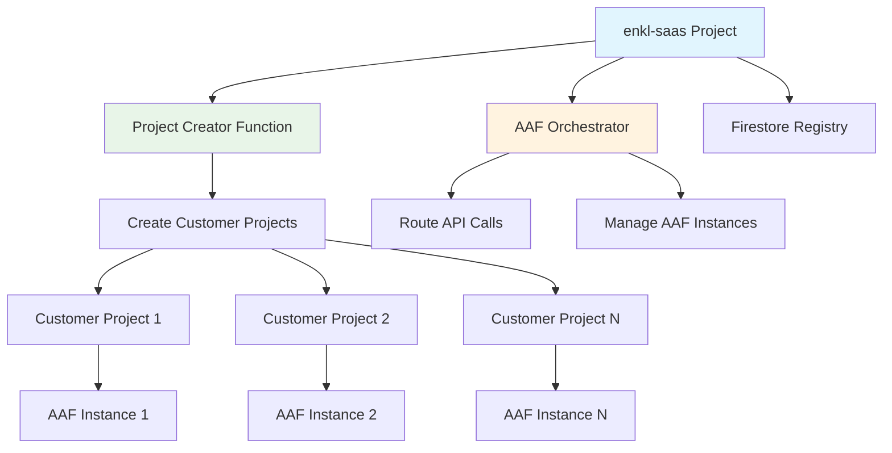

# AAF Multi-Project Deployment Guide - enkl-saas

This guide will walk you through deploying the complete AAF infrastructure to the `enkl-saas` GCP project.

## Deployment Overview



## Prerequisites

### 1. Required GCP APIs (in enkl-saas)

```bash
# Enable required APIs
gcloud config set project enkl-saas

gcloud services enable cloudfunctions.googleapis.com
gcloud services enable run.googleapis.com
gcloud services enable firestore.googleapis.com
gcloud services enable cloudresourcemanager.googleapis.com
gcloud services enable cloudbilling.googleapis.com
gcloud services enable iam.googleapis.com
gcloud services enable containerregistry.googleapis.com
gcloud services enable cloudbuild.googleapis.com
```

### 2. Service Account Setup

```bash
# Create service account for project creation
gcloud iam service-accounts create aaf-project-creator \
    --display-name="AAF Project Creator" \
    --description="Service account for creating customer AAF projects"

# Get service account email
PROJECT_CREATOR_SA="aaf-project-creator@enkl-saas.iam.gserviceaccount.com"

# Grant necessary permissions
gcloud organizations add-iam-policy-binding ${ORGANIZATION_ID} \
    --member="serviceAccount:${PROJECT_CREATOR_SA}" \
    --role="roles/resourcemanager.projectCreator"

gcloud organizations add-iam-policy-binding ${ORGANIZATION_ID} \
    --member="serviceAccount:${PROJECT_CREATOR_SA}" \
    --role="roles/billing.projectManager"

# Create service account for orchestrator
gcloud iam service-accounts create aaf-orchestrator \
    --display-name="AAF Orchestrator" \
    --description="Service account for AAF orchestrator"

ORCHESTRATOR_SA="aaf-orchestrator@enkl-saas.iam.gserviceaccount.com"

# Grant Firestore permissions
gcloud projects add-iam-policy-binding enkl-saas \
    --member="serviceAccount:${ORCHESTRATOR_SA}" \
    --role="roles/datastore.user"

# Grant Cloud Run admin for managing AAF instances
gcloud organizations add-iam-policy-binding ${ORGANIZATION_ID} \
    --member="serviceAccount:${ORCHESTRATOR_SA}" \
    --role="roles/run.admin"

gcloud organizations add-iam-policy-binding ${ORGANIZATION_ID} \
    --member="serviceAccount:${ORCHESTRATOR_SA}" \
    --role="roles/iam.serviceAccountUser"
```

### 3. Environment Variables

Create a deployment configuration file:

```bash
# Create deployment environment file
cat > external/deploy/.env.enkl-saas << 'EOF'
# GCP Configuration
GOOGLE_CLOUD_PROJECT=enkl-saas
ORGANIZATION_ID=your-org-id
BILLING_ACCOUNT_ID=your-billing-account-id
REGISTRY_PROJECT_ID=enkl-saas

# Orchestrator Configuration
ORCHESTRATOR_API_SECRET=$(openssl rand -hex 32)

# Firestore Configuration
FIRESTORE_DATABASE=(default)
FIRESTORE_COLLECTION=aaf_projects

# Deployment Configuration
REGION=europe-west1
FUNCTION_MEMORY=2GB
FUNCTION_TIMEOUT=3600s

# AAF Default Configuration
DEFAULT_AAF_IMAGE=gcr.io/enkl-saas/aaf-backend:latest
DEFAULT_MACHINE_TYPE=2Gi
DEFAULT_MAX_INSTANCES=5
EOF
```

## Step-by-Step Deployment

### Step 1: Setup Environment

```bash
# Navigate to deployment directory
cd /Users/alexanderekdahl/Docker/LangSwarm/external/deploy

# Load environment variables
source .env.enkl-saas

# Set GCP project
gcloud config set project enkl-saas

# Authenticate Docker with GCP
gcloud auth configure-docker
```

### Step 2: Deploy Project Creator Function

```bash
# Navigate to project creator directory
cd project-creator

# Verify required environment variables
echo "BILLING_ACCOUNT_ID: $BILLING_ACCOUNT_ID"
echo "ORGANIZATION_ID: $ORGANIZATION_ID"
echo "REGISTRY_PROJECT_ID: $REGISTRY_PROJECT_ID"

# Deploy the function
./deploy.sh

# Test the function (optional)
FUNCTION_URL=$(gcloud functions describe aaf-project-creator --region=europe-west1 --format="value(httpsTrigger.url)")
echo "Project Creator Function URL: $FUNCTION_URL"

# Save function URL for orchestrator
export PROJECT_CREATOR_FUNCTION_URL=$FUNCTION_URL
```

### Step 3: Initialize Firestore

```bash
# Create Firestore database (if not exists)
gcloud firestore databases create --region=europe-west1

# Create indexes for efficient queries
gcloud firestore indexes composite create \
    --collection-group=aaf_projects \
    --field-config field-path=status,order=ascending \
    --field-config field-path=created_at,order=descending
```

### Step 4: Build and Deploy AAF Backend Image

```bash
# Navigate to AAF backend
cd ../aaf

# Build AAF backend image
docker build -t gcr.io/enkl-saas/aaf-backend:latest .

# Push to Container Registry
docker push gcr.io/enkl-saas/aaf-backend:latest

# Verify image
gcloud container images list --repository=gcr.io/enkl-saas
```

### Step 5: Deploy Orchestrator

```bash
# Navigate to orchestrator directory
cd ../orchestrator

# Verify environment variables
echo "ORCHESTRATOR_API_SECRET: $ORCHESTRATOR_API_SECRET"
echo "PROJECT_CREATOR_FUNCTION_URL: $PROJECT_CREATOR_FUNCTION_URL"

# Deploy orchestrator
./deploy.sh

# Get orchestrator URL
ORCHESTRATOR_URL=$(gcloud run services describe aaf-orchestrator --region=europe-west1 --format="value(status.url)")
echo "Orchestrator URL: $ORCHESTRATOR_URL"
```

## Post-Deployment Configuration

### 1. Test Project Creator Function

```bash
# Test project creation
curl -X POST "$PROJECT_CREATOR_FUNCTION_URL" \
    -H "Content-Type: application/json" \
    -d '{
        "customer_id": "test-customer-001",
        "project_name": "Test Customer AAF",
        "aaf_config": {
            "memory": "2Gi",
            "max_instances": 3
        }
    }'
```

### 2. Test Orchestrator

```bash
# Test orchestrator health
curl "$ORCHESTRATOR_URL/health"

# List projects (should be empty initially)
curl "$ORCHESTRATOR_URL/api/projects" \
    -H "X-API-Secret: $ORCHESTRATOR_API_SECRET"

# Create a test project via orchestrator
curl -X POST "$ORCHESTRATOR_URL/api/projects" \
    -H "Content-Type: application/json" \
    -H "X-API-Secret: $ORCHESTRATOR_API_SECRET" \
    -d '{
        "customer_id": "demo-customer",
        "project_name": "Demo Customer AAF",
        "aaf_config": {
            "memory": "2Gi",
            "max_instances": 3,
            "env_vars": {
                "OPENAI_API_KEY": "test-key"
            }
        }
    }'
```

### 3. Frontend Configuration

Update your frontend configuration to use the deployed orchestrator:

```typescript
// Frontend environment configuration
const API_CONFIG = {
  ORCHESTRATOR_URL: 'https://aaf-orchestrator-xxx-uc.a.run.app',
  API_SECRET: 'your-orchestrator-api-secret',
  REGION: 'europe-west1'
};

// Example frontend API call
const createProject = async (projectData) => {
  const response = await fetch(`${API_CONFIG.ORCHESTRATOR_URL}/api/projects`, {
    method: 'POST',
    headers: {
      'Content-Type': 'application/json',
      'X-API-Secret': API_CONFIG.API_SECRET
    },
    body: JSON.stringify(projectData)
  });
  
  return response.json();
};
```

## Monitoring and Logs

### 1. Cloud Functions Logs

```bash
# View project creator function logs
gcloud functions logs read aaf-project-creator --region=europe-west1 --limit=50

# Follow logs in real-time
gcloud functions logs tail aaf-project-creator --region=europe-west1
```

### 2. Cloud Run Logs

```bash
# View orchestrator logs
gcloud run logs tail aaf-orchestrator --region=europe-west1

# View logs for specific AAF instance
gcloud run logs tail aaf-instance-customer-001 --region=europe-west1
```

### 3. Firestore Monitoring

```bash
# Query Firestore directly
gcloud firestore collections list

# View project registry
gcloud firestore documents list aaf_projects
```

## Security Configuration

### 1. IAM Policies

```bash
# List all IAM policies for verification
gcloud projects get-iam-policy enkl-saas

# Check service account permissions
gcloud iam service-accounts get-iam-policy $PROJECT_CREATOR_SA
gcloud iam service-accounts get-iam-policy $ORCHESTRATOR_SA
```

### 2. API Security

```bash
# Verify Cloud Run security
gcloud run services describe aaf-orchestrator --region=europe-west1 --format="value(spec.traffic[0].percent,status.traffic[0].url)"

# Check function security
gcloud functions describe aaf-project-creator --region=europe-west1 --format="value(httpsTrigger.securityLevel)"
```

## Troubleshooting

### Common Issues

1. **Permission Denied Errors**
   ```bash
   # Check service account permissions
   gcloud auth list
   gcloud config get-value account
   
   # Re-authenticate if needed
   gcloud auth application-default login
   ```

2. **Function Timeout**
   ```bash
   # Increase function timeout
   gcloud functions deploy aaf-project-creator \
       --timeout=3600s \
       --memory=2GB
   ```

3. **Docker Build Issues**
   ```bash
   # Ensure Docker is authenticated
   gcloud auth configure-docker
   
   # Check available space
   docker system df
   docker system prune -f
   ```

4. **Firestore Permission Issues**
   ```bash
   # Grant additional Firestore permissions
   gcloud projects add-iam-policy-binding enkl-saas \
       --member="serviceAccount:${ORCHESTRATOR_SA}" \
       --role="roles/datastore.owner"
   ```

## Scaling Configuration

### 1. Orchestrator Scaling

```bash
# Update orchestrator with higher limits
gcloud run services update aaf-orchestrator \
    --region=europe-west1 \
    --memory=4Gi \
    --cpu=4 \
    --max-instances=20 \
    --concurrency=100
```

### 2. Function Scaling

```bash
# Update function with higher limits
gcloud functions deploy aaf-project-creator \
    --memory=4GB \
    --timeout=3600s \
    --max-instances=10
```

## Cleanup (if needed)

```bash
# Delete orchestrator
gcloud run services delete aaf-orchestrator --region=europe-west1

# Delete function
gcloud functions delete aaf-project-creator --region=europe-west1

# Delete service accounts
gcloud iam service-accounts delete $PROJECT_CREATOR_SA
gcloud iam service-accounts delete $ORCHESTRATOR_SA

# Delete Firestore database (careful!)
# gcloud firestore databases delete --database=(default)
```

This deployment will create a production-ready AAF infrastructure that can automatically provision and manage customer AAF instances across multiple GCP projects! 🚀
